# Cognito User Pools Hands On

Walking through the visual mechanics of spinning up a live, production-grade identity directory using the brand-new **Managed Login** engine is a massive leveling-up play. 🏎️🛡️

Stephane's walk-through exposes how AWS completely handles the overhead of secure customer onboarding. Instead of managing databases of salted password hashes and coding complex verification email delivery logic, Cognito serves a fully custom-branded UI on a silver platter, tracks sign-up confirmations in real time, and redirects authenticated users back to your web app via precise URL callbacks.

## Hands On

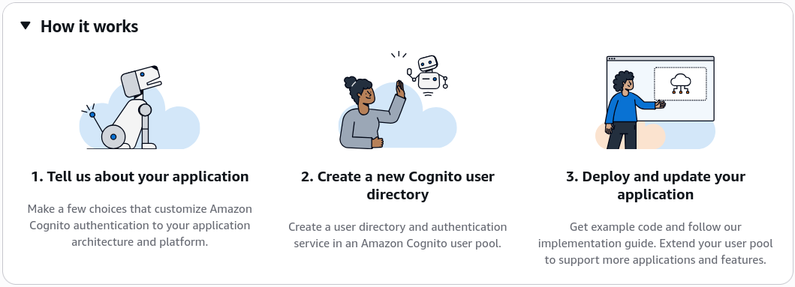

### 🏛️ 1. Initializing the Application Infrastructure Scope

- **Create the Vault:** Open up the **Amazon Cognito console** workspace ──► hit **Create user pool**.
- **Map the Application Type:** Select **Traditional web application** as your baseline frame ──► name your app explicitly `my-web-app` ──► hit Next.  
  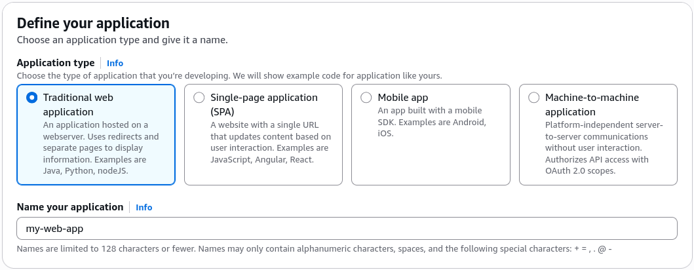
- **Configure Identity Sign-in Handles:** Under the standard sign-in options, choose **Email**. _DevOps Setup Context:_ In this step, you dictate exactly what unique identifier attributes (Username, Phone Number, or Email) the directory will accept to lock down user sessions.  
  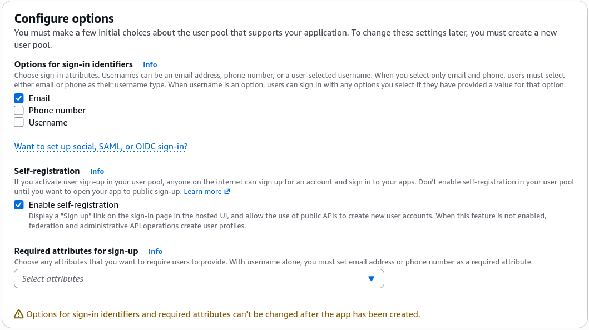
- **Establish the Post-Auth Landing Gates:** Set your secure **Return URL** (Callback URL) string to `https://example.com` (or your actual website routing endpoint). This ensures that the exact millisecond the security gate validates a user, it passes the resulting session token payloads right back down to your web app's custom landing view! Hit Create.

---

### 🎛️ 2. Navigating the Core Administrative Matrix

Click directly into your newly baked user pool profile from the list to audit the structural security boundaries available:

- **Users & Groups:** The central identity directory ledger. This is where you track individual account nodes, enforce account locking, look up metadata timestamps, or segment profiles into strategic administrative permission groups.
- **Authentication Methods:** Under the email card, Cognito have a built-in testing pipeline capable of firing out up to **50 email packages per day** for development purpose. _Architectural Fact:_ The exact second your environment shifts to production traffic, you must explicitly bind **Amazon SES (Simple Email Service)** to scale out email delivery parameters reliably.  
  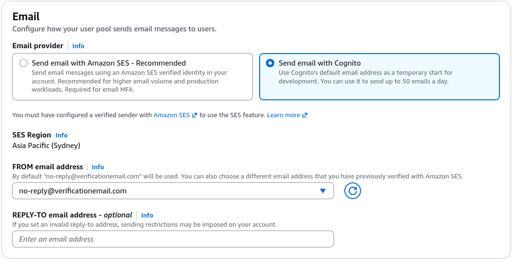
- **Password Complexity Polices:** Let's you dial in your exact corporate compliance rules, such as enforcing an absolute minimum parameter length of 8 characters, forcing alphanumeric combinations, and configuring automated password expiration clocks.  
  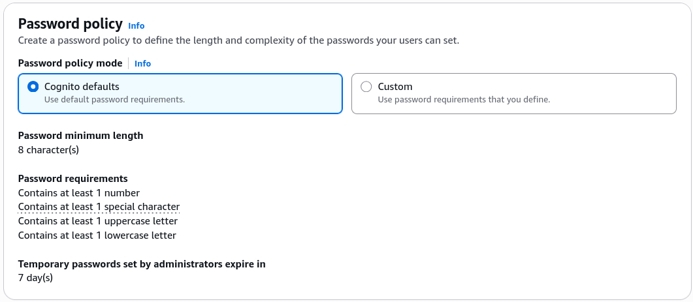

---

### 🔐 3. Sign-in

- **Immutable Sign-in Attributes:** Cognito locks down the sign-in attribute (Username, Email, or Phone Number) at the time of pool creation. If you need to pivot this later, you must provision a brand-new User Pool container and migrate your users over.
- **Multi-Factor Authentication (MFA):** Cognito supports Email/SMS and TOTP (Time-based One-Time Password) MFA flows. You can enforce MFA as optional or required for all users, enhancing security for sensitive applications.
- **User account recovery:** Cognito provides built-in mechanisms for users to recover their accounts, including password reset flows and account verification processes.  
  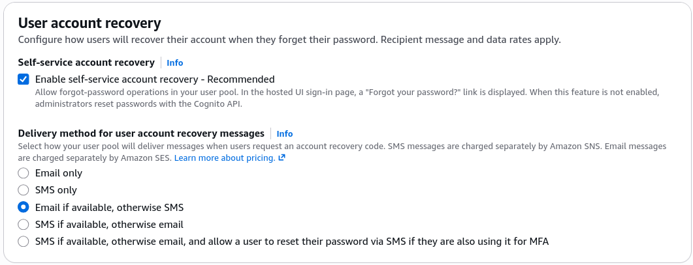

---

### 📝 4. Sign-up

- **Attributes Verification:** When a user signs up, Cognito can require them to verify their email address or phone number before their account becomes active. This helps ensure the accuracy of user information and prevents spam accounts.
  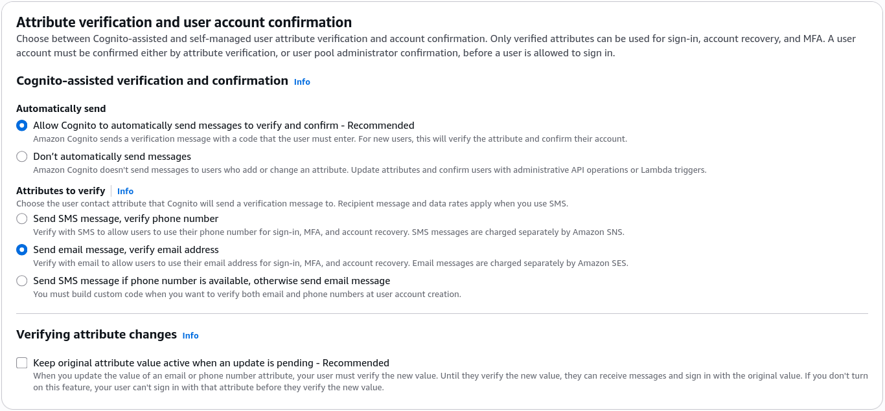
- **Required Attributes:** What attributes are required for user registration? You can configure mandatory fields like email, phone number, or custom attributes to ensure you collect the necessary information during sign-up. This is something you set up in the beginning and cannot change later without creating a new User Pool.
- **Custom Attributes:** You can define custom attributes to store additional user information beyond the standard attributes provided by Cognito. E.g., you might want to store a user's preferred language or subscription level.

---

### 🌐 5. Setting Up Identity Provider Federation & Extensions

- **The Social Handshake (Federated Providers):** Inside the Sign-in experience configuration tab, you can seamlessly activate **Federated Identity Providers**. With a few clicks, you can hook your app directly into major global authorization endpoints like **Google, Facebook, Amazon, Apple, SAML, or OpenID Connect**. This drops a "Login with Google" button straight onto your pages without you having to write custom OAuth routing code.  
  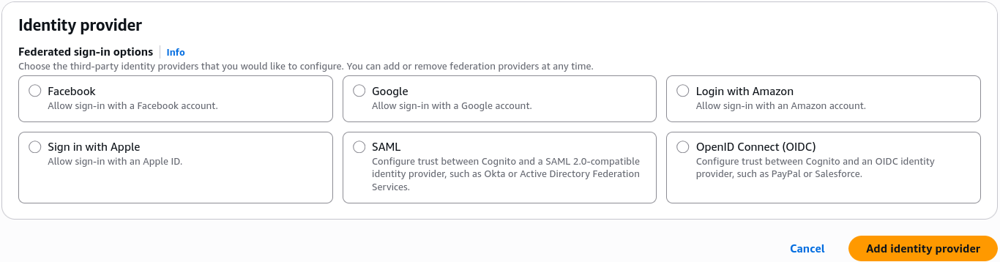
- **Extensions (Lambda triggers):** You can bind custom **AWS Lambda Triggers** directly to specific system lifecycle hooks (like `Sign-up`, `Authentication`, or `Custom Message`). This lets you inject custom code to audit an email address suffix against a corporate whitelist or inject custom parameters into a user's session claims dynamically.  
  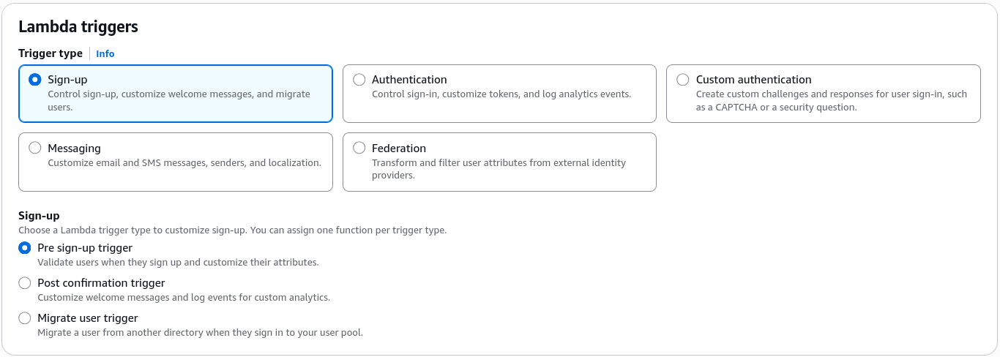

---

### 🛡️ 6. Security

- **WAF:** You can integrate **AWS WAF (Web Application Firewall)** with your Cognito User Pool to protect against common web exploits and attacks. This adds an additional layer of security to your authentication flows.
- **Threat Protection:**: Cognito provides built-in threat detection and protection mechanisms to help safeguard your user pool against malicious activities, such as brute-force attacks or suspicious login attempts. You can configure these settings to enhance the security of your authentication system.
- **Log Streaming:** You can enable **Amazon CloudWatch Logs** to capture detailed logs of authentication events, user sign-ins, and other activities within your User Pool. This allows you to monitor and analyze user behavior for security and operational insights.

---

### 🎨 7. Launching the Managed Login Interface

- **Branding & Domains:** Cognito automatically spins up a secure dedicated authentication domain endpoint for your pool. You can keep the default AWS-managed domain layout or route it natively through your own enterprise records using **Amazon Route 53**.  
   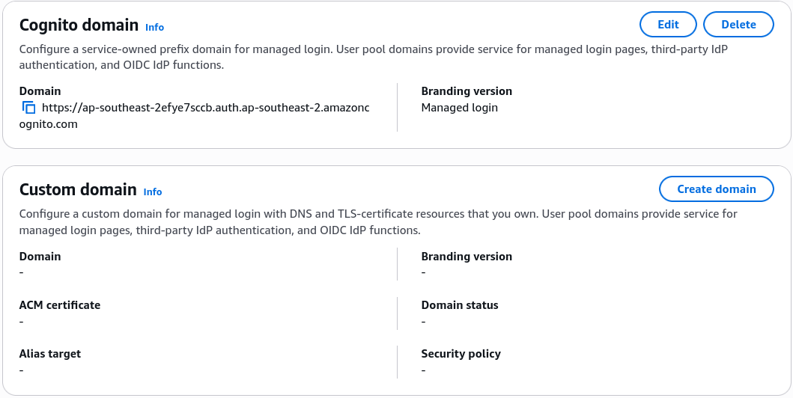
- **The Managed Login Designer:** This is the brand-new, cutting-edge evolution of the historical "Hosted UI". It ships with a comprehensive visual design workspace allowing you to dynamically restyle, preview, and skin your registration cards, password reset grids, and MFA prompts to perfectly align with your brand's layout theme.  
  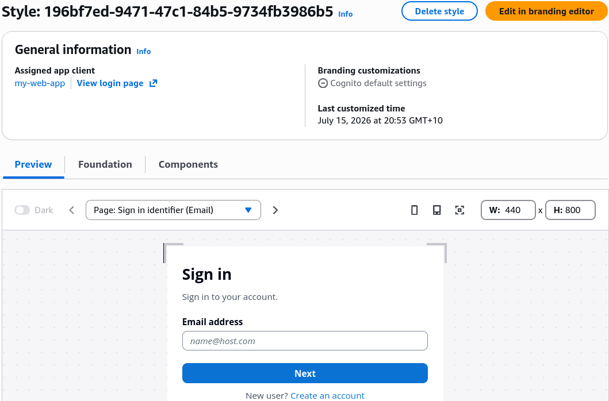

---

### 🧪 8. Simulating a Live User Registration Cycle

- **Spin Up a Sandbox Terminal Email:** Jump over to a temporary email service provider (like Mailinator) and copy a fresh sandbox test email string (e.g., `demo-cognito@mailinator.com`).
- **Launch the Security Gate:** Back in the Cognito console overview panel, hit the **View login page** link button to pop open the live authentication portal.  
  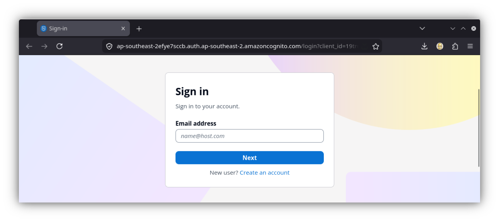
- **Trigger a New User Account Creation:** Click "Create an account" ──► drop in your sandbox email string ──► set a complex password matching your compliance parameters ──► click Sign Up.  
  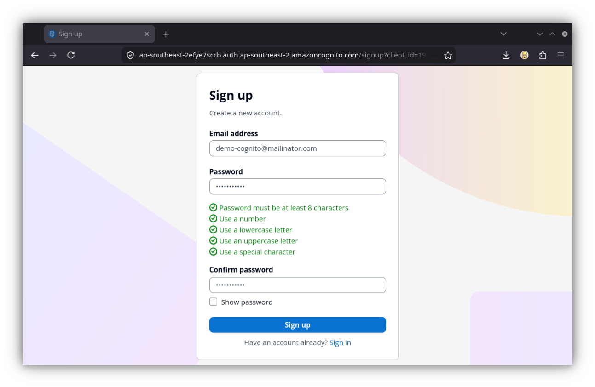
- **The Real-Time Audit Check:** Open your Cognito console **Users** dashboard tab in a side window, chief. You will instantly see your test username pop up inside the tracking grid showing a status of **`Unconfirmed`** and an email status of **`Unverified`**.  
  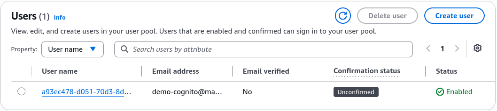
- **Pass the Verification Challenge:** Refresh your temporary email box, snap up the multi-digit security code payload sent by Cognito, drop it straight into the active browser confirmation prompt box, and hit enter.  
  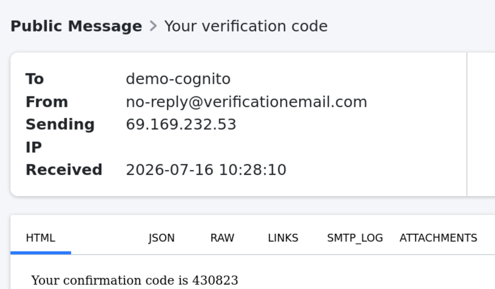
- **The Landing Success:** The browser instantly drops the session and gracefully redirects you right out to `https://example.com`.  
  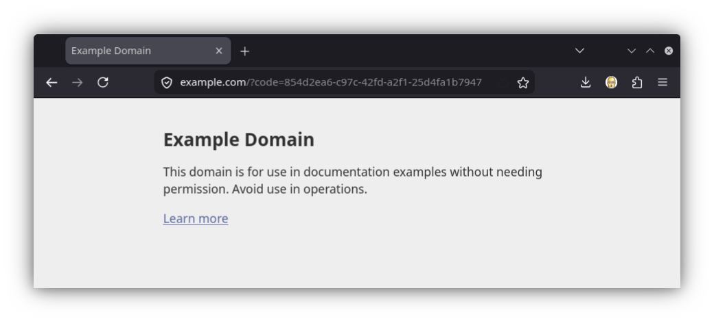
- **The Verified Confirmation 🏆:** Refresh your main console Users grid layout one last time. The tracking metrics dynamically flip to show an absolute status of **`Confirmed`** and a verified email parameter!  
  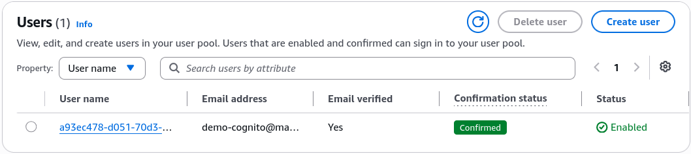

---

## Exam Tips

- Always keep anchored in your mind for exam scenarios that while you can customize messaging templates, fonts, and login attributes over time, **core immutable sign-in settings (like deciding if a user signs in using an email handle vs. a customized username) can only be set during the initial creation workflow of the User Pool.** If your engineering team demands a migration pivot down the wire, you must provision an entirely fresh User Pool container from scratch.
