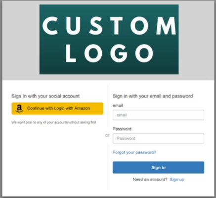
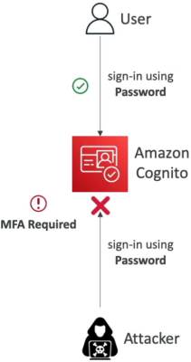
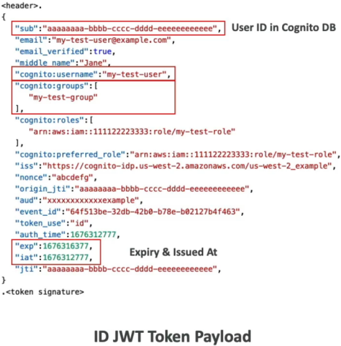

# Cognito User Pools - Others

Taking a deep dive into advanced **Amazon Cognito User Pools (CUP)** mechanics is how you inject true enterprise-grade intelligence, cross-region cryptographic compliance, and razor-sharp token validation directly into your application boundaries. 🏎️🛡️

When your customer base scales out to millions of active nodes, you can't rely on simple username-password match loops. You need the infrastructure to actively hunt for attackers, intercept session requests with custom logic triggers, and cleanly unpack JSON Web Tokens at the API border.

---

## Key Takeaways

Let's check out the granular mechanics of **Lambda Triggers**, **Custom Domains**, **Adaptive Authentication**, and **JWT Anatomy** to completely lock down your DVA-C02 preparation.

### 🧠 Programmable Interception: Lambda Triggers

Cognito User Pools allow you to natively inject custom **AWS Lambda functions** to run synchronously at precise lifecycle execution phases. This gives you complete programmatic control over authentication, user onboarding, and messaging parameters:

#### 🔑 Authentication Tier Triggers

- **`Pre Authentication` & `Post Authentication` 🛰️:** Executes code scripts right before or immediately after a sign-in challenge. Perfect for setting up custom risk analytics logging or blocking corporate access outside specific time windows.
- **`Pre Token Generation` 🎛️:** An absolute elite engineering tool. This trigger fires right before Cognito mints your tokens. It lets you programmatically inject, override, decorate, or completely suppress specific custom user profile claims right inside the outgoing identity and access tokens on the fly!

#### 📝 User Onboarding Tier Triggers

- **`Pre Sign-up` 🛑:** Runs before a new user is committed to the database ledger. Perfect for checking an email suffix against an internal corporate whitelist to reject spam domain sign-ups instantly.
- **`Post Confirmation` 📧:** Triggers the exact millisecond a user passes their email verification code. Ideal for triggering downstream systems, creating default rows in a separate DynamoDB analytics table, or sending a stylized custom greeting.
- **`User Migration` 🔄:** Runs seamlessly when a user tries to log in but their profile is missing. It allows your function to securely query an old legacy database external to AWS, validate the password hash, and cleanly auto-migrate the profile record straight into Cognito without forcing a painful global password reset for your customers.

---

### 🌐 Custom Identity Domains & The US-East-1 ACM Rule

- If your enterprise security protocol dictates that the authentication portal cannot use an AWS-branded domain string, you can cleanly map a custom domain (like `auth.mycompany.com`) right inside the app integration console settings, chief.

:::tip
To secure your custom Cognito login endpoint using custom domains, you must explicitly provision a public SSL/TLS cryptographic certificate via **AWS Certificate Manager (ACM)**.  
**Regardless of where your actual Cognito User Pool is located globally (even if your User Pool is deployed in Sydney `ap-southeast-2` or London `eu-west-2`), your custom domain's ACM certificate MUST be created explicitly in the US-East-1 (N. Virginia) region.**
If you create the certificate inside the local regional home stack where the User Pool container sits, Cognito will fail to bind the domain layout completely.
:::

- **Hosted Auth UI:** Cognito has a **hosted authentication UI** that you can add to your app to handle sign-up and sign-in workflows. You can customize with a custom logo and custom CSS to match your brand identity. Using hosted UI, you have a foundation for integration with social logins, OIDC or SAML.
  

---

### 🛡️ Threat Protection & Risk-Based Adaptive Authentication

By turning on Cognito's **Advanced Security Features (Threat Protection)**, you hand the keys over to an automated machine learning threat detection engine.

Every single onboarding, login, or password change attempt is evaluated in real time against key environmental variables, including the user's explicit hardware device fingerprint, geographical location, source IP address, and geo-velocity travel variables.

```text
🔓 STANDARD PASSWORD CHALLENGE ──► COGNITO ADVANCED THREAT ANALYSIS 🌐
                                       │
     ┌─────────────────────────────────┴─────────────────────────────────┐
     ▼ LOW/NO RISK                                         ▼ HIGH RISK / DEVICE DRIFT
 🚀 Pass token back instantly.                                       🚨 Adaptive Action Rules Apply:
                                                                         ├── 🛑 BLOCK SIGN-IN
                                                                         └── 🎛️ STEP-UP MFA CHALLENGE
```

Cognito processes the context data, calculates a specific risk probability profile scoring category (**Low, Medium, High**), and automatically enforces your target mitigation playbook:

- **Audit Only:** Passes the session through unimpeded but ships full behavioral metrics straight to **Amazon CloudWatch Logs** for deep security audits.
- **Adaptive Step-Up:** If the risk level spikes (e.g., logging in from an entirely new country mid-day), Cognito dynamically intercepts the authorization lane and forces an on-demand Multi-Factor Authentication (MFA) or passkey challenge, even if your global application setup marks MFA as optional for standard daily connections!
- **Compromised Credentials Protection:** Cognito continuously cross-references incoming sign-up and password strings against a global database of stolen data pairs circulating on the web, blocking the reuse of weak or leaked passwords on the spot!  
  

---

### 🪪 Cryptographic Decoding: JWT Token Dissection

The exact millisecond your client app completes the login sequence, Cognito hands back a Base64-encoded string bundle splitting into three periods: `Header.Payload.Signature`.

The **Payload** is the meat of the transaction. Once decoded, it contains a flat JSON key-value object holding foundational user profile metadata attributes:  
 

#### 🚨 Critical Application Engineering Rules:

1. **Trust Needs Verification 🔑:** You cannot just blindly read a JWT payload and assume it's true. A malicious user could easily alter their Base64 string locally to state they belong to an `"Admin"` group. To trust the payload claims, your application backend or gateway **must cryptographically validate the Token Signature** against the User Pool’s public keys (JWKS JSON file) using standard asymmetric crypto libraries before parsing any code fields!
2. **The Master Identity Key (`sub`) 🧠:** The **`sub`** field stands for the absolute unique Subject Identifier UUID assigned to that specific user node inside the Cognito database database. If your app backend needs to cross-reference user records inside a separate custom database (like looking up order history inside a DynamoDB collection), you use the token's `sub` string parameter as the partition primary key anchor down the wire.

---

## Exam Tips

- **The Global Certificate Route Trap:** If a question describes an international architecture deployed in an active region like `eu-west-1` that needs to stand up a custom domain mapping layout for their application sign-in screens, and asks where to deploy the mandatory SSL certificate parameters—**always select the option that provisions the HTTPS certificate inside AWS Certificate Manager (ACM) explicitly targeted to the `us-east-1` region.**
- **The Seamless Database Migration Rule:** If an enterprise needs to migrate millions of active customers out of a legacy on-premise user store over into an Amazon Cognito User Pool database array, but explicitly forbids a massive mass import because it would require resetting passwords and breaking customer trust—**choose the answer that wires up a `User Migration` Lambda Trigger to catch passwords dynamically on their next normal login event, moving the record cleanly over the wire with zero friction.**
