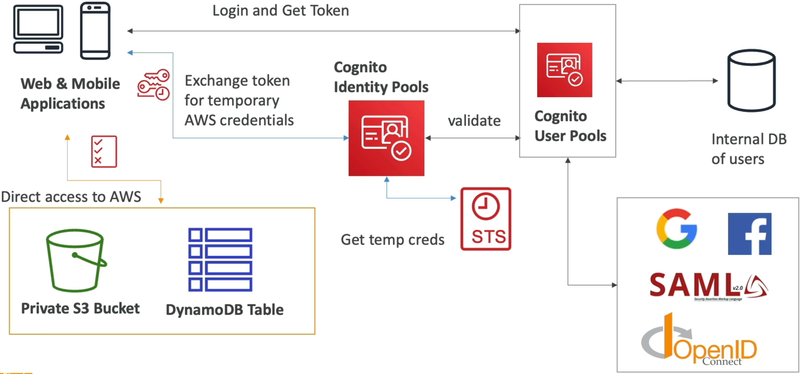

# Cognito User Pools vs Cognito Identity Pools

**Amazon Cognito User Pools (CUP)** and **Amazon Cognito Identity Pools** solve two fundamentally different cryptographic engineering problems. Mixing them up during stack design is how security policies break and how code pipelines fail.

---

## Key Takeaways

Let’s smash through the comparison matrix and solidify your understanding of the two services.

### ⚖️ The Definitive Architectural Split

| Feature Criteria           | 🔑 Cognito User Pools (CUP)                                                                  | 🪪 Cognito Identity Pools                                                                   |
| -------------------------- | -------------------------------------------------------------------------------------------- | ------------------------------------------------------------------------------------------- |
| **Core Operational Focus** | **Authentication (Identity Verification)** — _Who are you?_                                  | **Authorization (Access Control)** — _What can you touch inside AWS?_                       |
| **Primary Data Output**    | Standard web **JSON Web Tokens (JWTs)**: ID, Access, and Refresh tokens.                     | Temporary **AWS IAM security credentials** (via AWS STS API lines).                         |
| **Underlying Directory**   | **Yes.** Maintains a massive, fully managed database engine of actual user profiles.         | **No.** Has no data directory of its own; acts strictly as an exchange token broker.        |
| **Unauthenticated State**  | Requires a defined account registration state to function.                                   | Natively allows **Guest / Anonymous access** to pass down baseline roles.                   |
| **Gateway Destinations**   | Native security firewalls for **APIs YOU built** (API Gateway / Application Load Balancers). | Secure direct SDK bypass for **APIs AWS built** (writing straight to S3 / DynamoDB tables). |

---

### 🤝 The Perfect Architectural Synergy Loop

When building highly secure, modern web or mobile applications, **best practices dictate deploying both services side-by-side to handle the two-part security handshake.**

```text
📱 CLIENT DEVICE (SPA/MOBILE)
   │
   ├── 🧠 STEP 1: AUTHENTICATION (CUP)
   │   ├── User types password / social login into the Hosted UI / Managed Login portal.
   │   └── User Pool validates the credentials and hands back Base64 JWT Tokens.
   │
   └── 🪪 STEP 2: AUTHORIZATION (Identity Pool)
       ├── Client presents that CUP JWT straight to the Identity Pool.
       ├── Identity Pool runs background checks, then fires `AssumeRoleWithWebIdentity` to STS.
       └── STS dispenses short-lived, temporary AWS IAM credentials (Access/Secret keys)!

```

Once that dual handshake resolves, your application client holds the ultimate power: it drops those temporary credentials right into its local AWS SDK layer and reads or writes its data folders completely bypassing your custom backend application servers entirely.



---

### 🔒 Row-Level Variables: Securing the Shared Target

The crowning glory of hooking an Identity Pool up to an IAM policy configuration is the leverage of dynamic **Policy Variables**, chief. Instead of writing millions of separate security roles, you pass a single baseline policy wrapper carrying the magic string:

$$\mathbf{\$\{cognito-identity.amazonaws.com:sub\}}$$

- **The Runtime Magic:** The exact millisecond your authenticated user tries to execute an API call against a shared Amazon DynamoDB table or an Amazon S3 storage bucket, the IAM evaluation engine dynamically intercepts the action. It swaps out that variable tag for the user's explicit resolved Cognito Subject ID string on the fly!
- **The Result:** User A can effortlessly query rows or write files inside paths matching their explicit user tracking ID, but if they attempt to sniff out or modify User B's partition keys, the boundary blocks them instantly at the cloud layer—achieving **row-level and folder-level multi-tenant isolation** with absolute zero application logic code overhead.

---

## Exam Tips

- **The Architectural Handoff Key Match 🚨:** If an exam scenario presents a mobile development group that needs to build a scalable application directory supporting social media sign-ins, and simultaneously requires that those verified accounts have the direct capacity to fetch secure configuration blocks out of a private Amazon DynamoDB cluster—**look straight for the answer choice that combines Cognito User Pools for the initial User Authentication token minting step, with Cognito Identity Pools for the subsequent AWS IAM Credentials Exchange authorization step.**
- **The Token Target Audit:** Keep locked in your back pocket for multi-choice prompts:
  - If you are hitting **API Gateway**, pass the raw **JWT Token** straight from your User Pool.
  - If you are hitting the raw **S3 API directly via the SDK**, exchange that token first via the Identity Pool to pull down **IAM Access Keys**.
