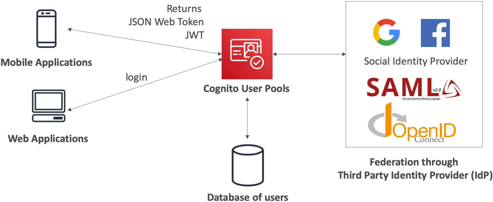
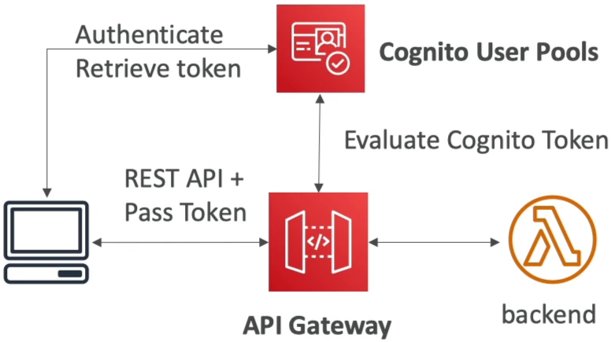
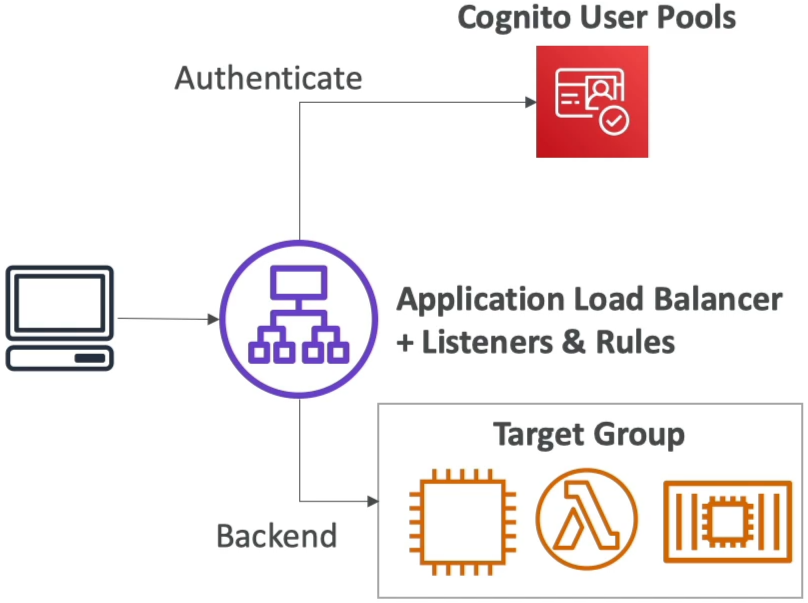

# Cognito User Pools

Building out a native directory layer using **Amazon Cognito User Pools (CUP)** is how you establish a fully serverless, ultra-secure, and highly scalable user base without writing a single line of tedious backend user-management code. 🏎️🛡️

Think of a Cognito User Pool as a highly optimized, fully managed user directory service. It takes the entire heavy lifting of customer self-registration, password resets, Multi-Factor Authentication (MFA), and session token validation completely off your plate, letting you focus strictly on shipping core features.

---

## Key Takeaways

Let’s dissect the identity tokens, network gateways, and high-frequency developer patterns you need to master for your DVA-C02 exam.

### 🏛️ The Core Directory Mechanics

When a customer logs into your app using their username/email or hooks in via **Social Identity Providers** (like Google, Facebook, Apple) or enterprise directories (via SAML 2.0 or OpenID Connect), Cognito processes the handshake and returns a set of three distinct cryptographic **JSON Web Tokens (JWTs)** right to the client device:

```text
🔑 THE NATIVE JWT TRIPLE-STACK:
   ├── 🪪 1. Identity Token (ID Token)  ──► Contains user profile claims (e.g., email, name, custom attributes).
   ├── 🔑 2. Access Token               ──► Contains operational OAuth scopes to authorize API processing lanes.
   └── 🔄 3. Refresh Token              ──► A long-lived token used to automatically pull fresh tokens without forcing a re-login!
```



---

### 🛰️ Natively Integrated Gateway Guardrails

Once your front-end client app secures these JWTs from the user pool, it passes them along inside the HTTP `Authorization` header to hit your protected backend workloads. Two core AWS network components handle evaluating these tokens natively over the wire:

#### ⚡ Option A: Amazon API Gateway (The Serverless Firewall)

You don't need to write custom validation code in your Lambda functions to parse signatures. You simply configure a native **Cognito Authorizer** right inside the API Gateway console interface.

- _The Security Flow:_ API Gateway intercepts the inbound HTTP request, cryptographically validates the token's JSON Web Signature against your User Pool's public keys, inspects expiration scopes, and passes the parsed user metadata straight down to your backend Lambda code while instantly blocking unauthorized attackers at the perimeter!  
  

#### 🏎️ Option B: Application Load Balancer (ALB)

If you're running your microservices on top of classic EC2 instance pools, Docker containers in ECS, or local server routes, the ALB handles the security gate seamlessly.

- _The Security Flow:_ You create an ALB listener rule with an **`Authenticate: cognito`** action block. The load balancer transparently intercepts unauthenticated traffic, redirects the browser straight to your User Pool’s hosted login UI page, validates the resulting authentication token, and seamlessly forwards the vetted request down to your backend target groups!  
  

---

## Exam Tips

- **The Client Application Security Trap 🚨:** This is a guaranteed architecture trick question on the exam. If a prompt requires you to configure an App Client path inside a Cognito User Pool to facilitate authentication for a public SPA (Single Page React/Vite App) or a native mobile app—**ensure that the "Generate client secret" checkbox is explicitly UNCHECKED (creating a Public Client).** Public frontend environments cannot securely hide a symmetric cryptographic secret key; exposing it in a user's browser dev tools completely breaks your security posture!
- **The Pre-Authentication Validation Rule:** If a scenario presents a rule requiring that whenever a user attempts to sign up or sign into your system, their email suffix must be audited against a corporate domain whitelist, or their custom user profile properties must be decorated on the fly before their session starts—**look straight for linking an AWS Lambda Trigger (like the `Pre Sign-up` or `Pre Authentication` hooks) directly inside the User Pool behavior configuration panel.**
