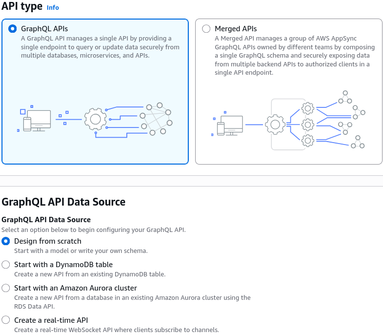
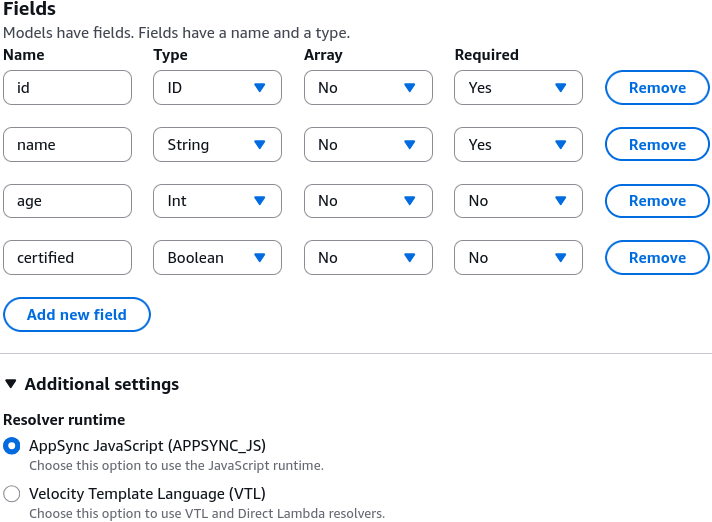
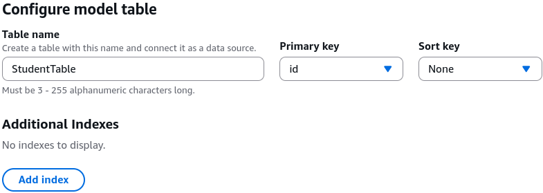
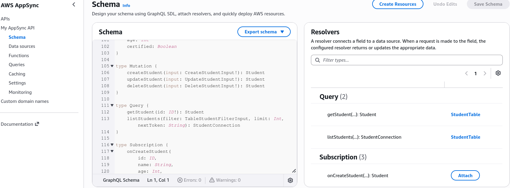
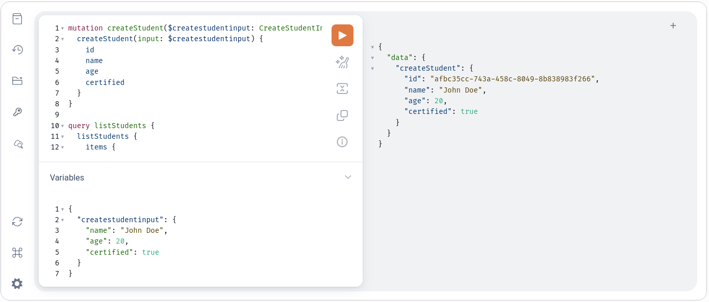
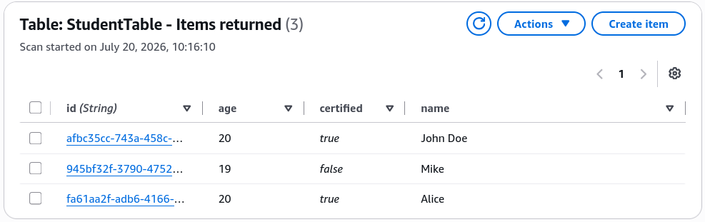
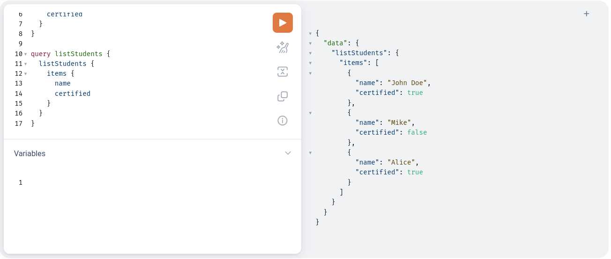
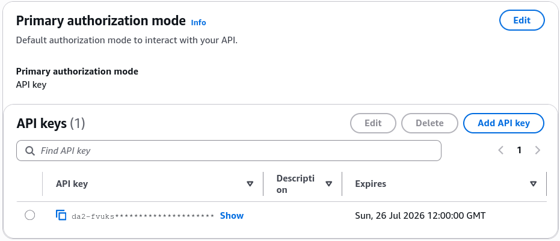
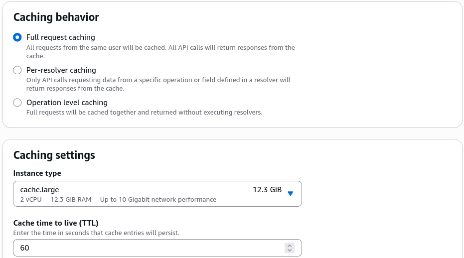

# AppSync Hands On

We're going to see **AWS AppSync GraphQL API** dynamically spin up its own database infrastructure, map out its own schemas, and process structured JSON mutations over the wire is an absolute leveling-up play. 🏎️🕸️

Stephane's walk-through exposes the absolute serverless convenience of this pattern: you map a data model layout visually, and AWS takes over the entire heavy lifting of provisioning the database backend and managing the endpoint listeners.

---

## Hands On

### 🎛️ 1. Initializing the Managed GraphQL API Engine

- **The Ingress Path:** Open up the **AWS AppSync Console** dashboard ──► hit **Create API**.
- **Select Architecture Shape:** Choose **GraphQL API** (the foundational engine structure) ──► select **Design from scratch** ──► name the workspace explicitly `My AppSync API` ──► hit Next.  
  
- **Define the Structural Model Type:** Tell the wizard you want the data type backed by a fresh **Amazon DynamoDB table** right out-of-the-box.
  - _Model Name:_ Set this to `Student`.
  - _Configure Attributes:_ Drop in fields for `id` (Type: ID, Required), `name` (Type: String, Required), `age` (Type: Int, Optional), and `certified` (Type: Boolean, Optional).  
    
- **Bind the Database Pipeline:** Name the target database layer `StudentTable` and set the primary partition index key to `id`. Hit Next ──► hit **Create API**!  
  

---

### 📊 2. Behind-the-Scenes Infrastructure Verification

- **The Automatic Provisioning Engine 🏗️:** The exact millisecond the AppSync creation loop finishes, it calls the DynamoDB APIs in the background to automatically build out a physical, fully configured `StudentTable` matching your exact primary keys.
- **The Auto-Generated ASL Schema 📄:** AppSync automatically compiles a complete GraphQL schema definition file, complete with pre-baked standard **Queries** (like `getStudent`, `listStudents`) and **Mutations** (like `createStudent`, `updateStudent`, `deleteStudent`).  
  
- **The Data Source Map:** The console automatically links your fresh DynamoDB cluster straight into the AppSync API layer as a native, zero-latency direct data source resolver.

---

### 🧪 3. Executing Live GraphQL Operations (The Queries Tab)

Jump into the built-in console query console engine to test the active over-the-wire communication loops:

- **Write Data (The Mutation Flow) ✍️:** Select the `createStudent` mutation block from the schema explorer, inject your parameter payloads inside the JSON input drawer, and fire the run command:  
  

- _The Storage Check:_ Fire a few student variations (like Mike and Alice). If you pivot straight to the DynamoDB console and scan your live table items, you will see the exact data objects perfectly stored with auto-generated UUID key strings.  
  

- **Read Data (The Query Select Flow) 🔍:** Switch the workspace toggle over to execute the `listStudents` query. Because it's GraphQL, you explicitly write out only the attributes your client application needs to display on screen (e.g., asking for _just_ the `name` and `certified` flags, skipping the `age`). AppSync parses the request, fetches the rows from DynamoDB, strips out the unrequested data fields, and returns a pristine, highly optimized JSON array!  
  

---

### ⚙️ 4. Advanced Security, Caching, & Production Settings

- **Authorization Multi-Stacking 🛡️:** By default, the API provisions a standard `API_KEY` for testing. However, the settings drawer exposes the real enterprise power, chief: **AppSync natively allows you to configure multiple authorization providers simultaneously!** You can lock down your public queries with an API Key while securing private user mutations with a native **Amazon Cognito User Pool** or custom IAM Roles.  
  
- **Performance Optimization (Caching Framework) ⚡:** The caching pane allows you to turn on high-performance in-memory caching layers—offering **Full request caching** or **Per-resolver caching** to slash read-latencies and protect your backend DynamoDB tables from massive traffic spikes.  
  
- **The Final Polish (Custom Domains):** Maps out the configuration drawer to cleanly attach an alternate custom sub-domain name string fronted by an SSL certificate.

---

## Exam Tips

- **The No-Code Resolver Reality:** Always keep top of mind for exam scenarios that AppSync's ability to act as a direct proxy to DynamoDB means **you do not need an intermediary AWS Lambda function to execute simple CRUD data operations.** This cuts architectural complexity and slashes your execution bill down to zero compute duration fees.
