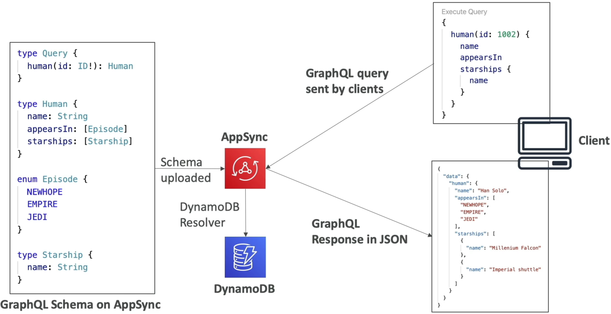
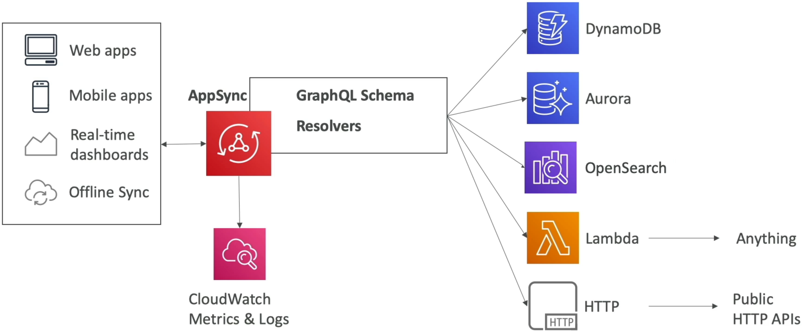

# AppSync Overview

Flipping the script from traditional, bulky REST APIs straight over to **AWS AppSync** is how you build an elite, hyper-efficient, and data-decoupled backend API layer, chief! 🏎️ Graphing your data means giving frontend teams the ultimate superpower: the ability to request the exact fields they need, and absolutely nothing more.

No more over-fetching massive payloads over cell networks or spinning up multiple round-trip HTTP requests to patch together user data, profile links, and orders. AppSync synthesizes everything down into a single, cohesive endpoint.

---

## Key Takeaways

Let’s check the schemas, the direct resource resolvers, the real-time engine, and the mission-critical security boundaries you need to lock down to crush your DVA-C02 exam.

### 🏛️ The Core Engine: GraphQL Schemas & Resolvers

AppSync is a fully managed, serverless **GraphQL as a Service** engine. To stand up a live endpoint, you only need to manage two foundational architectural components:

- **The GraphQL Schema 📄:** A strongly-typed blueprint file that maps out your data model, operations, and attributes. It defines your **Queries** (read actions), **Mutations** (write/update actions), and **Subscriptions** (real-time stream triggers).
- **The Resolvers 🧠:** The computational engines behind the fields. Resolvers map your GraphQL fields straight to the background data stores.

```text
🌎 FRONTEND APP ──► 1. Executes Query ──► 🕸️ AWS APPSYNC (GraphQL Engine)
                                                │
       ┌────────────────────────────────────────┼────────────────────────────────────────┐
       ▼ DIRECT DATA RESOLVER                   ▼ DIRECT DATA RESOLVER                   ▼ LAMBDA RESOLVER
 📊 Amazon DynamoDB                       🗄️ Amazon RDS Aurora                     ⚙️ AWS Lambda
(No-code CRUD parsing)                  (Direct Relational SQL)                  (Custom Logic/Any API)
```

The absolute magic of AppSync is its **Direct Integrations**. You don't have to spin up a costly, slow Lambda function just to pull a row out of a database. AppSync connects directly to your target data sources via high-performance VTL or JavaScript resolver mappings:

- **Amazon DynamoDB:** The ultimate serverless match. Instantly writes or reads items out of key-value tables.
- **Amazon RDS (Aurora Serverless):** Fires direct SQL strings down to relational databases via the Data API.
- **Amazon OpenSearch Service:** Runs complex full-text search indexes, geofencing queries, and aggregations.
- **HTTP Endpoints & AWS Lambda:** If your data lives inside a legacy third-party REST API or requires heavy business-logic processing before returning to the user, you route the resolver through a Lambda function to easily bridge the gap!



---



### ⚡ Real-Time WebSockets & Mobile Offline Synchronization

Beyond parsing standard request-response data queries, AppSync dominates two specific real-time architecture paths:

- **Managed WebSockets Protocol 🛰️:** Building a real-time chat application, live sports tracking board, or collaborative document space usually requires managing a massive fleet of servers to keep WebSocket connections open. AppSync takes over that entire operational overhead out of the box. Frontend clients establish a single secure WebSocket channel, subscribe to specific data mutations, and AppSync automatically pushes live JSON updates out the millisecond data changes!
- **The AppSync Mobile Sync Framework (Cognito Sync Replacement) 📲:** If you are building a modern mobile app, your users expect it to work flawlessly even inside planes or subways with zero network connection. Combined with the **AWS Amplify Client SDK**, AppSync acts as the official modern cloud replacement for the legacy _Cognito Sync_ engine. It allows devices to interact with a local cached database layer offline, tracks metadata changes, and executes automated **Conflict Resolution** rules (like Optimistic Concurrency, Automerge, or Lambda-custom overrides) the exact second the device reconnects to the network.

---

### 🛡️ The AppSync Security Gate: Four Authorization Vectors

Because your API layer is fully exposed to the public web, AppSync ships with four native, foundational authorization models to strictly regulate who can execute queries, mutations, or subscriptions:

1. **`API_KEY` 🔑:** A simple, hardcoded string key passed along inside the HTTP headers. It’s perfect for public guest access, testing sandbox environments, or setting up lightweight dev connections. These keys have a maximum expiration lifespan of 365 days.
2. **`AWS_IAM` 🪪:** Leverages standard AWS Identity and Access Management signatures. Perfect for internal microservices, backend ECS containers, or cross-account data exchanges that carry dedicated IAM Execution Roles.
3. **`AMAZON_COGNITO_USER_POOLS` 👥:** Integrates directly with your user directory databases. Users pass their validated Cognito JWT access token to AppSync. The engine evaluates their profile claims and can even lock down fields based on whether a user belongs to a specific Cognito User Group (e.g., `"PremiumUsers"` or `"Admins"`).
4. **`OPENID_CONNECT` (OIDC) 🌐:** Allows you to authorize API traffic using any external third-party OIDC-compliant identity provider (like Okta or Auth0) by parsing their standards-based JSON Web Tokens over the wire.

---

### 🌐 Custom Domains & The Hidden Infrastructure Rule

If compliance requires you to discard the generic, auto-generated endpoint host prefix URL (`https://xxxx.appsync-api.ap-southeast-2.amazonaws.com/graphql`) and replace it with a clean corporate alternate domain layout (like `api.mycompany.com`), AppSync features a native **Custom Domain Names** panel.

:::tip
Under the hood, when you spin up a native Custom Domain inside the AppSync configuration layer, AWS automatically provisions a hidden, fully managed **Amazon CloudFront Distribution** to secure and terminate edge traffic seamlessly.
Because of this CloudFront design, you must obey the absolute global security certificate boundary: **Your Alternate Domain's SSL/TLS Certificate must be requested or imported into AWS Certificate Manager (ACM) explicitly inside the US-East-1 (N. Virginia) region.** Even if your core AppSync endpoint and database tables are running out of Sydney or Tokyo, a certificate created in those local home regions will cause the custom domain binding pipeline to fail instantly.
:::

---

## Exam Tips

- **The Under-Fetching/Over-Fetching REST Crisis:** If an exam prompt describes an engineering group struggling with a mobile application that keeps crashing or lagging because the front-end has to execute five separate cascading REST API calls down to the server to render a single dashboard view—**look straight for the answer that migrates the API architecture tier to AWS AppSync, using GraphQL queries to collapse multiple data source fetches into a single optimized network round-trip request.**
- **The Modern Offline Synchronization Option:** If a scenario prompt presents a mobile application deployment for field service workers that requires offline data availability and automated synchronization/conflict resolution strategies when devices drop off the cellular grid, and asks for a modern replacement for the legacy _Cognito Sync_ utility—**choose the answer that implements AWS AppSync combined with the AWS Amplify framework.**
