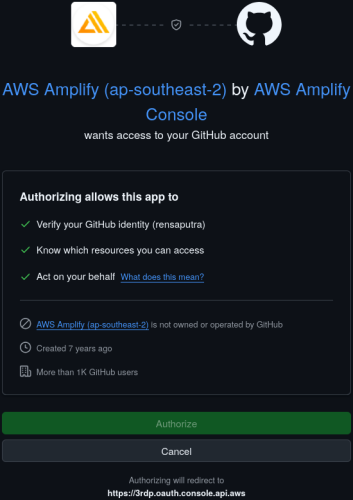
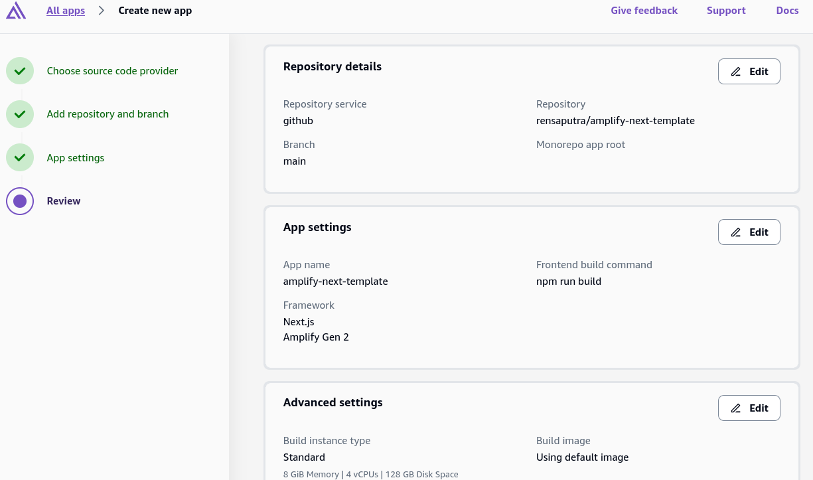
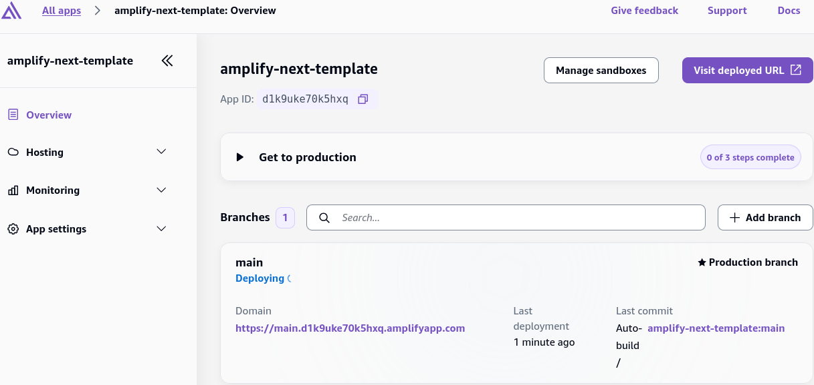
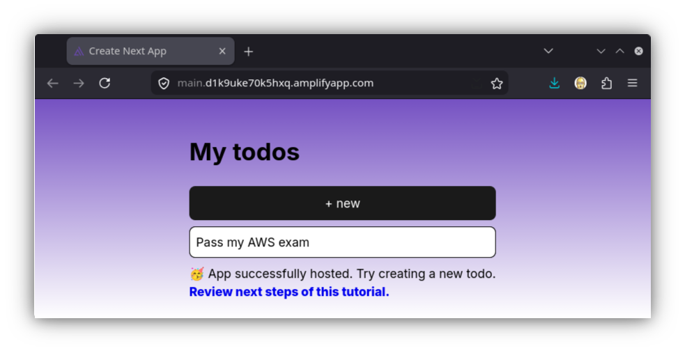
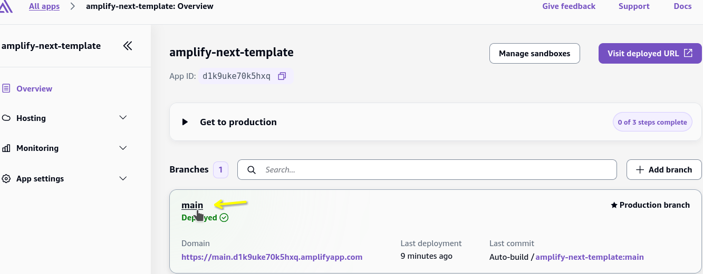
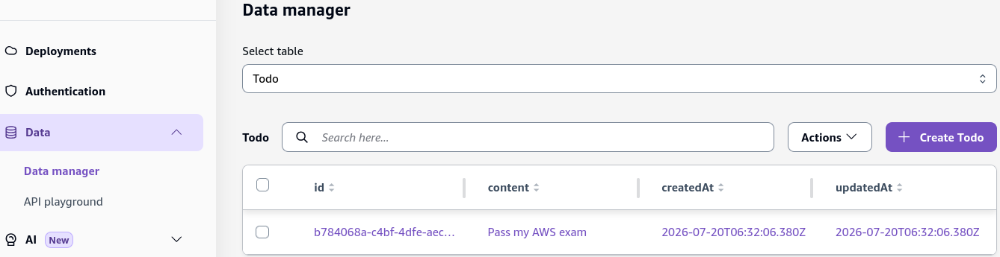
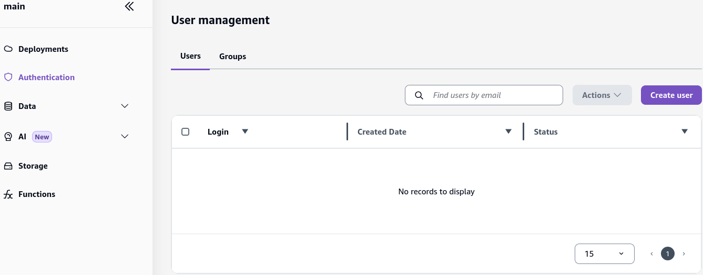

# AWS Amplify - Hands On

Stephane’s walk-through exposes how Amplify abstracts away the painful parts of full-stack engineering. By connecting a repository to Amplify, the platform automatically initializes continuous deployment, provisions underlying **AWS CDK / CloudFormation stacks** behind the scenes, and wires up live database viewers without you having to configure a single IAM trust policy manually!

---

## Hands On

Let's walk through a live **AWS Amplify hands-on deployment** from Git clone all the way to full-stack cloud provisioning.

### 🎛️ 1. Connecting the Source Repository & Bootstrapping Stacks

- **Fork the Template:** Clone the sample React application template repository directly into your own **GitHub** account.
  - I chose a Next.js (App Router) template, as it's the most I'm familiar with, here's the link to the template repo [amplify-next-template](https://github.com/aws-samples/amplify-next-template).
- **Authorize the Pipeline:** Head into the **AWS Amplify Console** ──► hit **Create new app** ──► select **GitHub** as your source code provider. Grant Amplify permission to read your repository.  
  
- **Build Settings Setup:** Select your cloned `amplify-vite-react-template` repository ──► leave default build settings intact ──► authorize Amplify to auto-create an IAM Service Role. Hit **Save and deploy**.  
  
- **Underlying Infrastructure Bootstrapping 🏗️:** The exact millisecond deployment starts, Amplify triggers **AWS CDK** in the background. If you pivot to the **CloudFormation Console**, you will see a root stack alongside nested stacks automatically spinning up your frontend hosting and backend resources!  
  

---

### 📊 2. Managing Data, Users, & Backend Storage

Once the build pipeline completes, click your generated live domain link (e.g., `https://main.dXXXXXXXXX.amplifyapp.com`) to test the app live! Drop in a few To-Do items (like _"Pass my AWS exam"_).  
 

Now jump back into the **Amplify Console (Production Branch view)** to explore the management drawers:

- 
- **Data Manager (DynamoDB Direct) 📊:** Click into the Data tab. Amplify provides an out-of-the-box visual administrative drawer where you can view, edit, or create new To-Do records live! _Behind the Scenes:_ Open the **Amazon DynamoDB Console** to confirm that Amplify built a dedicated `TodoTable` where your items sit securely with unique primary keys.  
  
- **User Management (Cognito Integration) 👥:** The central identity drawer. Adding authentication to your app routes straight through here, backing your user sign-ups and security policies with **Amazon Cognito User Pools**.  
  
- **Storage & Functions (S3 & Lambda) 📁:** Provides abstract management panels for file storage (backed by **Amazon S3**) and custom backend business logic functions (backed by **AWS Lambda**).

---

### 🧹 3. Clean-Up Protocol

When testing finishes, keep your playground account squeaky clean:

1. Go to **App Settings** inside the Amplify Console ──► **General** ──► hit **Delete app** to wipe all linked CloudFormation and CDK stacks.
2. Jump over to your GitHub account settings, scroll to the bottom of the repository settings page, and hit **Delete repository** to complete the teardown!

---

## Exam Tips

Always remember for scenario-based questions that while Amplify feels like magic, **every single backend resource created inside Amplify is explicitly represented as standard Infrastructure as Code (IaC) via AWS CDK and CloudFormation stacks!** If your DevOps team needs to inspect, extend, or enforce compliance rules on Amplify backends, they can easily export the CDK constructs straight into existing corporate CI/CD pipelines.
