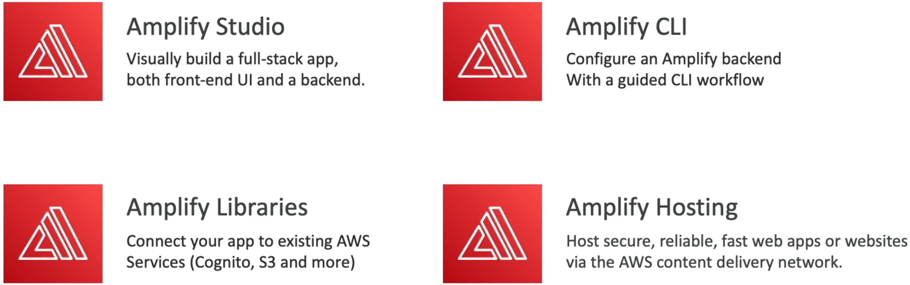
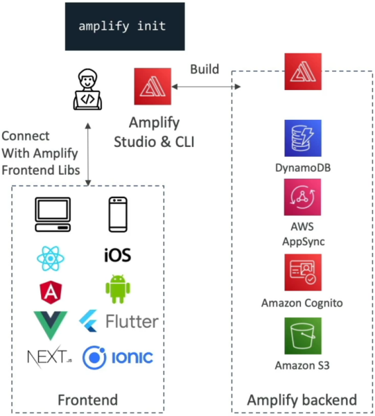
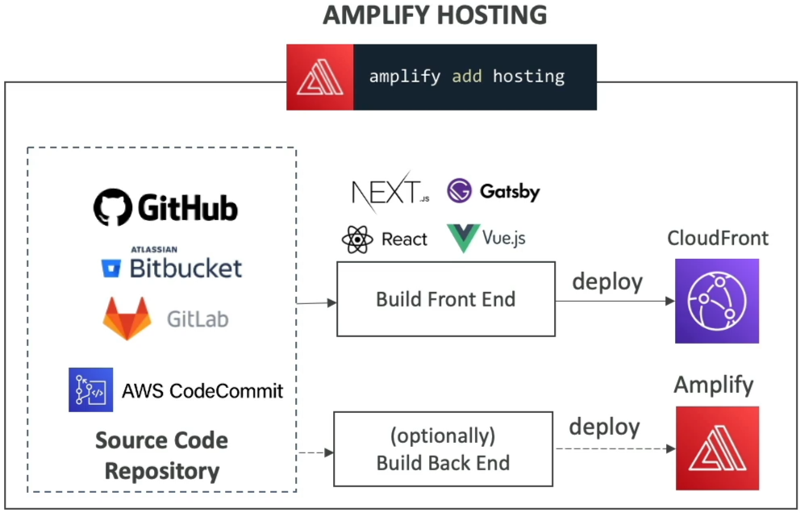
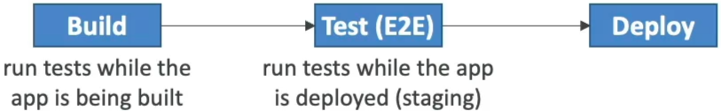
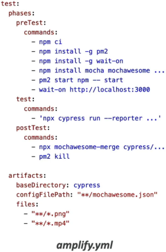

# AWS Amplify

**AWS Amplify** is basically the absolute king of rapid full-stack app prototyping and deployment. 🏎️💨

If you want a mental model for the exam, **think of AWS Amplify as the Elastic Beanstalk for mobile and web applications.** Instead of manually stitching together S3 buckets, Cognito user pools, AppSync GraphQL schemas, and CloudFront CDNs using thousands of lines of CloudFormation, Amplify acts as a unified abstraction layer that spins up and wires all those backend services together in minutes!

---

## Key Takeaways

Let's dissect the core toolchain, CLI workflows, and testing pipelines you need to master for your DVA-C02.


### 🧰 The Four Pillar Components

Amplify splits its operational landscape into four distinct tools, chief:

- **Amplify Studio / Code Gen 🎨:** A visual workspace interface where you can visually design your full-stack backend models, generate front-end React/Vue component code, and map UI elements straight to your data models.
- **Amplify CLI 🛠️:** The command-line powerhouse. You run `amplify init` in your terminal to initialize a fresh project wrapper right inside your local repository.  
  
- **Amplify Libraries 📚:** Pre-built client SDK packages available for React, Vue, Angular, Next.js, iOS, Android, and Flutter. They make connecting your frontend code to Cognito or S3 as simple as calling a single JavaScript function!
- **Amplify Hosting 🌐:** A fully managed, continuous integration and deployment (CI/CD) hosting engine (competing directly with services like Vercel or Netlify). It pulls code directly from GitHub, Bitbucket, GitLab, or AWS CodeCommit, builds your static/SSR assets, and serves them over CloudFront.  
  

---

### ⚡ High-Frequency CLI Blueprint Commands

When building out features, you use intuitive terminal commands to instantly provision heavy AWS backend infrastructure:

```text
🛠️ AMPLIFY CLI COMMAND MATRIX:
   ├── 🔑 amplify add auth    ──► Provisions Amazon Cognito (MFA, Social Logins, Self-Signup).
   ├── 📊 amplify add api     ──► Provisions AWS AppSync (GraphQL) + Amazon DynamoDB (DataStore).
   ├── 📁 amplify add storage ──► Provisions Amazon S3 buckets for user file uploads.
   └── 🌐 amplify add hosting ──► Connects repo for automated Git-based CI/CD hosting pipelines!
```

:::tip
**The Offline DataStore Power:** When you execute `amplify add api`, Amplify configures **Amplify DataStore**. Powered by AppSync and DynamoDB, it gives mobile and web apps local-first offline reading/writing capabilities, automatically syncing data and resolving conflicts behind the scenes the exact millisecond the user's phone regains cellular network!
:::

---

### 🧪 CI/CD & The Testing Matrix (Build-Time vs. End-to-End)

This is a massive validation track on the DVA-C02 exam. When you deploy via **Amplify Hosting**, your pipeline execution rules are defined directly inside your repository's **`amplify.yml`** build specification file.

Amplify explicitly segregates testing into two distinct phases:

```text
📦 AMPLIFY BUILD PIPELINE (amplify.yml)
   ├── 1. BUILD PHASE   ──► Runs Unit Tests (Tests individual code functions in isolation)
   ├── 2. DEPLOY PHASE  ──► Spins up application instance / previews
   └── 3. TEST PHASE    ──► Runs End-to-End (E2E) Tests via CYPRESS Framework 🌲
```



#### 🌲 The Cypress E2E Integration Rule

Inside the `test` phase block of `amplify.yml`, Amplify natively integrates with the **Cypress** testing framework.

- **Why Cypress?** Cypress simulates a real web browser headless instance. It programmatically opens your newly deployed application URL, clicks buttons, fills out forms, tests user sign-in flows, and validates usability.
- **Visual Reporting:** Amplify generates a comprehensive UI test report (using tools like Mochawesome) directly inside the console build logs, allowing developers to catch UI regressions _before_ the code promotes to live production traffic!  
  

---

## Exam Tips

- **The Rapid Full-Stack Web App Trap:** If an exam prompt describes a developer who needs to rapidly build a mobile app with user authentication (Cognito), file storage (S3), and a real-time database API (AppSync + DynamoDB) without manually writing backend CloudFormation infrastructure templates—**always select AWS Amplify as the top choice.**
- **The E2E Testing Framework Question:** If a scenario asks how to run automated, headless end-to-end browser tests against a front-end application right after the build phase completes inside the Amplify Hosting pipeline—**look straight for configuring Cypress testing inside the `amplify.yml` buildspec file.**
