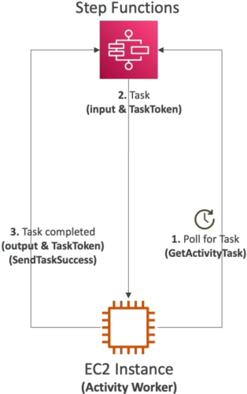

# Step Functions - Activity Tasks

When you need your state machine to offload heavy processing down to distributed background fleets—like long-running batch jobs on an EC2 cluster, embedded IoT microcontrollers, or deep-learning containers—and you want your worker nodes to **actively fetch their own work rather than reacting to messages dropped in a queue**, you deploy **Step Functions Activity Tasks**. 🏎️📡

While the goal feels very similar to the `__waitForTaskToken` callback layout we just crushed, the entire data ingestion philosophy flips completely on its head. We transition from a dynamic **push-based messaging framework** straight over to a highly organized, **pull-based worker execution loop**.

---

## Key Takeaways

Let’s unpack the operational mechanisms, API orchestration loops, and the vital heartbeat check guardrails you need to know for your DVA-C02 exam.

### 🔄 The Pull-Based Execution Architecture

In a standard callback workflow, Step Functions actively _pushes_ a payload out of the engine into an external landing gate (like Amazon SQS). **With Activity Tasks, the pattern is entirely poll-driven.**

You define a named placeholder boundary called an **Activity ARN**, and your worker nodes continuously query that endpoint directly for work, creating a very simple network layout since workers only need outbound connectivity to the Step Functions endpoint:



```text
⚙️ STATE MACHINE AXIS ⚡
   └── [ Activity State: Pause & Hold ]
           ▲                 │
           │ 1. API:         │ 2. Payload Handover
           │ GetActivityTask │    & Task Token Distributed
           │                 ▼
🏗️ DISTRIBUTED WORKER FLEET (EC2 / ECS Containers / Bare Metal / IoT Devices)
   └── Process Heavy Data Loops Offline...
           │
           └── 3. API: SendTaskSuccess / SendTaskFailure ──► Resumes State Machine Line!
```

---

### 🎛️ The Core API Orchestration Loop

To move data across the firewall, your worker nodes continuously execute a lightweight triple-stack API sequence using the AWS SDK:

- **`GetActivityTask` 🛰️:** The intake pull request. Workers target the specific Activity ARN and loop this call. If a workflow execution hits that state, Step Functions halts its engine, packages the input JSON variables, generates a unique base64 `TaskToken`, and hands the entire bundle down to the polling worker node.
- **`SendTaskHeartbeat` 💓:** The life-support signal. While the worker is grinding away on a long compute task offline, it regularly fires this ping back to the cloud to signal: _"I am still working, do not time me out!"_
- **`SendTaskSuccess` / `SendTaskFailure` 🎯:** The closing gate. Once the computing loops finish, the worker submits this method passing the output payload matching the exact original `TaskToken` to smoothly resume the main state machine pipeline.

---

### ⏱️ Guarding Long Runs: Heartbeats vs. Timeouts

Because Activity Tasks can run on unmanaged or external infrastructure that could crash or drop network connections out of nowhere, Step Functions introduces a dual-clock safety net to ensure your pipelines never hang indefinitely:

- **`TimeoutSeconds` ⏳:** Sets the absolute maximum ceiling duration parameter a task is permitted to remain in an active processing loop before the system flags it as a hard failure. **If you keep feeding the heartbeat loop continuously, an activity task can technically hold its state line open for up to one full year!**
- **`HeartbeatSeconds` 💓:** Dictates the maximum allowable time window between heartbeat pings before the orchestrator assumes the worker machine has dropped dead or crashed offline.

:::tip
If you configure your state machine's `HeartbeatSeconds` variable to a value of **10 seconds**, your background application logic loop should be coded to fire the `SendTaskHeartbeat` API call **every 5 seconds.** If you cut the window too close to the line, minor network jitter will cause the state machine to throw a hard `States.Timeout` exception, killing your execution lane prematurely!
:::

---

## Exam Tips

- **The Push vs. Pull Network Isolation Choice:** If an exam scenario presents a strict corporate firewall rule where internal security teams forbid AWS from pushing notification payloads or events directly into an on-premise datacenter network, but allows secure servers inside that datacenter to make standard outbound HTTPS calls to the public internet—**bypass the SQS `waitForTaskToken` callback strategy entirely! Choose the answer that implements Step Functions Activity Tasks, enabling the on-premise servers to cleanly poll out using the `GetActivityTask` API loop.**
- **The Unmanaged Worker Drop Recovery:** If a prompt describes a cluster of spot-instance EC2 workers processing intensive media rendering tasks pulled from Step Functions, and asks how to ensure that if a spot instance is suddenly terminated mid-job, the state machine instantly detects the crash and routes a cleanup task—**look straight for setting a tight `HeartbeatSeconds` parameter on the Activity state, allowing the engine to catch the missing ping and trigger a `Catch` fallback route immediately.**
