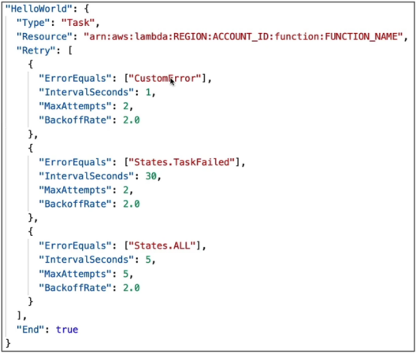
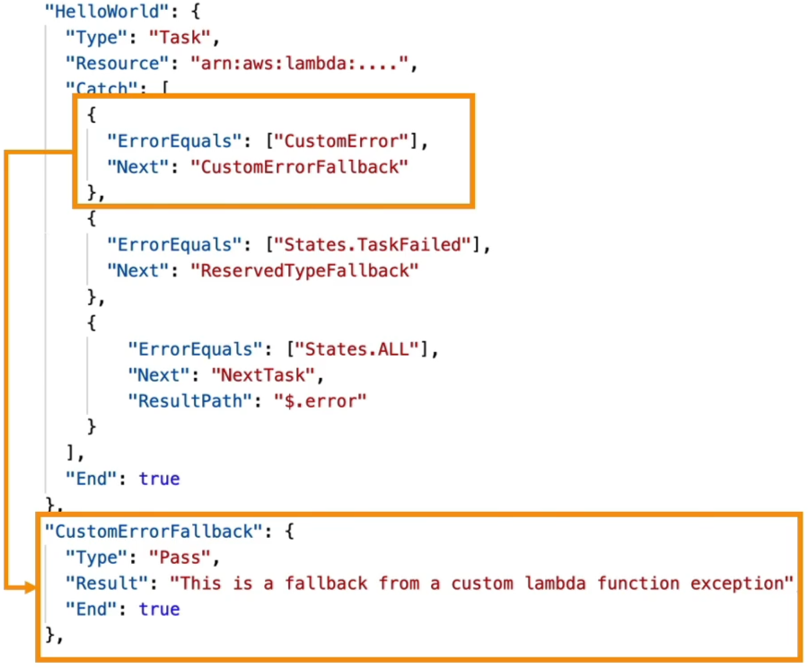
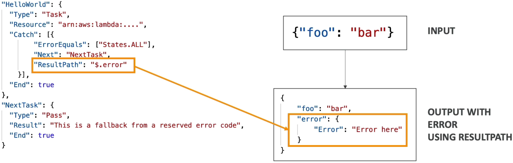

# Step Functions - Error Handling

If you are writing complex nested `try/catch` loops inside a Lambda function, setting manual execution timeouts, and managing your own tracking database records just to handle a temporary network drop, you are burning valuable code velocity. If a transient network glitch happens or an downstream database chokes, **the Lambda function should crash hard on purpose.** You let the orchestrator—**AWS Step Functions**—intercept the crash, manage the retry logic metrics, and route fallback pathing loops completely out-of-band.

---

## Key Takeaways

### 🛠️ The Core Cloud Error Codes Grid

When a `Task`, `Map`, or `Parallel` state blows up at runtime, Step Functions matches the failure behavior against these native, predefined core exception strings:

- **`States.ALL` 🃏:** The ultimate global catch-all wildcard descriptor. Matches any known runtime error type signature.
- **`States.Timeout` ⏳:** Thrown the absolute microsecond a task execution surpasses the explicit `TimeoutSeconds` metric limit or drops its background activity `HeartbeatSeconds` monitoring clock.
- **`States.TaskFailed` 📉:** Caught when the target computing unit completely chokes at runtime—like a Python or Node.js Lambda function throwing an unhandled code exception array or running entirely out of runtime memory.
- **`States.Permissions` 🔑:** Dropped when the state machine's underlying IAM execution role lacks sufficient privilege scopes to successfully invoke the downstream target resource asset.

---

### 🔄 The Micro-Engineered Retrier Matrix (`Retry`)

The `Retry` block array tells the orchestration system how to automatically salvage a transient runtime failure. Rules evaluate in a strict **top-to-bottom hierarchy**. Check out this highly resilient ASL payload breakdown:

#### 🎛️ The Math Mechanics Behind the Rate:

Let's trace that second retrier targeting a basic `States.TaskFailed` container crash:

- **Attempt 1:** Wait exactly $30\text{ seconds}$ (`IntervalSeconds`) before retrying.
- **Attempt 2:** Multiply the previous delay duration parameter by the `BackoffRate` ($30 \times 2.0 = 60\text{ seconds}$).
- If that final attempt fails, the retrier drops the session out because it hit its maximum threshold boundary (`MaxAttempts: 2`), forcing the flow instantly down into the active `Catch` infrastructure loop!

---

### 🎯 The Graceful Rescue Engine (`Catch`)

When retries are completely spent or an error matches a terminal code signature, you activate a **`Catch`** block array to steer the traffic payload cleanly into a fallback route state:

#### 🔀 The High-Stakes Target Filter: `ResultPath`

This is a high-frequency milestone concept on the blueprint. Pay close attention to how it handles JSON data injection paths:

- **The Default Behavior Trap 🚨:** If you do _not_ explicitly declare a `ResultPath` in your catcher parameters, **the returning error stack information object will completely nuke and overwrite the state machine's initial input payload data block.**
- **The Preservation Play 📥:** By configuring `"ResultPath": "$.errorInfo"`, the state machine smoothly intercepts the inbound data dictionary (like `{"foo": "bar"}`), injects the error logs cleanly under a fresh, nested sub-key tracker, and passes the combined tracking map down to the fallback node path:

This allows your downstream emergency handler steps (like an SMS alert manager or a Slack webhook publisher) to see exactly _why_ the pipeline crashed while retaining complete context of the user payload variables that triggered the event.

---

## Exam Tips

- **The MONSTROUS Lambda Bill Reducer:** If an exam prompt sets up a scenario where an engineering squad wants to optimize serverless operating budgets by ensuring an integration task retries transient network connection locks safely over a 10-minute window, but demands a solution that keeps individual compute execution times locked down to single-digit seconds—**choose the answer that strip out internal `while/retry` code blocks from the Lambda function entirely and leverages a Step Functions `Retry` block configured with an exponential `BackoffRate` and custom `IntervalSeconds` parameters.**
- **The Input Preservation Target:** If a question introduces a distributed task failure path where the fallback node keeps crashing because the user context data is completely missing by the time it lands inside the error tracking step—**look straight for fixing or adding an explicit `ResultPath` filter format (like `$.error`) on the Catcher parameter declaration list to prevent the raw error dictionary from overwriting the master state stream.**
