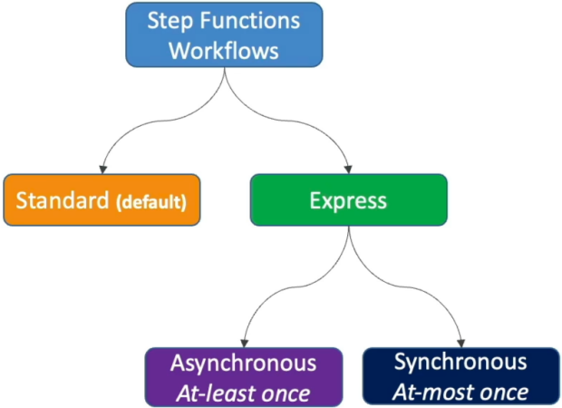

# Step Functions - Standard vs Express

Choosing between **Standard** and **Express Workflows** is the absolute highest-leverage optimization move you can make when architecting serverless state machines. 🏎️💨

If you map a high-throughput stream of microservices to the wrong engine, your AWS operating bill can swell out of control in minutes. But if you pick the right track, you can smoothly execute millions of operations a second for practically couch change.

---

## Key Takeaways

Let's make a distinction between the limits, the billing structures, and the high-stakes Execution Guarantees you must lock down to absolutely crush the DVA-C02 exam framework.



### 🏗️ The Architectural Divide: Standard vs. Express

AWS splits the Step Functions engine into two distinct deployment profiles based on execution duration, scale metrics, and auditing depth:

| Feature Matrix              | 🏛️ Standard Workflows                                         | ⚡ Express Workflows                        |
| --------------------------- | ------------------------------------------------------------- | ------------------------------------------- |
| **Max Run Duration**        | **Up to 1 full year** ⏳                                      | **Up to 5 minutes max** ⏱️                  |
| **Execution Throughput**    | ~2,000 starts per second                                      | **Over 100,000+ per second** 🚀             |
| **Pricing Model**           | **Per State Transition** ($0.025 per 1k)                      | **Per Request + Compute Duration** (GB-sec) |
| **Console Auditing**        | Complete 90-day visual step history ledger or CloudWatch Logs | **CloudWatch Logs exclusively** 📄          |
| **Integrations Exclusions** | None (Supports everything)                                    | **NO Activities or `.waitForTaskToken`** 🛑 |
| **Execution Model**         | **Exactly-Once** 🎯                                           | Split: _Asynchronous_ vs. _Synchronous_     |

---

### 🔀 The Core Execution Models (The Ultimate Exam Trap)

This is a milestone validation checkpoint on the certification blueprint. The exam loves to test if you know exactly how the micro-execution guarantees shift depending on whether your Express workflow is running synchronously or asynchronously:

```text
⚡ EXPRESS WORKFLOW EXECUTION MODELS:
   ├── 📤 A. ASYNCHRONOUS ──► AT-LEAST-ONCE  ──► (Fire-and-forget / Requires IDEMPOTENCY! 🔄)
   └── 📥 B. SYNCHRONOUS  ──► AT-MOST-ONCE   ──► (Request-response / Immediate return hook 📲)
```

#### 📤 Mode A: Asynchronous Express Workflows (At-Least-Once)

This is your massive fire-and-forget ingestion engine. When you trigger this endpoint, the Step Functions service drops an instant acknowledgment confirming the workflow has successfully _started_, but it **does not wait around** to tell you the final output parameters. To see what happened, your system must check CloudWatch logs down the line.

- **The Execution Trap 🔄:** Because it guarantees an **At-Least-Once** execution profile, if an underlying server drop or transient system glitch happens inside the cloud engine, Step Functions may aggressively restart the workflow behind the scenes. **This means the exact same sequence can run twice.**
- **The Architecture Rule:** Any task embedded inside an Async Express workflow **MUST be completely idempotent** (like utilizing DynamoDB `UpdateItem` or `PutItem` logic instead of generic incrementing mutations) to guarantee that duplicate processing loops don't corrupt your master datasets!

#### 📥 Mode B: Synchronous Express Workflows (At-Most-Once)

This is your high-speed, real-time microservice orchestrator. You invoke this state machine directly via an **Amazon API Gateway** route or a Lambda call, and the connection holds open live until every single step inside the workflow completes. It returns the exact computed JSON response right back over the open network channel.

- **The Execution Trap 📉:** Because it operates on an **At-Most-Once** model, if a task crashes or a step fails midway through, the cloud infrastructure **will not attempt to auto-recover or rerun the workflow** for you. It immediately stops and returns an error payload. It is entirely up to your frontend client application code to catch the network drop and schedule a manual retry execution loop!

---

## Exam Tips

- **The Runaway Budget Multi-Transition Fix:** If an exam scenario presents an architecture team using a Standard Workflow to ingest high-frequency streaming IoT coordinates or chat messages, and their billing charts show an explosive financial crisis due to millions of state transitions passing through the system—**look straight for the answer that shifts the processing workflow type completely over to an Express Workflow, cutting operating costs dramatically by switching billing to compute duration rather than individual step transitions.**
- **The Real-Time API Gateway Orchestrator:** If a multi-choice prompt details a new mobile app backend that needs to coordinate three quick microservice data transformations in under 2 seconds via an HTTPS REST API hook and return a unified payload immediately to the screen—**choose the option that builds a Synchronous Express Workflow fronted natively by API Gateway.**
- **The Idempotency Async Match:** If a prompt asks how to design an ingestion pipeline that handles a massive spike of messaging payloads asynchronously while ensuring zero data loss, and notes the downstream steps are safely idempotent—**instantly select the Asynchronous Express Workflow configuration to unlock high-capacity At-Least-Once scaling power.**
