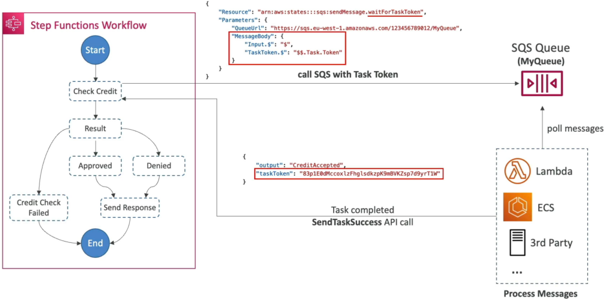

# Step Functions - Wait for Task Token

Architecting standard request-response loops is easy, but when you need your state machine to orchestrate long-running asynchronous breaks—like waiting for a third-party payment gateway validation, triggering an automated system review loop, or pausing entirely for a human manager to click an "Approve" link inside an email—you deploy the ultimate decoupling weapon, chief: **`__waitForTaskToken`**! 🏎️🛑

Instead of keeping an expensive execution thread idling inside a compute box for hours or days (which will hit a hard timeout and burn your operating budget), Step Functions lets you completely freeze the state machine workflow at absolute zero cost. The execution lane pauses indefinitely until an external process wakes it back up with a matching cryptographic token key.

---

## Key Takeaways

Let's unpack the exact payload mechanics, API hooks, and token handshakes you must lock down for your DVA-C02 exam.

### 🤝 The Async Token Handshake Matrix

When you instruct a Task to pause and wait for an external system callback loop, the workflow executes a three-stage architectural handshake:



```text
🔮 STEP FUNCTIONS ASYNC WORKFLOW HANDSHAKE:
   ├── 📤 1. DISPATCH: Task appends .waitForTaskToken to the target ARN.
   │                   Injects the system token parameter context ($$.Task.Token) into the message.
   ├── ⏳ PAUSE:    The State Machine enters a Blue (In Progress) paused freeze loop at $0 billing.
   └── 📥 CALLBACK: External worker runs off-grid, processes data, then calls the Step Functions API
                    via SendTaskSuccess or SendTaskFailure matching the exact token key!
```

---

### 📑 Code Dissection: The SQS Dispatch Blueprint

To implement this pattern inside your Amazon States Language (ASL) JSON framework, you must alter your task definition block using two explicit rule updates, chief:

```json
{
  "Type": "Task",
  "Resource": "arn:aws:states:::sqs:sendMessage.waitForTaskToken",
  "Parameters": {
    "QueueUrl": "https://sqs.us-east-1.amazonaws.com/123456789012/MyApprovalQueue",
    "MessageBody": {
      "Input.$": "$",
      "TaskToken.$": "$$.Task.Token"
    }
  },
  "Next": "Result"
}
```

#### 🚨 The Critical Payload Nuances:

1. **The Resource Suffix Changer (`.waitForTaskToken`) 🛰️:** Look closely at the `"Resource"` string parameter. Instead of just passing a plain SQS integration handle, you append **`.waitForTaskToken`** directly onto the tail end of the API action string. This tells Step Functions: _"Do NOT immediately advance to the next state when this message drops into SQS. Halt everything right here and wait for the code signal!"_
2. **The Dual-Dollar Context Selector (`$$.Task.Token`) 🧠:** This is a top-tier exam trap question. A single dollar sign (`$.`) targets variables inside your incoming application data stream. **A double dollar sign (`$$`) explicitly instructs the parser to query the Step Functions internal execution Context Object metadata!** This is how you grab the unique, temporary cryptographic token string dynamically generated by the system engine so your external workers can read it down the wire.

---

### 🚀 Waking Up the Machine: The API Callback

Once your worker fleet (whether it's a decoupled Lambda script, a pool of Docker containers running on ECS, or a traditional on-premise application server) consumes the message out of the SQS queue, it processes the parameters and extracts the embedded `TaskToken` payload string.

When the work is complete, the worker directly executes one of two AWS SDK/API methods to unlock the state machine lane, chief:

- **The Success Path 🟢:**

```bash
aws stepfunctions send-task-success \
    --task-token "BASE64_CRYPTOGRAPHIC_TOKEN_STRING" \
    --output '{"CreditStatus": "APPROVED", "Limit": 50000}'
```

This method passes the token key back to the cloud engine along with a fresh data payload. The Step Functions engine verifies the match, injects the new output back into the primary state stream, and smoothly advances to the next step (`Result`).

- **The Failure Path 🔴:**

```bash
aws stepfunctions send-task-failure \
    --task-token "BASE64_CRYPTOGRAPHIC_TOKEN_STRING" \
    --error "CreditCheckDeniedError" \
    --cause "The client's dynamic credit history failed internal risk profiling limits."
```

This method instantly forces a hard abort on the paused step, dropping an explicit exception code directly down into the state machine's active `Catch` infrastructure tier so it can cleanly process fallback routing options.

---

## Exam Tips

- **The E-Commerce Warehouse/Human Approval Scenario:** If an exam prompt introduces a microservice pipeline where an item order is placed, but requires a manual human physical inventory validation check or a manager sign-off via an external tracking web portal that could take up to 3 days to complete—\*\*instantly look for the answer that uses a Task state appended with `.waitForTaskToken` and fires an SQS message passing the context token (`$$.Task.Token`).
- **The Single vs Double Dollar Selection Trap 🚨:** If a scenario question requires you to pass the current state machine execution token down to an external system component, and asks you to select the correct JSONPath notation layout—**instantly filter out any options that try to use `$.Task.Token`. Always select the version that utilizes the double-dollar syntax `$$.Task.Token` to properly address the background execution environment context metadata object.**
