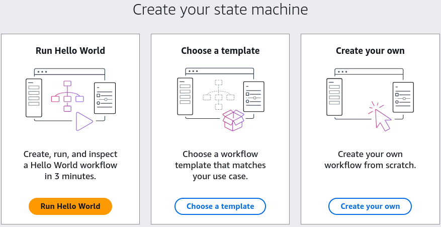
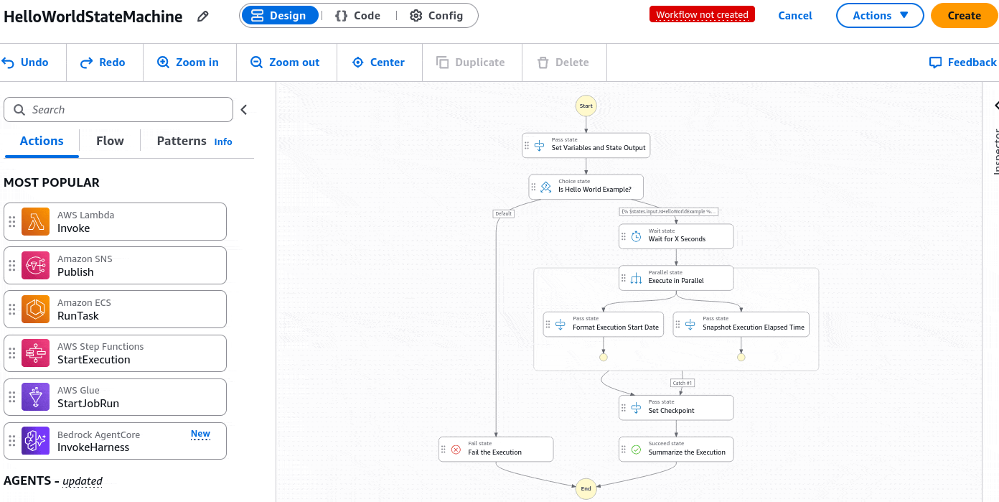
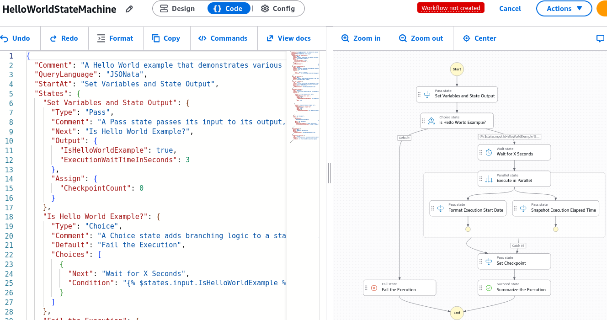
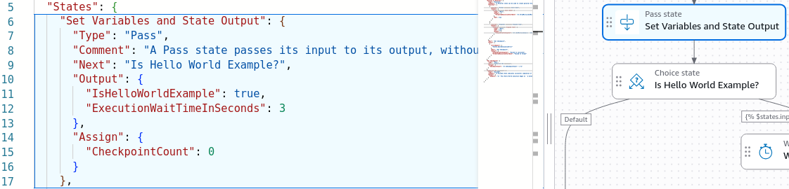
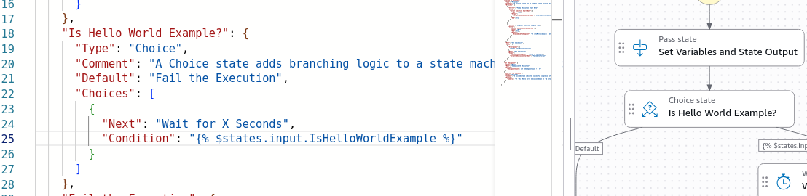
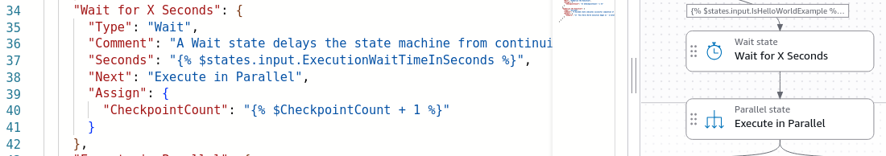
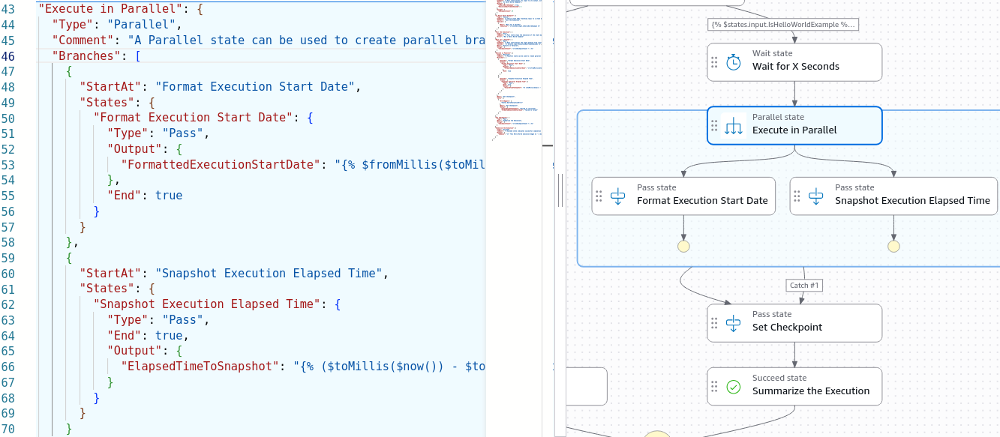
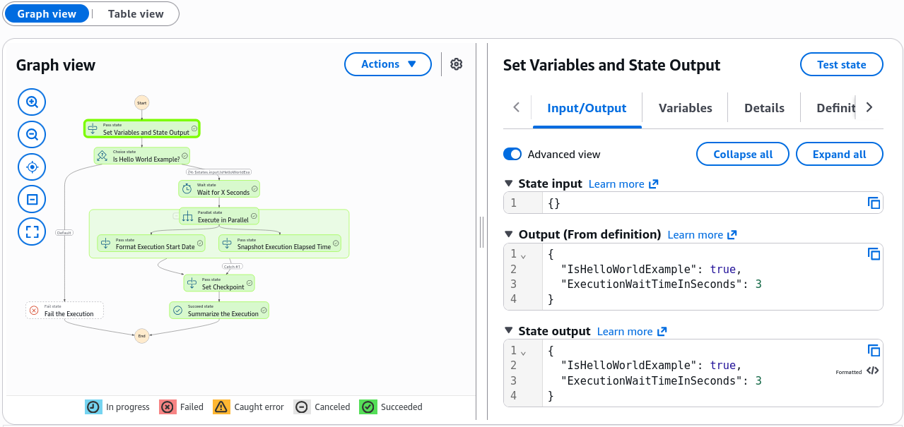
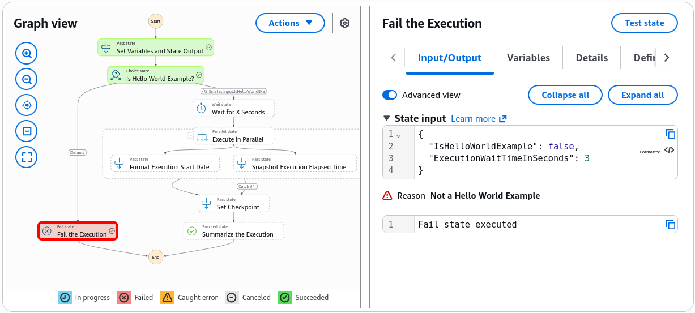

# Step Functions - Hands On

Getting hands-on with the visual **Workflow Studio** and debugging variables inside the execution inspector is how you master serverless state tracking.

Stephane’s console lab highlights the core power of the **Amazon States Language (ASL)**: your entire complex flow maps straight to a centralized, deterministic JSON matrix. If you mutate a variable flag at the top of your execution run, the downstream branching choice nodes react instantly, routing payloads down entirely different architectural tracks while recording every single state transition.

---

## Hands On

### 🎨 Navigating the Visual Interface Canvas (Workflow Studio)

- **The Component Dock 🧱:** Pop open the **Step Functions** Console UI ──► hit **Create state machine**. Choose a **Hello World** template for now, you can choose a workflow template or create your own workflow if you already familiar with this.  
  
- The left-hand panel exposes a **drag-and-drop** workspace packed with popular pre-wired AWS service API integrations side-by-side with logical Flow handlers (`Choice`, `Parallel`, `Map`). You can drag and drop these components onto the canvas to build your workflow visually.
  
- **The Blueprint Synthesis Engine (ASL Code Hub) 📑:** As you drag, drop, and configure steps visually on the grid, the console dynamically auto-generates your definitions using the **Amazon States Language (ASL)** inside a unified JSON object layout. You can see the ASL code generated in Workflow Studio code editor.  
  
- **Core Operational Profiles:** Before you launch, the properties panel allows you to configure your machine runtime limits:
  - _The Stack Identity:_ Naming the machine node parameters.
  - _The Execution Lane Type:_ Choosing between **Standard** (up to 1 year of duration, full state tracking, audited history) or **Express** (high-throughput, ultra-rapid runs under 5 minutes).
  - _Security Envelope:_ Attaching the target **IAM execution role** to trust the machine to make calls to downstream buckets or functions.

#### Standard vs. Express

When you hit the initialization configurations page in the lab, you must choose your state machine layout lane. **The exam heavily tests whether you know exactly when to pull the trigger on each type:**

| Core Parameters            | 🛡️ Standard Workflows                                                             | ⚡ Express Workflows                                                                 |
| -------------------------- | --------------------------------------------------------------------------------- | ------------------------------------------------------------------------------------ |
| **Max Execution Duration** | Up to **1 Year** continuous runtime.                                              | Up to **5 Minutes** absolute maximum.                                                |
| **Throughput Capacity**    | Lower throughput rate, billed precisely **per state transition** ($0.025 per 1k). | Massive throughput scaling, billed **per invocation + execution duration**.          |
| **Execution Semantics**    | Strict **Exactly-Once** processing guarantee.                                     | **At-Least-Once** (Async) or **At-Most-Once** (Sync) processing.                     |
| **Console Observability**  | Full, native execution history tracking stored in console for 90 days.            | No native console history; relies on streaming logs straight to **CloudWatch Logs**. |
| **Primary Use Cases**      | Human-in-the-loop approvals, payment pipelines, long batch loops.                 | High-volume IoT data ingestion, rapid REST API proxies, streaming data.              |

---

### 📜 Dissecting the Logic Tree (Hello World Flow Rules)

Click directly on the graphical flow blocks to track exactly how data flows down the branch corridors:

- **The Initialization Vector (`Set Variables & State Output`) 🏁:** The baseline setup step. It injects a flat parameter map into the stream, declaring `IsHelloWorldExample: true` and mapping a dynamic clock delay variable `executionWaitTimeInSeconds: 3`, while starting a tracking counter `CheckpointCount: 0`.  
  
- **The Guardrail Fork (`Choice State`) 🔀:** Acts as a standard programmatic `if/else` conditional logic block.
  - _The Metric Rule:_ It evaluates the token parameter string `IsHelloWorldExample`.
  - _The Split Corridor:_ If the string evaluates cleanly to `true`, the machine unlocks the right-side route branch and drops the traffic down into the **`Wait State`**. If it catches a `false` parameter, it forces a hard pivot straight down the left-side corridor into an absolute **`Fail State`**, instantly killing the execution loop.  
    
- **The Delay Corridor (`Wait for X Seconds`) ⏳:** Instead of wasting processing money idling a container or function, this node reads the numeric property payload variable we mapped earlier and cleanly pauses the internal state machine clock for exactly **3 seconds** at zero cost.  
  
- **The Async Acceleration Core (`Parallel State`) 🛤️:** Simultaneously kicks off separate, isolated runtime branches concurrently, automatically merging the returning data maps back together into a single unified JSON block when they complete successfully.  
  
- **The Goal Line (`Summarize Execution`) 🏆:** Reaches a standard `Succeed` state node, summarizing the tracking data history loops and printing out the final pipeline metric values cleanly.
- When you finished configuring the state machine, you can click **Create** to save your configuration and launch the execution.

---

### 🧪 Running the Operational Test Rounds

#### 🟢 Test Run A: The Success Lane (True State)

- Pop open the control bar and hit **Start Execution** passing an empty JSON input.
- _The Visual Audit:_ The graph view updates live in real time, chief! The blocks light up a clean **Blue (In Progress)** as they process, then flip to a solid **Green (Success)**.
- _The Data Breakdown:_ Select any completed state block node. The right-hand panel allows you to dynamically switch between **Input**, **Output**, **Variables**, and **Event History** tabs. You can watch the `CheckpointCount` increment steadily, and see the final string payload compile perfectly across the endpoints!  
  

#### 🔴 Test Run B: The Auto-Healing Fail Lane (False State)

- Hit the code editor layout pane, shift the core initialization property value from `true` over to **`false`**, and save the changes.
- Fire **Start Execution** a second time.
- _The Execution Reality:_ The choice condition catches the delta instantly! The right-side corridor shuts down entirely, and the left-side corridor lights up a sharp **Red (Failed)**, terminating the pipeline execution stack on the spot with a clean, fully traced validation log inside the Event History panel.  
  

---

## Exam Tips

- **The Workflow Type Lock Trap 🚨:** This is a classic multi-choice trap on the blueprint! Always keep anchored in your mind that **once a State Machine is created in your account, its Workflow Type (Standard vs. Express) is completely immutable and CANNOT be changed or toggled under the hood!** If a high-volume data stream forces a pivot from Standard to Express to save massive transition costs, your pipeline script must provision a completely fresh state machine resource stack from scratch and migrate the ASL templates over.
- **The High-Volume IoT Cost Optimization Prompt:** If an exam scenario presents an architecture group running a Standard Step Function that processes millions of sub-second streaming sensor event inputs per day, resulting in an astronomical AWS bill due to state transition metrics—**look straight for the option that copies the ASL code matrix over into a brand-new Express Workflow state machine container to capitalize on duration-based compute pricing.**
