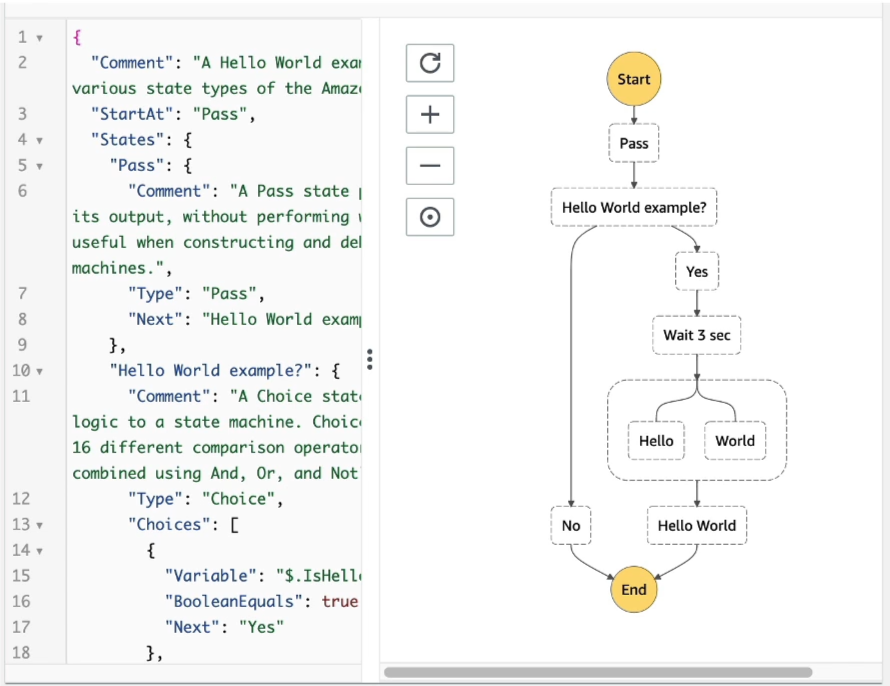
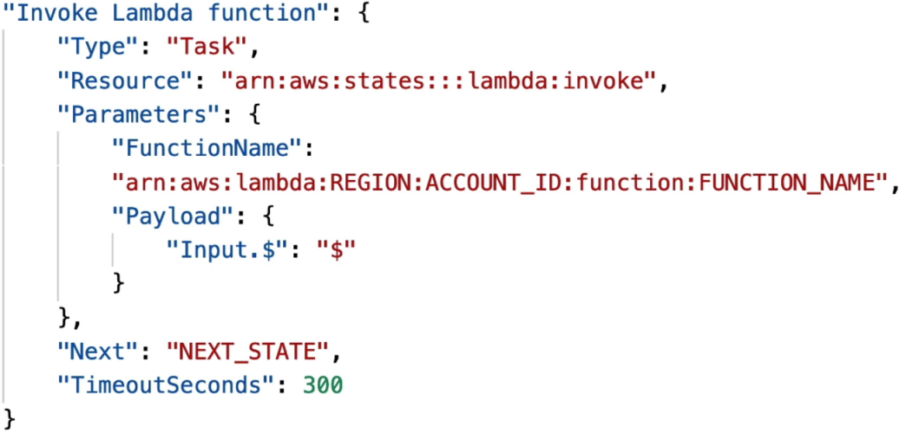
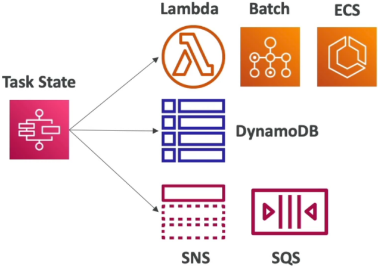
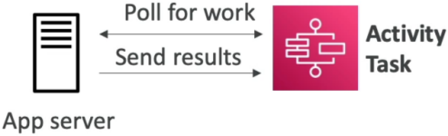
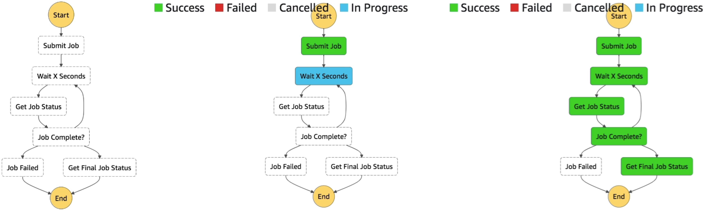

# Step Functions Overview

If you are trying to coordinate ten different interconnected serverless microservices by nesting them inside a massive, fragile web of custom Lambda execution logic, you are doing it wrong.

Stephane hits the nail right on the head: coding orchestration directly inside your application logic tightly couples your code, makes tracking states a complete nightmare, and leaves your error handling highly exposed to timeouts. **AWS Step Functions completely separate your workflow orchestration logic from your actual business logic.**

By mapping your execution pipeline as a visual, state-driven blueprint using the **Amazon States Language (ASL)**, Step Functions turns complex microservice meshes into highly reliable, fault-tolerant, and auto-scaling state machines.

---

## Key Takeaways

Let's discuss the triggers, task, and state types you must know to survive the DVA-C02 exam, and how to architect your workflows for maximum reliability and scalability.

### 🛰️ Invocation Vectors: Waking Up the Machine

To kickstart an automated state machine execution workflow over the wire, you hook Step Functions natively right into your primary cloud ingress points:

- **Programmatic Core (AWS SDK API) 💻:** Firing the low-level **`StartExecution`** API method directly inside your application code (like inside a React app's API route handler or an active Lambda trigger execution loop).
- **The Public Rest Ingress (API Gateway) 🌐:** Exposing a public URL path that acts as a secure, zero-code proxy mapping incoming web payloads directly down to a Step Function execution line.
- **The Event-Driven Radar (Amazon EventBridge) 🛰️:** Configuring custom routing rules that catch cloud deltas (like watching for a specific file upload state in S3 or an EC2 status flip) and automatically firing off a state machine run in response.



---

### 📦 The Core Building Block: Task States (`Type: Task`)

The heavy lifting inside your workflow happens inside a **Task State**. A task explicitly dictates a single structural block of functional work, and it splits into two distinct operational paradigms:

#### ⚡ Paradigm A: Optimized AWS Service Integrations

Step Functions can directly target over 200+ native AWS services right inside the JSON/ASL parameter payload without writing a single line of tedious backend "glue code"!

- Running a compute block by invoking a dedicated **AWS Lambda function**.  
  
- Writing a structural item row straight into an **Amazon DynamoDB table**.
- Pushing message payloads directly onto **Amazon SQS queues or SNS topics**.
- Spinning up an isolated container run inside an **Amazon ECS cluster** and holding execution until the container finishes processing its task parameters!  
  

### 🏗️ Paradigm B: Human-in-the-Loop & On-Premise Worker Activities

What if the work needs to be executed by a long-running bare-metal script sitting on a local, on-premise physical server, or requires manual human approval via email before continuing?

- You register an **Activity** blueprint string within Step Functions.
- Instead of the cloud service pushing traffic down to your private servers, your external workers continuously **poll the Step Functions API endpoints** (`GetActivityTask`) to fetch task items.
- The worker processes the data offline for hours or days, and finally sends a completion signal back (`SendTaskSuccess` or `SendTaskFailure`) to gracefully unlock the state machine's next layout path!  
  

---

### 🎛️ The Flow Control Architecture State Grid

To construct complex logical routing paths inside your ASL JSON matrix, you stitch your Tasks together using six foundational structural control states, chief:

```text
🎛️ NATIVE ASL STATE CONTROL ARCHITECTURE:
   ├── 🔀 Choice State    ──► Dynamic branch conditions (e.g., NumberEquals, StringMatches).
   ├── 🛤️ Parallel State  ──► Fires up multiple distinct async processing lanes simultaneously.
   ├── 🔄 Map State       ──► Dynamic looping iterator over data arrays at massive concurrent scale.
   ├── ⏳ Wait State      ──► Pauses execution for absolute seconds or until a fixed date-timestamp.
   ├── 📥 Pass State      ──► Non-operational data transformer (perfect for debugging and static token injection).
   └── 🛑 Succeed/Fail    ──► Instantly terminates the state machine run with a strict status report.
```

### Visual Workflow in Step Functions



- In workflow visualization above, we would have **Submit a job**, we **Wait for X Seconds**, we get the **Job Status**, and then we check the **Job Status**. If the job is not complete, we go back to **Wait for X Seconds** and loop the process until the job is complete. Once the job is complete, we check if the job was successful or failed. If the job was successful, we go to **Job Succeeded** and if the job failed, we go to **Job Failed**. End we'll get to the end.
- As you can see Step Functions is here to orchestrate whatever work you need to do, to define how state machines should be executed, and to define how the flow of your application should be executed.

## Exam Tips

- **The Multi-Function Orchestration Trap 🚨:** If an exam prompt presents a multi-stage workflow where an application must process a file, wait exactly 2 hours, run data analytics, and conditionally notify managers based on success or failure outcomes—**always pick AWS Step Functions over hacking custom timeout-tracking databases inside a single monolithic Lambda function.**
- **The Concurrent Array Processing Choice:** If a scenario outlines an ETL data pipeline that needs to process a massive JSON array payload by fanning out identical analysis steps across all array members simultaneously at high concurrency—**look straight for deploying the `Map State` or `Parallel State` constructs right inside the structural ASL code block.**

### Practice Test

**Question 1:** A company wants to automate and orchestrate a multi-source high-volume flow of data in a scalable data management solution built using AWS services. The solution must ensure that the business rules and transformations run in sequence, handle reprocessing of data in case of errors, and require minimal maintenance.

Which AWS service should the company use to manage and automate the orchestration of the data flows?

- [ ] Amazon Kinesis Data Streams
- [ ] AWS Glue
- [ ] AWS Batch
- [ ] AWS Step Functions

<details>
  <summary>Correct Answer</summary>

- [x] AWS Step Functions
  - **Explanation:** AWS Step Functions is a visual workflow service that helps developers use AWS services to build distributed applications, automate processes, orchestrate microservices, and create data and machine learning (ML) pipelines.

</details>
