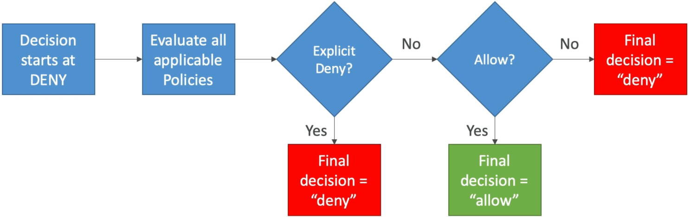

# Advanced IAM

Mastering **Advanced IAM Policy Evaluation Logic** is what separates the average script devs from true cloud security architects. 🏎️🛡️

When you scale up across hundreds of accounts and thousands of microservices, you can't be guessing how permissions evaluate. You need to know the exact decision tree AWS runs every single millisecond an API call hits the wire.

---

## Key Takeaways

Let's deep dive into the evaluation flow, identity-vs-resource unions, dynamic policy variables, and policy types for your master notes.

### 🚦 The Evaluation Flow: The Golden Rule of Deny

When an IAM principal attempts an API call, AWS starts with an **Implicit Deny** by default. The decision engine then evaluates all applicable policies following a strict priority sequence:

$$\mathbf{Implicit\ Deny} \longrightarrow \mathbf{Check\ Explicit\ Deny} \longrightarrow \mathbf{Check\ Explicit\ Allow} \longrightarrow \mathbf{Final\ Decision}$$



1. **Explicit Deny Wins Always 🛑:** If _any_ applicable policy (Identity policy, Resource policy, SCP, or Permission Boundary) contains an `"Effect": "Deny"`, evaluation stops dead in its tracks. **Explicit Deny trumps any number of explicit Allows, period.**
2. **Explicit Allow Required ✅:** If no explicit Deny exists, AWS searches for at least one explicit `"Effect": "Allow"`.
3. **Implicit Deny Fallback ❌:** If no policy explicitly grants an Allow, the request defaults to a Deny.

---

### 🔀 Identity Policies vs. Resource Policies: The Union Rule

When accessing single-account resources like an **Amazon S3 Bucket**, permissions evaluate as the **UNION** of the IAM Identity Policy and the Resource-based Policy.  
 

:::tip
**The Single-Account Union Principle:** Within the _same_ AWS account, access is granted if **EITHER** the IAM identity policy **OR** the S3 bucket policy allows the action (as long as neither side explicitly denies it)!
:::

#### 🧪 The Four Evaluation Scenarios

- **Scenario 1: IAM Allow | No Bucket Policy**
- _Result:_ **ALLOWED ✅**. The IAM policy grant is sufficient.

- **Scenario 2: IAM Allow | Bucket Policy Explicit Deny**
- _Result:_ **DENIED ❌**. Explicit Deny on the resource overrides the IAM Allow.

- **Scenario 3: Empty IAM Policy | Bucket Policy Explicit Allow**
- _Result:_ **ALLOWED ✅**. The S3 Bucket Policy grants access directly, even if the EC2 role/User IAM policy contains zero S3 permissions!

- **Scenario 4: IAM Explicit Deny | Bucket Policy Explicit Allow**
- _Result:_ **DENIED ❌**. Explicit Deny on the identity overrides the resource Allow.

---

### 📑 Policy Categorization: Managed vs. Inline

AWS provides three structural ways to attach policies to identities, chief:

| Policy Type             | Managed By | Reusable across Identities?    | Version Control & Rollbacks? | Use Case / Best Practice                                                      |
| ----------------------- | ---------- | ------------------------------ | ---------------------------- | ----------------------------------------------------------------------------- |
| **AWS Managed** 🏢      | AWS        | Yes (Globally across accounts) | Yes (Managed by AWS)         | Fast baseline setup for standard job functions (e.g., `AdministratorAccess`). |
| **Customer Managed** 🛠️ | You        | Yes                            | **Yes (Up to 5 versions)**   | **AWS Best Practice.** Reusable, auditable, modular access control.           |
| **Inline** 📌           | You        | **No (1-to-1 strict bind)**    | No                           | Strict single-principal binding. Deleted when the principal is deleted.       |

:::warning
**The Inline Policy Size Trap:** Inline policies share a strict character/byte quota directly on the user or role object (e.g., 2 KB limit for users). If you paste massive JSON policies into an inline block, deployment will fail due to size limits! Always prefer Customer Managed policies.
:::

---

### 🎯 Dynamic Policy Variables: Scaling Least-Privilege

Instead of creating hundreds of individual policies for every developer in your team (`/home/zoro`, `/home/luffy`), you write **ONE dynamic policy** using runtime IAM Policy Variables:

```json
{
  "Effect": "Allow",
  "Action": ["s3:GetObject", "s3:PutObject"],
  "Resource": "arn:aws:s3:::my-company-user-vault/home/${aws:username}/*"
}
```

- **Runtime Replacement:** When user `Zoro` attempts an S3 call, AWS dynamically resolves `${aws:username}` to `Zoro` on the fly, locking them strictly to `/home/Zoro/*` while keeping your administrative overhead practically zero!

---

## Exam Tips

- **The Single-Account Bucket Access Fix:** If an exam question mentions an EC2 instance that lacks S3 permissions in its IAM role, but still needs access to an S3 bucket in the _same_ account—**you do not need to edit the IAM role! You can simply add an explicit Allow for the role ARN directly inside the S3 Bucket Policy!**
- **The Scalable User Directory Pattern:** If a scenario asks for the most efficient, scalable way to grant 500 developers write access to their own personal sub-folder in a shared S3 bucket without creating 500 separate policies—**choose the option that deploys a single policy using the `${aws:username}` policy variable!**
