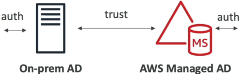
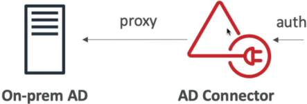
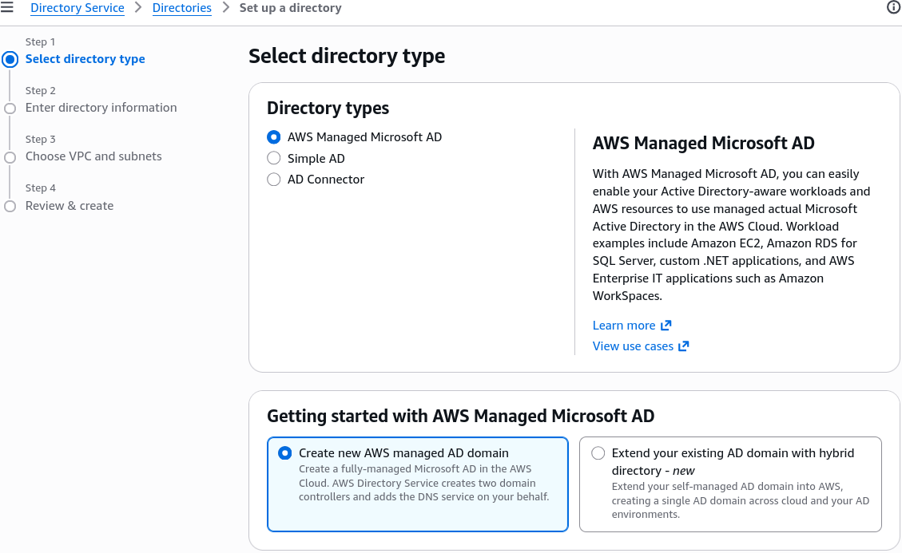
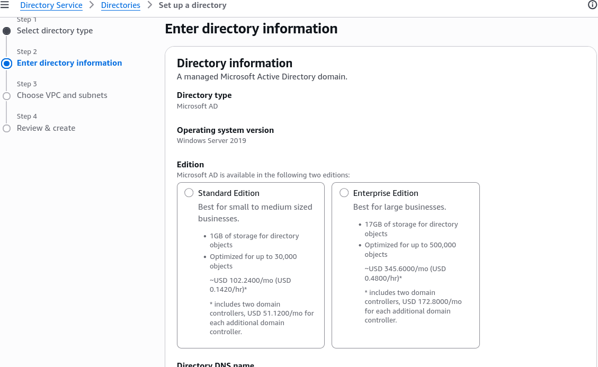

# AWS Directory Services

Bridging your local enterprise user directory straight into your AWS cloud infrastructure is how you unlock smooth Single Sign-On (SSO) and domain joins for your Windows EC2 fleets. 🏎️🏢

When you need an Active Directory (AD) presence inside your AWS VPC layout, you don't have to manually stand up and patch EC2 instances running Windows Server. **AWS Directory Service** handles the heavy lifting as a fully managed service suite.

---

## Key Takeaways

Let's explore the three core Active Directory flavors, their precise architecture patterns, and the exact decision criteria you need to master for your DVA-C02 notes.

```text
                               ┌────────────────────────────────────────────────────────┐
                               │               AWS DIRECTORY SERVICE                    │
                               └───────────────────────────┬────────────────────────────┘
                                                           │
             ┌─────────────────────────────────────────────┼─────────────────────────────────────────────┐
             ▼                                             ▼                                             ▼
🏢 AWS Managed Microsoft AD                     🌉 AD Connector                                🎈 Simple AD
  • Actual MS Active Directory                    • Pure Gateway Proxy                           • Samba 4 AD-compatible
  • Standalone or Hybrid                          • No cloud user directory                      • Standalone only
  • Supports Trust Relationships                  • Proxies auth to On-Prem AD                   • NO On-Prem AD connection
  • Supports MFA                                  • Supports MFA                                 • NO MFA / Trust relationships
```

---

### 🏢 AWS Managed Microsoft AD (The Full Enterprise Option)

This is a **real, fully managed Microsoft Active Directory** running actual Windows Server domain controllers directly inside AWS infrastructure.

- **Core Architecture:** AWS provisions two domain controllers across multiple Availability Zones (AZs) for high availability. AWS handles daily backups, software updates, and domain controller monitoring.
- **Hybrid Trust Relationships 🤝:** You can create an **Active Directory Forest Trust** (one-way or two-way) between your AWS Managed Microsoft AD and your local On-Premise Active Directory. This allows your on-prem employees to log in to AWS resources (like WorkSpaces or AWS Management Console) using their existing corporate passwords without replicating sensitive credential hashes!
- **Key Features:** Supports Multi-Factor Authentication (MFA) via RADIUS, schema extensions, and comes in two sizing tiers: **Standard** (up to 30,000 objects) and **Enterprise** (up to 500,000 objects).  
  

---

### 🌉 AD Connector (The Redirect Proxy Gateway)

If you already have a massive, highly optimized Microsoft Active Directory running in your corporate data center, and you **DO NOT** want to store or sync user directory data inside the AWS cloud, **AD Connector is your go-to play.**

- **Core Architecture:** AD Connector is **NOT** a directory itself. It is a lightweight, highly available **redirect proxy**.
- **How It Works:** When a user or EC2 instance attempts to log in via AWS, AD Connector catches the auth request and proxies the Kerberos / LDAP validation directly back to your On-Premise Active Directory domain controllers via Direct Connect or an AWS Site-to-Site VPN!
- **Key Features:** Zero data synchronization or cloud user caching. Supports MFA integration (via RADIUS) and comes in two sizes: **Small** (up to 500 users) and **Large** (up to 5,000 users).  
  

---

### 🎈 Simple AD (The Lightweight Standalone Option)

If you don't have an existing on-premise Active Directory and just need a lightweight, low-cost directory engine inside AWS to join Windows EC2 instances to a domain or manage basic user accounts, **Simple AD is the play.**

- **Core Architecture:** Powered by a managed **Samba 4** engine (Active Directory compatible).
  - **Key Limitations 🚨:**
  - **CANNOT** join or establish trust relationships with an On-Premise Active Directory!
  - **CANNOT** integrate with MFA.
  - Does not support advanced AD features like dynamic schema extensions or PowerShell remoting.
- **Sizing Tiers:** Comes in **Small** (up to 500 users/objects) and **Large** (up to 5,000 users/objects).  
  

---

### 📊 Summary Comparison Matrix

| Feature / Metric                   | 🏢 AWS Managed Microsoft AD                         | 🌉 AD Connector                        | 🎈 Simple AD                                 |
| ---------------------------------- | --------------------------------------------------- | -------------------------------------- | -------------------------------------------- |
| **Underlying Engine**              | Actual Microsoft AD (Windows Server)                | Gateway Proxy                          | Samba 4 (AD Compatible)                      |
| **Directory Data Stored in AWS?**  | Yes                                                 | **No** (Redirects to On-Prem)          | Yes                                          |
| **On-Premise Trust Relationship?** | **Yes** (Forest / Domain Trusts)                    | N/A (Direct Proxy)                     | **No**                                       |
| **Supports MFA?**                  | **Yes** (via RADIUS)                                | **Yes** (via RADIUS)                   | **No**                                       |
| **Best For...**                    | Hybrid corporate setups, actual Windows AD features | Proxying existing on-prem users to AWS | Cheap, standalone Linux/Windows domain joins |

#### Screenshots



---



## Exam Tips

- **The Zero-Cloud-Directory Proxy Scenario 🚨:** If an exam prompt states an organization wants to allow on-premise users to access AWS applications using their existing Active Directory credentials, but strict security compliance forbids storing or caching user credentials inside the AWS cloud—**look straight for AD Connector.**
- **The Hybrid Trust Requirement:** If a prompt asks for an Active Directory setup that can host local cloud users while simultaneously allowing federated corporate users from an on-premise domain via a formal forest trust—**choose AWS Managed Microsoft AD.**
- **The Cheap Standalone Directory:** If a scenario asks for a low-cost directory solution for a cloud-only app that does not have an on-premise Active Directory and does not require MFA—**select Simple AD!**
