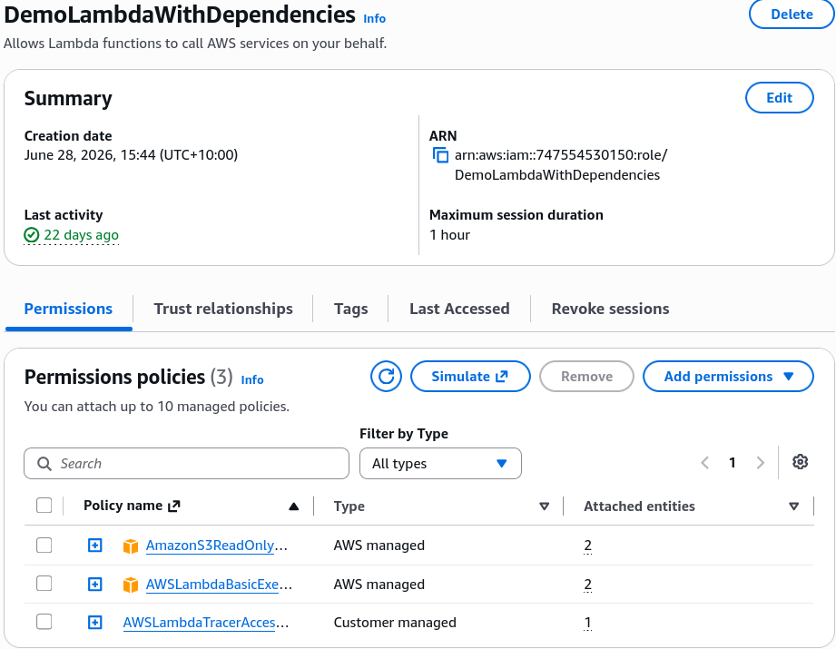
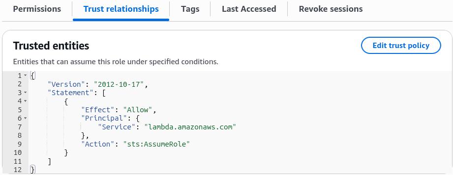

# Granting a User Permissions to Pass a role to an AWS Service

**`iam:PassRole`** is the ultimate security bridge that prevents low-privileged developers from pulling off an instant privilege escalation hack. 🏎️🛡️

When you attach an IAM role to an AWS service—like launching an EC2 instance, creating a Lambda function, or setting up a CodePipeline pipeline—you aren't directly using that role yourself. **You are passing that role to the AWS service so the service can assume it and act on your behalf.**

Because assigning a role gives a service full administrative or data-level rights, AWS explicitly requires the **`iam:PassRole`** permission on the user or pipeline attempting to configure the resource!

---

## Key Takeaways

### 🔒 Why `iam:PassRole` Prevents Privilege Escalation

Imagine a developer who only has basic read-only access to S3, but they want full admin power over the entire account.

If `iam:PassRole` didn't exist, that developer could simply spin up a new EC2 instance or Lambda function, attach an existing `AdministratorAccess` IAM Role to it, and write a script inside the instance/function to run admin commands!

```text
🧑‍💻 DEVELOPER (Has iam:PassRole for S3Role ONLY)
   │
   ├── ❌ Tries to attach AdminRole to EC2  ──► 🛑 DENIED by IAM (Missing iam:PassRole on AdminRole)
   │
   └── ✅ Attaches S3Role to EC2 ──────────► 🟢 ALLOWED! EC2 assumes S3Role to fetch bucket data.
```

By enforcing `iam:PassRole`, AWS forces security administrators to explicitly restrict **which specific roles** a developer is permitted to hand over to AWS compute services!

---

### 📄 Structuring the `iam:PassRole` Policy

To allow a developer or deployment script to pass a role to a service (like EC2), you attach a policy granting `iam:PassRole` bounded directly to the target role's ARN:

```json
{
  "Version": "2012-10-17",
  "Statement": [
    {
      "Effect": "Allow",
      "Action": ["ec2:RunInstances", "ec2:DescribeInstances"],
      "Resource": "*"
    },
    {
      "Effect": "Allow",
      "Action": "iam:PassRole",
      "Resource": "arn:aws:iam::123456789012:role/S3AccessEC2Role"
    }
  ]
}
```

- **The Security Lock:** The user can launch EC2 instances all day long, but **they can ONLY attach the `S3AccessEC2Role`** to those instances. If they try to attach any other role (like a full DB access or Admin role), the`ec2:RunInstances`call throws an`AccessDeniedException` instantly!

---

### 🤝 The Trust Policy Requirement (`sts:AssumeRole`)

Can any role be passed to any service? **No!**

Even if a user has `iam:PassRole` in their policy, the target role **must explicitly trust the destination service** inside its own **Trust Relationship (Trust Policy)**.

The target service uses the **`sts:AssumeRole`** API under the hood, so its trust document must list the service principal:

```json
{
  "Version": "2012-10-17",
  "Statement": [
    {
      "Effect": "Allow",
      "Principal": {
        "Service": "ec2.amazonaws.com"
      },
      "Action": "sts:AssumeRole"
    }
  ]
}
```

#### 🎯 Common AWS Service Principals for Trust Policies:

- **Amazon EC2:** `ec2.amazonaws.com`
- **AWS Lambda:** `lambda.amazonaws.com`
- **AWS CodePipeline:** `codepipeline.amazonaws.com`
- **Amazon ECS Tasks:** `ecs-tasks.amazonaws.com`

:::tip
**Rule of Thumb:** To pass Role X to Service Y, **User A** needs `iam:PassRole` targeting **Role X**, and **Role X's Trust Policy** must explicitly list **Service Y** under `Principal: { "Service": ... }`!
:::

#### Example


`DemoLambdaRole` has three attached policies: S3 read only, x-ray tracer and basic cloudwatch logging.


In the trust policy, the principal is set to `lambda.amazonaws.com`, allowing Lambda to assume the role.

:::note
In order for a user to create a Lambda function and assign it the `DemoLambdaRole`, the user must have `iam:PassRole` permission for that role.
:::

---

## Exam Tips

- **The Service Role Assignment Error 🚨:** If an exam scenario describes a developer attempting to create an AWS Lambda function or deploy an ECS task, but gets an authorization error when selecting the execution role—**look straight for the answer choice stating the developer is missing the `iam:PassRole` permission on their IAM identity policy!**
- **The Granular Access Control Question:** If a prompt asks how to allow junior engineers to spin up CloudFormation stacks containing Lambda functions while preventing them from granting those functions administrative permissions—**select the option that grants the engineers `iam:PassRole` limited explicitly to specific, pre-approved execution role ARNs.**

### Scenario Practice

**Scenario**: The development team at a HealthCare company has deployed EC2 instances in AWS Account A. These instances need to access patient data with Personally Identifiable Information (PII) on multiple S3 buckets in another AWS Account B.

As a Developer Associate, which of the following solutions would you recommend for the given use-case?

- [ ] Create an IAM role with S3 access in Account B and set Account A as a trusted entity. Create another role (instance profile) in Account A and attach it to the EC2 instances in Account A and add an inline policy to this role to assume the role from Account B
- [ ] Copy the underlying AMI for the EC2 instances from Account A into Account B. Launch EC2 instances in Account B using this AMI and then access the PII data on Amazon S3 in Account B
- [ ] Create an IAM role (instance profile) in Account A and set Account B as a trusted entity. Attach this role to the EC2 instances in Account A and add an inline policy to this role to access S3 data from Account B
- [ ] Add a bucket policy to all the Amazon S3 buckets in Account B to allow access from EC2 instances in Account A

<details>
<summary>Correct Answer</summary>

- [x] Create an IAM role with S3 access in Account B and set Account A as a trusted entity. Create another role (instance profile) in Account A and attach it to the EC2 instances in Account A and add an inline policy to this role to assume the role from Account B
  - You can give EC2 instances in one account ("account A") permissions to assume a role from another account ("account B") to access resources such as S3 buckets. You need to create an IAM role in Account B and set Account A as a trusted entity. Then attach a policy to this IAM role such that it delegates access to Amazon S3 like so -
  ```json
  {
    "Version": "2012-10-17",
    "Statement": [
      {
        "Effect": "Allow",
        "Action": "s3:*",
        "Resource": [
          "arn:aws:s3:::awsexamplebucket1",
          "arn:aws:s3:::awsexamplebucket1/*",
          "arn:aws:s3:::awsexamplebucket2",
          "arn:aws:s3:::awsexamplebucket2/*"
        ]
      }
    ]
  }
  ```
  Then you can create another role (instance profile) in Account A and attach it to the EC2 instances in Account A and add an inline policy to this role to assume the role from Account B like so -
  ```json
  {
    "Version": "2012-10-17",
    "Statement": [
      {
        "Effect": "Allow",
        "Action": "sts:AssumeRole",
        "Resource": "arn:aws:iam::AccountB_ID:role/ROLENAME"
      }
    ]
  }
  ```

</details>
