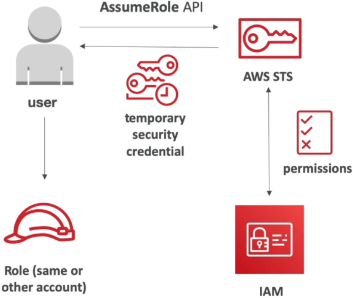
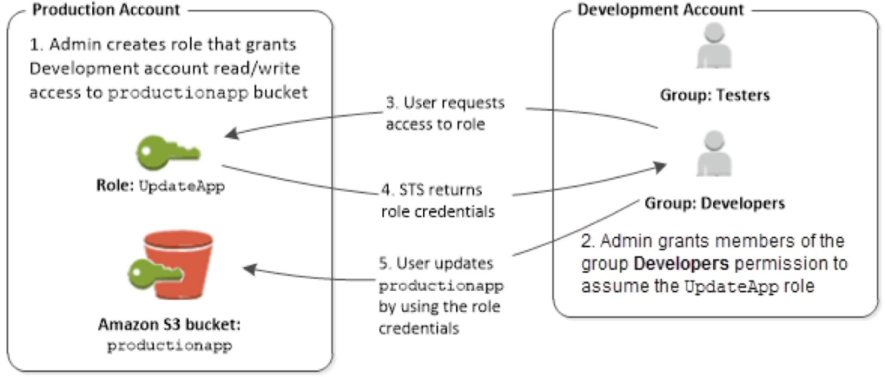

# STS Overview

**AWS Security Token Service (STS)** is the undisputed core engine of temporary access control across the entire cloud. 🛡️

Whenever a user, script, container, or cross-account deployment needs to touch an AWS resource without embedding static, risky IAM access keys inside source code, STS is the service issuing the short-lived credentials.

---

## Key Takeaways

Let’s check the core API methods, session durations, cross-account handshakes, and the high-stakes **MFA Policy condition checks** you need to know for the DVA-C02 exam.

### 🧰 The Core STS API Command Matrix

While STS has a vast set of operations, the exam tests four foundational API actions:

| STS API Action                      | Target Primary Use Case                                                         | Key Execution Details                                                                                               |
| ----------------------------------- | ------------------------------------------------------------------------------- | ------------------------------------------------------------------------------------------------------------------- |
| **`AssumeRole`** 🪪                 | Cross-account access, EC2/Lambda execution roles, local developer CLI switches. | Returns temporary key/secret/session token. Session duration: **15 min up to 12 hours** (configurable on the role). |
| **`GetSessionToken`** 🔐            | Programmatic access forcing **Multi-Factor Authentication (MFA)**.              | Designed for IAM users using hardware/virtual MFA tokens. Default session: **12 hours** (up to **36 hours**).       |
| **`GetCallerIdentity`** 🔍          | "Who am I?" debugging / environment validation.                                 | Returns the Account ID, User/Role ARN, and unique UserId string making the call. Requires zero permissions!         |
| **`DecodeAuthorizationMessage`** 🔓 | Unpacking encrypted `AccessDenied` error payloads.                              | Decodes base64 error messages output by AWS CLI/SDK calls to reveal the failing IAM evaluation condition.           |

:::tip
**Legacy Exam Note:** API calls like `AssumeRoleWithWebIdentity` and `AssumeRoleWithSAML` exist for external federated logins, but for web/mobile apps, AWS explicitly recommends routing through **Amazon Cognito Identity Pools** instead!
:::

### 🌉 Cross-Account Access (The AssumeRole Pattern)

When Account A needs to access resources inside Account B (e.g., a CI/CD runner in Account A deploying code into an S3 bucket in Account B), **never pass long-term access keys across the boundary!**

```text
📦 ACCOUNT A (Trusting Principal)             🏛️ ACCOUNT B (Resource Owner)
   │                                              │
   ├── 1. Fires sts:AssumeRole ──────────────────►│ 2. Checks IAM Role Trust Policy
   │                                              │    (Does Account B trust Account A?)
   │◄── 3. Returns Temporary AWS Credentials ─────┤
   │                                              │
   └── 4. Calls s3:PutObject using STS Keys ─────►📦 Targets S3 Bucket in Account B
```



#### 🚨 The Dual-Trust Condition Requirement:



Cross-account access **FAILS** unless permissions are explicitly granted on **BOTH** sides:

1. **Account B (Target):** The IAM Role’s **Trust Policy** must list Account A as a trusted Principal allowed to execute `sts:AssumeRole`.
2. **Account A (Source):** The IAM User/Role identity policy in Account A must explicitly grant the `sts:AssumeRole` permission targeting Account B's Role ARN!

---

### 🔐 Enforcing Programmatic MFA via `GetSessionToken`

This is a top-tier DVA-C02 validation checkpoint. If an IAM policy demands MFA to perform high-risk API operations (like terminating an EC2 instance), passing standard user access keys won't cut it.

#### Step 1: The Strict IAM Policy Condition

An administrator attaches a policy enforcing the explicit context condition key:

```json
{
  "Effect": "Allow",
  "Action": ["ec2:StopInstances", "ec2:TerminateInstances"],
  "Resource": "*",
  "Condition": {
    "Bool": {
      "aws:MultiFactorAuthPresent": "true"
    }
  }
}
```

#### Step 2: Requesting Temporary MFA Keys via CLI/SDK

The user cannot run `aws ec2 stop-instances` directly using long-term credentials because `aws:MultiFactorAuthPresent` evaluates to `false`. Instead, they call `GetSessionToken` passing their hardware/virtual MFA device details:

```bash
aws sts get-session-token \
    --serial-number "arn:aws:iam::123456789012:mfa/rendy" \
    --token-code "654321" \
    --duration-seconds 3600
```

#### Step 3: Trading the Triple-Key Response

STS validates the 6-digit code against the MFA serial number and returns a short-lived credential set containing **three elements**:

1. `AccessKeyId`
2. `SecretAccessKey`
3. `SessionToken`

The developer sets these three environment variables inside their terminal SDK. Because these temporary keys were issued _via_ an MFA verification loop, `aws:MultiFactorAuthPresent` now evaluates to `true`, instantly unlocking the `ec2:StopInstances` API action!

---

## Exam Tips

- **The Decryption Error Scenario:** If a scenario presents a developer getting a long, encrypted string error message when an API call fails with `AccessDenied`, and asks how to read the underlying policy failure—**select using the `aws sts decode-authorization-message` CLI command.**
- **The Identity Debugging Command:** If a deployment script inside an EC2 instance needs to dynamically inspect its own assumed IAM Role ARN and Account ID to set up dynamic S3 paths—**look straight for invoking `sts:GetCallerIdentity`!**
- **The MFA Enforced API Execution:** If a multi-choice question asks how a developer can programmatically execute API operations protected by an `aws:MultiFactorAuthPresent: true` condition—**target the answer that calls `sts:GetSessionToken` with `--serial-number` and `--token-code`, and configures the resulting `SessionToken` alongside the access keys!**
