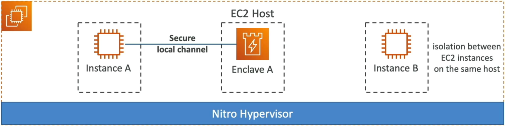
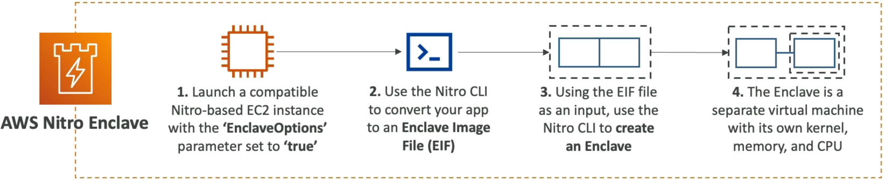

# AWS Nitro Enclaves

**AWS Nitro Enclaves** are the absolute peak of confidential computing and isolated processing on EC2.

When standard VPC security groups, private subnets, and IAM roles aren't enough to satisfy strict regulatory compliance (e.g., handling raw credit card processing, PII, healthcare records, or cryptographic signing keys), Nitro Enclaves drop an ultra-isolated, zero-access sandbox directly alongside your primary EC2 instance.

---

## Key Takeaways

### 🏰 What is a Nitro Enclave?



A **Nitro Enclave** is an isolated, hardened, and highly constrained virtual machine created from a parent Nitro-based EC2 instance.

```text
┌─────────────────────────────────────────────────────────────────────────────┐
│ 🖥️ EC2 PARENT INSTANCE (Nitro-Based)                                        │
│  • Full Networking / Internet Access                                        │
│  • SSH / SSM Session Manager Access                                         │
│  • Persistent EBS Volumes                                                   │
│                                                                             │
│  ┌───────────────────────────────────────────────────────────────────────┐  │
│  │ 🔐 NITRO ENCLAVE (Ultra-Isolated Sandbox)                             │  │
│  │  ❌ NO External IP / Network Connectivity                             │  │
│  │  ❌ NO Interactive Access (No SSH, No Admin User, No Console)         │  │
│  │  ❌ NO Persistent Disk Storage                                        │  │
│  │  ✅ Local Communication ONLY (VSOCK Channel ↔ Parent EC2)             │  │
│  └───────────────────────────────────────────────────────────────────────┘  │
└─────────────────────────────────────────────────────────────────────────────┘
  ▲
  │ Managed directly by the underlying AWS Nitro Hypervisor
```

#### 🔑 Key Characteristics & Constraints:

- **Zero External Networking 🚫:** Has no IP address, no network interface, and zero direct connectivity to the VPC or public internet.
- **No Interactive Access 🚫:** You **cannot SSH, log in, or execute remote commands** inside an Enclave.
- **No Persistent Storage 🚫:** It has no attached EBS volumes or local disk storage.
- **VSOCK Communication 🔌:** The Enclave communicates _only_ with the parent EC2 instance via a secure local socket interface called **VSOCK**.

---

### 🛠️ How Nitro Enclaves Work Under the Hood



1. **Launch Nitro EC2 Instance:** Launch a supported Nitro-based EC2 instance with the `EnclaveOptions: { Enabled: true }` parameter set.
2. **Carve Out CPU & Memory:** The parent instance allocates a dedicated slice of its vCPUs and RAM specifically for the Enclave.
3. **Build Enclave Image File (`.eif`):** Using the **Nitro CLI**, package your application code and dependencies into an Enclave Image File (`.eif`).
4. **Run Enclave:** Use the Nitro CLI on the parent EC2 instance to start the Enclave using the `.eif` file.

---

### 🔐 Cryptographic Attestation & KMS Integration

How does the Enclave decrypt sensitive data from AWS KMS if it has no network interface or IAM credentials?

```text
🔐 Nitro Enclave ──(1. Generates Attestation Document)──► 🖥️ Parent EC2 ──(2. Calls kms:Decrypt via VSOCK Proxy)──► 🔑 AWS KMS
```

- **Cryptographic Attestation 📜:** The Nitro Hypervisor generates a signed **Attestation Document** containing cryptographic hashes (PCRs) of the Enclave's code image, kernel, and parent instance ID.
- **KMS Condition Enforcement:** You configure your **KMS Key Policy** to verify the Attestation Document. KMS will **only decrypt data keys if the request originates from a signed, verified Enclave running exact, unaltered code!**

---

## Exam Tips

- **Primary Use Cases 🚨:** Selected whenever a scenario requires processing **PII, healthcare records, credit card processing (PCI-DSS), digital asset signing, or multi-party computation** on EC2 with maximum isolation.
- **Architecture Distinction:**
  - If a scenario asks for isolated compute _without_ network access or admin interaction on EC2: **AWS Nitro Enclaves**.
  - If a scenario asks for hardware security module control: **AWS CloudHSM**.
- **Zero Trust Operator Model:** Nitro Enclaves guarantee that even an administrator with full `root` or `sudo` access on the parent EC2 instance **cannot inspect memory, steal keys, or access data inside the Enclave!**
