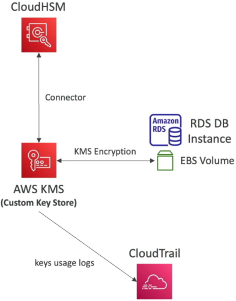

# CloudHSM Overview

**AWS CloudHSM** is the ultimate heavy-artillery cryptographic solution when fully managed KMS services just don't give your enterprise compliance auditors the exclusive hardware control they demand. 🏎️🛡️

While KMS abstracts away the underlying Hardware Security Modules (HSMs) in a multi-tenant, zero-maintenance model, **CloudHSM drops dedicated, single-tenant, physical HSM hardware straight inside your own VPC.**

---

## Key Takeaways

### 🏗️ Architecture & Security Model

With CloudHSM, AWS manages the physical hardware rack, cooling, and firmware updates, but **you hold 100% ownership over the cryptographic keys, user permissions, and access controls.** AWS operators have zero access to your keys or plaintext data!

```text
🌎 YOUR VIRTUAL PRIVATE CLOUD (VPC)
   └── 🔐 CloudHSM Cluster (Single-Tenant Hardware)
           ├── 🏢 Subnet AZ-1: HSM Device #1  ◄──┐
           │                                      ├── Managed High-Availability Sync
           └── 🏢 Subnet AZ-2: HSM Device #2  ◄──┘
                    ▲
                    │ 🛰️ Direct Connection via CloudHSM Client Software (PKCS#11, JCE, CNG)
                    │
   💻 EC2 Application Nodes / On-Premise Servers
```

- **Physical Isolation & Compliance:** Hardware devices are single-tenant and certified to **FIPS 140-2 Level 3 / FIPS 140-3 Level 3.** If anyone attempts physical tampering or environmental attacks on the rack, the hardware actively erases key material instantly!
- **Crypto Primitives Supported:** Supports Symmetric (AES), Asymmetric (RSA/ECC), Hashing algorithms, and SSL/TLS web server offloading!
- **High Availability (HA):** Provision HSM instances across multiple Availability Zones inside a single cluster. The CloudHSM client software automatically handles load-balancing and synchronization between devices.

---

### 🌉 KMS Custom Key Store (The Hybrid Bridge)

How do you get the compliance power of a dedicated HSM while retaining the simple API developer experience of AWS services like S3, EBS, and RDS? **You connect CloudHSM to KMS as a Custom Key Store.**

```text
📦 Amazon S3 / EBS / RDS ──► 🔑 AWS KMS APIs ──► 🔐 Custom Key Store ──► 🛡️ CloudHSM Cluster
                                                                           (Keys generated & stored inside dedicated HSM)
```

- **How it works:** KMS uses your CloudHSM cluster as its underlying storage engine. Whenever an AWS service requires an encryption key, KMS routes the generation/decryption call straight to your dedicated CloudHSM cluster.
- **Audit Trail:** Every operation triggers an audit record in **AWS CloudTrail**, giving you end-to-end visibility across all key usages.  
  

---

### 📊 AWS KMS vs. AWS CloudHSM

This side-by-side matrix locks down the primary architectural differences for exam scenarios:

| Feature Dimension           | 🔑 AWS KMS                                             | 🛡️ AWS CloudHSM                                                  |
| --------------------------- | ------------------------------------------------------ | ---------------------------------------------------------------- |
| **Tenancy Model**           | Fully Managed, Multi-Tenant                            | **Single-Tenant Dedicated Hardware**                             |
| **Access Control**          | **AWS IAM Policies & KMS Key Policies**                | **CloudHSM Client Software (Users/Roles defined inside HSM)**    |
| **Network Location**        | Public Regional AWS API Endpoint                       | **Deployed inside your private VPC**                             |
| **AWS Service Integration** | Native integration with 100+ services                  | Custom integration OR via **KMS Custom Key Store**               |
| **Key Exportability**       | Cannot export CMK plaintext key material               | **Keys CAN be exported / wrapped for migration**                 |
| **Pricing Model**           | Pay per key / per request ($1/mo + $0.03/10k requests) | **Hourly rate per provisioned HSM (~$1,000+/mo, NO Free Tier!)** |

---

## Exam Tips

- **The Strict Single-Tenant Hardware Requirement 🚨:** If a scenario specifies that contractual or regulatory mandates (e.g., PCI-DSS or corporate audit requirements) demand **dedicated, single-tenant hardware** where AWS employees have zero access to keys under any circumstances—**bypass standard KMS immediately! Choose AWS CloudHSM.**
- **The IAM vs. Native HSM User Fallacy:** If a question asks why an IAM administrator cannot create or modify crypto users or generate keys inside a CloudHSM cluster—**remind yourself that IAM only manages the cluster's lifecycle (creation/deletion)! Key generation and user access are strictly managed via the CloudHSM Client software tools.**
- **Server-Side Encryption with Customer-Provided Keys (SSE-C):** If an application stores objects in Amazon S3 using SSE-C where you must manage your own encryption keys in a secure, tamper-resistant environment—**CloudHSM is the top candidate for storing and generating those external keys!**
