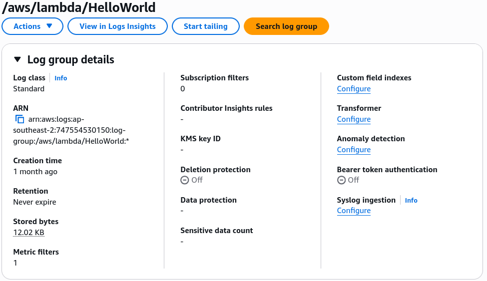
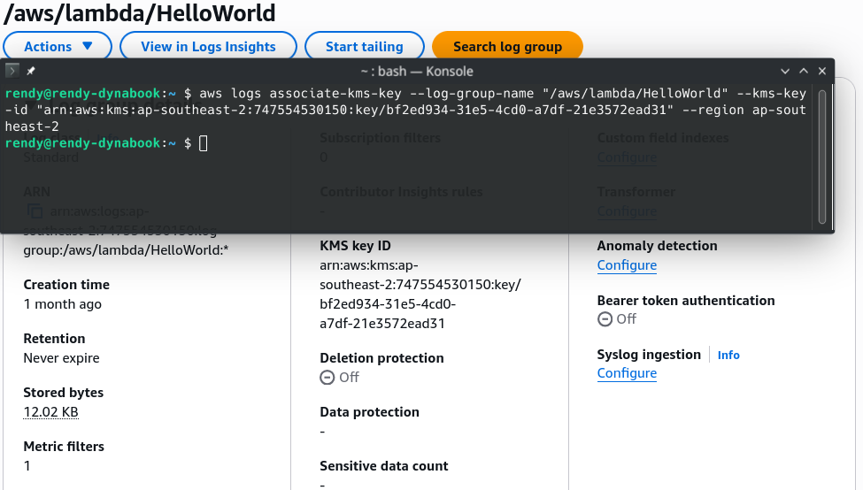
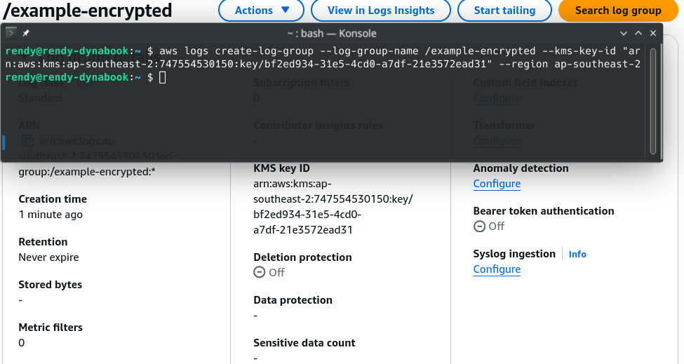

# CloudWatch Logs Encryption

Locking down **CloudWatch Logs Encryption** via KMS is a classic DVA-C02 security pattern that catches many engineers off guard. 🏎️🔐

Because log groups often capture raw application stack traces, debug payloads, or API metadata, encrypting them at rest with a Customer Managed Key (CMK) is critical for enterprise compliance.

---

## Key Takeaways

Let's review the core architectural rules and have hands-on practice with the CLI commands and KMS Key Policy requirement.

### 🎛️ Core Architectural Rules for CloudWatch Logs Encryption

- **Granularity Level:** Encryption is applied strictly at the **Log Group level**, _NOT_ at the individual Log Stream level! All log streams residing inside an encrypted log group automatically inherit that group's encryption configuration.
- **Console Limitation 🚨:** **You CANNOT associate or modify a KMS key on a CloudWatch Log Group via the AWS Management Console!** You must use the **AWS CLI**, **SDK**, or **CloudFormation**.
- **Association Timing:** You can attach a KMS CMK when creating a brand-new log group OR associate a key with an existing, unencrypted log group retroactively.

---

### 🔐 The KMS Key Policy Requirement (The AccessDenied Trap)

When you attempt to associate a KMS key with a log group, passing IAM permissions alone is **not enough**! Attempting to execute the CLI command without updating the KMS Key Policy triggers an `AccessDeniedException`.

Why? Because the **CloudWatch Logs service principal** (`logs.<region>.amazonaws.com`) must be explicitly granted cryptographic permissions directly inside the **KMS Key Policy**!

```json
{
  "Sid": "Allow CloudWatch Logs Service to use the key",
  "Effect": "Allow",
  "Principal": {
    "Service": "logs.ap-southeast-2.amazonaws.com"
  },
  "Action": [
    "kms:Encrypt*",
    "kms:Decrypt*",
    "kms:ReEncrypt*",
    "kms:GenerateDataKey*",
    "kms:Describe*"
  ],
  "Resource": "*",
  "Condition": {
    "ArnLike": {
      "aws:SourceArn": "arn:aws:logs:ap-southeast-2:747554530150:log-group:*"
    }
  }
}
```

---

### 💻 The AWS CLI Command Matrix

#### A. Associate Key with an EXISTING Log Group

To attach a KMS key to a log group that is already created:

```bash
aws logs associate-kms-key \
    --log-group-name "/aws/lambda/HelloWorld" \
    --kms-key-id "arn:aws:kms:ap-southeast-2:111122223333:key/12345678-1234-1234-1234-123456789012" \
    --region ap-southeast-2
```

---


Before the association, the log group is unencrypted.

---


After the association, the log group is now encrypted with the specified KMS key.

---

#### B. Create a NEW Encrypted Log Group Directly

To instantiate a fresh log group with KMS encryption baked in from second zero:

```bash
aws logs create-log-group \
    --log-group-name "/example-encrypted" \
    --kms-key-id "arn:aws:kms:ap-southeast-2:111122223333:key/12345678-1234-1234-1234-123456789012" \
    --region ap-southeast-2
```



---

## Exam Tips

- **The Console Misdirection 🚨:** If an exam question asks how to configure KMS encryption for an existing CloudWatch Log Group using the AWS Management Console, **eliminate that option immediately!** It must be performed via the CLI (`associate-kms-key`), SDK, or Infrastructure as Code (CloudFormation).
- **`AccessDeniedException` Troubleshooting:** If an engineer attempts to associate a Customer Managed Key with a CloudWatch Log Group using proper administrator IAM permissions but still gets an `AccessDeniedException` error—**the cause is an incomplete KMS Key Policy! You must update the Key Policy to grant `logs.<region>.amazonaws.com` permission to perform cryptographic operations.**
- **Existing Log Data:** Associating a KMS key with an existing log group encrypts **newly ingested log data moving forward**. Historical log events created prior to key association remain stored as they were previously configured.
