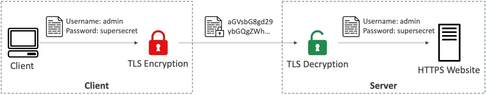
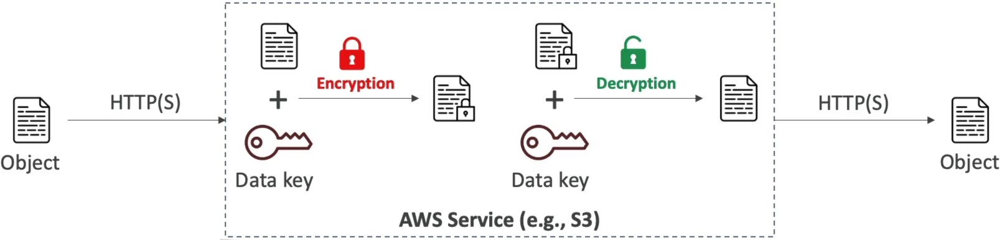
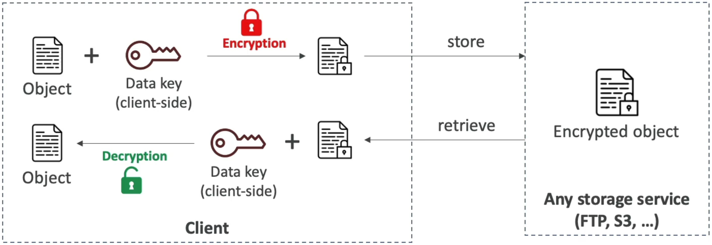

# Encryption 101

Whether data is flying across the public internet or sitting on an S3 drive, knowing **WHERE** and **HOW** encryption and decryption happen determines your entire security architecture.

---

## Key Takeaways

### 🛰️ Encryption In Flight (In Transit)

- **The Core Problem:** Data traveling across networks (especially public internet or between microservices) is exposed to **Man-in-the-Middle (MitM) attacks** where malicious nodes can eavesdrop or intercept sensitive payloads.
- **The Solution:** Uses **TLS/SSL Certificates** (HTTPS).
- **How It Works:**
  1. Data is encrypted on the **Client** _before_ being transmitted over the wire.
  2. The payload travels across routers in encrypted ciphertext.
  3. The **Server** decrypts the payload using its server TLS certificate upon arrival.
- **Key Takeaway:** Only the target destination server holding the matching certificate can decrypt the payload. Intermediate network hops see unreadable garbage.  
  

---

### 🖥️ Server-Side Encryption (SSE) at Rest

- **The Core Problem:** Protecting stored data from physical disk theft, unauthorized access, or misconfigured storage buckets.
- **The Solution:** The server (e.g., **Amazon S3**, **Amazon EBS**, **Amazon DynamoDB**) manages the actual encryption and decryption processes on your behalf.
- **How It Works:**
  1. The client sends a **plaintext object** over the wire (ideally encrypted in flight via HTTPS).
  2. The server receives the plaintext object, calls a Key Management Service to fetch a **Data Key**, encrypts the object, and writes the ciphertext to physical storage.
  3. When the client requests the object back, the server reads the ciphertext, fetches the key to decrypt it back to plaintext, and returns it over the network.
- **AWS SSE Variations (Target Exam Knowledge):**
  - **SSE-S3:** AWS fully manages keys and encryption.
  - **SSE-KMS:** AWS KMS manages keys; AWS performs encryption (offers audit logs via CloudTrail).
  - **SSE-C:** You manage and provide the key per request; AWS performs encryption and discards the key.  
    

---

### 🔐 Client-Side Encryption (CSE)

- **The Core Problem:** You do **NOT trust the cloud provider or server** to ever see your unencrypted plaintext data or hold your raw decryption keys.
- **The Solution:** Encryption and decryption happen **entirely on the client side** using local libraries (e.g., **AWS Encryption SDK** or **Amazon S3 Encryption Client**) _before_ making an API call.
- **How It Works:**
  1. The client app uses a local Data Key to encrypt the plaintext object locally.
  2. The client uploads the **already encrypted payload** to storage (e.g., S3 or EBS).
  3. The server receives cipher text and stores it as a blob—the server has zero ability to inspect or decrypt the file contents!
  4. Upon download, the client pulls the encrypted payload and uses its local key material to decrypt it back to plaintext.  
     

---

### 📊 Quick Summary Matrix

| Encryption Model                 | Where Encryption Happens? | Who Manages the Keys?         | Does the AWS Server See Plaintext?          |
| -------------------------------- | ------------------------- | ----------------------------- | ------------------------------------------- |
| **In Flight (TLS/SSL)**          | Client (Transmission)     | Certificate Authorities / ACM | Yes (Once decrypted at destination)         |
| **Server-Side Encryption (SSE)** | AWS Service (Server)      | AWS or Customer (via KMS)     | **Yes** (Receives plaintext, then encrypts) |
| **Client-Side Encryption (CSE)** | Client Application        | Customer / Client App         | **NO!** (Only sees ciphertext)              |

---

## Exam Tips

- **The Zero-Trust Server Requirement 🚨:** If an exam question states that data must be encrypted before leaving the client application premises and that AWS services must never have access to plaintext data or decryption keys—**look straight for Client-Side Encryption (CSE) or the AWS Encryption SDK, chief!**
- **The Compliance Audit Trail:** If a scenario requires encryption at rest where every single key usage (encryption and decryption request) must be auditable in AWS CloudTrail—**target Server-Side Encryption with AWS KMS (SSE-KMS).**
