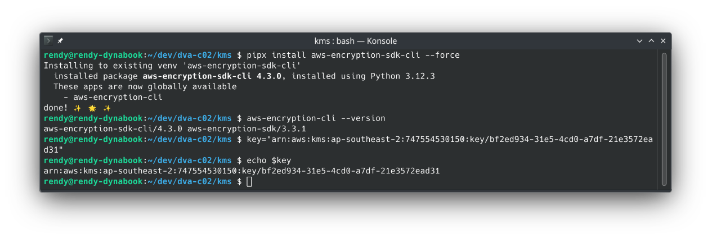
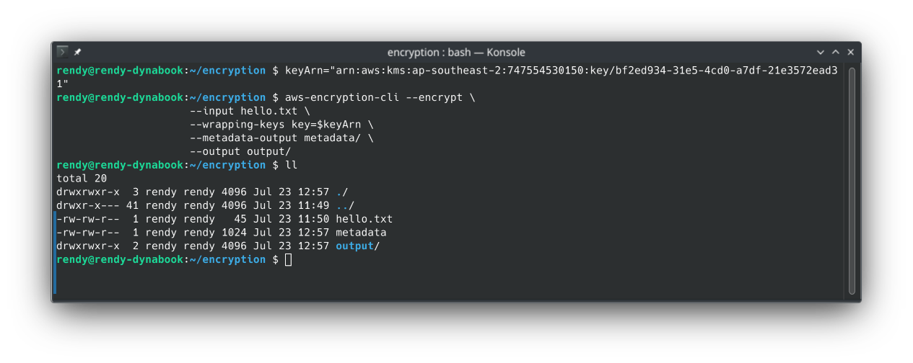
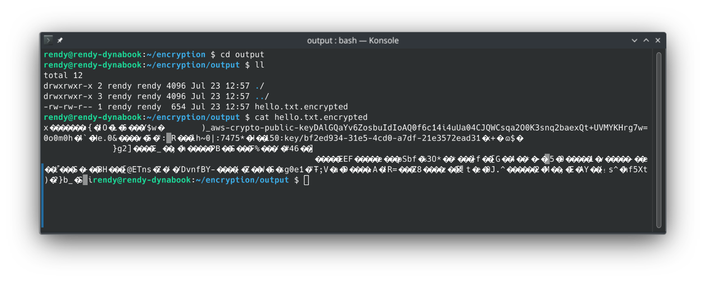
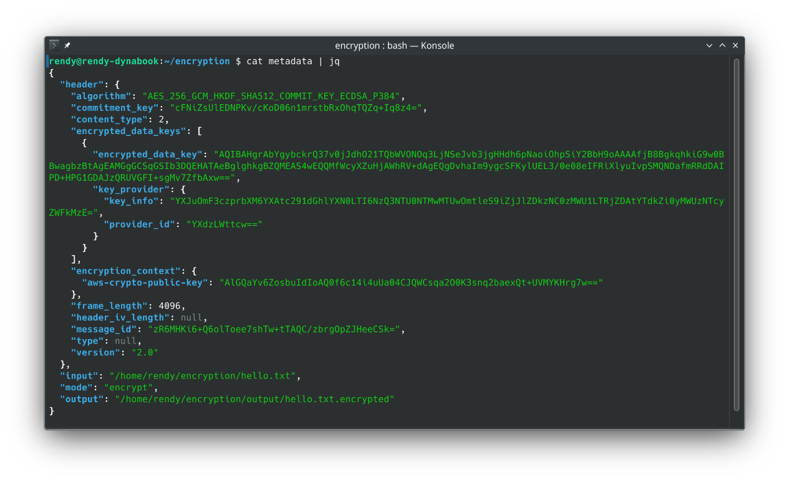
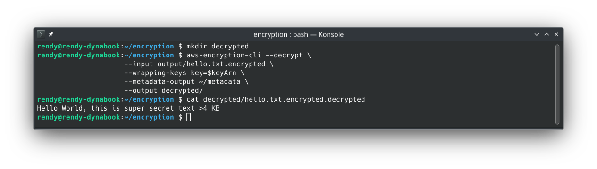

# Encryption SDK CLI Hands On

Taking the **AWS Encryption SDK CLI** for a spin gives you a front-row seat to how Envelope Encryption and Client-Side Encryption operate. The CLI itself is built on top of the AWS Encryption SDK for Python.

While you won't need to memorize exact command flags for the DVA-C02 exam, this hands-on lab reinforces several high-stakes conceptual principles that _will_ appear on test day.

---

## 🛠️ 1. Setup & Installation

- **Tool Installation:** Installed via Python's package manager: `pip install aws-encryption-sdk-cli`.
  - Full installation instructions are available in the [official AWS Encryption SDK CLI documentation](https://docs.aws.amazon.com/encryption-sdk/latest/developer-guide/crypto-cli-install.html).
- **Key Scope:** Stored the full **KMS Key ARN** inside an environment variable (`$key`).
  :::tip
  Unlike basic KMS operations that can use aliases, the AWS Encryption SDK requires a **full KMS Key ARN** for encryption operations to avoid cross-region or ambiguous key targeting.
  :::



---

## 🔐 2. The Encryption Flow (Client-Side Envelope Encryption)

```bash
//replace with your own KMS Key ARN
keyArn=arn:aws:kms:ap-southeast-2:111122223333:key/1234abcd-12ab-34cd-56ef-1234567890ab

aws-encryption-cli --encrypt \
                     --input hello.txt \
                     --wrapping-keys key=$keyArn \
                     --metadata-output metadata/ \
                     --output output/
```



### 🧠 What Happens Behind the Scenes?

1. The CLI calls KMS's `GenerateDataKey` API using the provided Key ARN.
2. KMS returns a **Plaintext Data Encryption Key (DEK)** and an **Encrypted DEK**.
3. The CLI uses your local CPU to encrypt `hello.txt` with the **Plaintext DEK**.
4. The Plaintext DEK is wiped from RAM, and the resulting file contains the **encrypted payload AND the Encrypted DEK packaged together**.  
   
5. **The Metadata File:** The `--metadata-output` file generates a JSON document containing header specs, algorithm suites, and key provider metadata.
   

---

## 🔓 3. The Decryption Flow

```bash
aws-encryption-cli --decrypt \
                     --input output/hello.txt.encrypted \
                     --wrapping-keys key=$keyArn \
                     --metadata-output metadata/ \
                     --output decrypted/
```

### 🧠 What Happens Behind the Scenes?

1. The CLI extracts the **Encrypted DEK** embedded directly inside the header of the `.encrypted` file.
2. The CLI sends the Encrypted DEK to KMS via `kms:Decrypt`.
3. KMS decrypts the DEK using the CMK and returns the **Plaintext DEK** back to the CLI.
4. The CLI decrypts the payload locally on your machine, restoring the original plaintext file!  
   

---

## Exam Tips

- **Direct KMS vs. Encryption SDK:** Standard AWS CLI commands like `aws kms encrypt` send the raw payload over the wire to KMS and fail if the file exceeds **4 KB**. The **AWS Encryption SDK** executes Envelope Encryption locally, allowing you to encrypt files of **virtually any size** (gigabytes/terabytes)!
- **Where Encryption Happens:** In this hands-on exercise, **100% of payload encryption/decryption happened on the client side**. KMS was only invoked to handle the small Data Key lifecycle!
- **Decryption Metadata:** The SDK automatically embeds key provider information inside the ciphertext header, enabling seamless decryption without needing to manually pass data keys.
