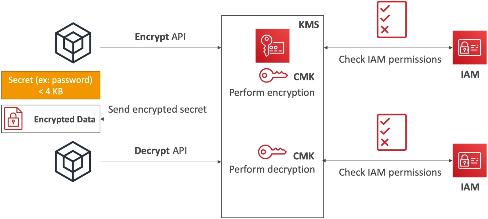
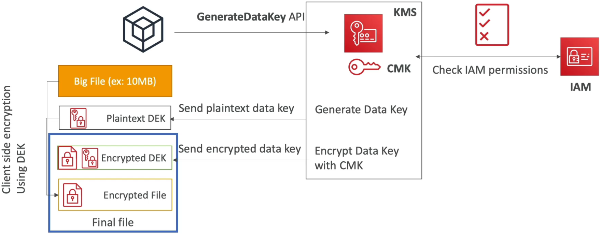
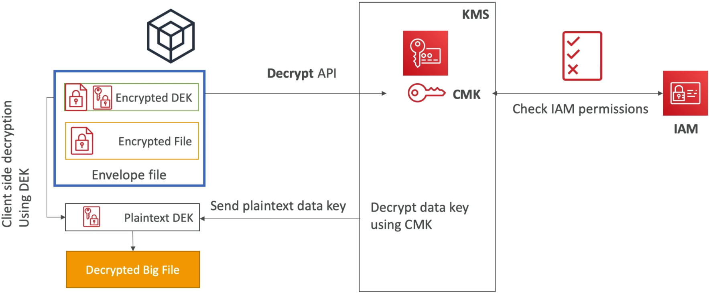

# KMS Encryption Patterns and Envelope Encryption

We're diving deep into **Envelope Encryption** and the precise KMS API calls is how you completely secure top marks on Domain 2 of the DVA-C02 exam. 🏎️🔐

When your payload exceeds that hard **4 KB size limit** on direct KMS API calls, passing raw data over the network to KMS is a no-go. Envelope Encryption fixes this by shifting the heavy lifting of payload encryption locally to your application's CPU using a local Data Key, while letting KMS do what it does best: securely generating and managing cryptographic keys.

---

## Key Takeaways

Let's check the two execution patterns, the API matrix, and the key caching strategies for your DVA-C02 exam prep:

### 📐 Direct KMS APIs vs. Envelope Encryption Pattern

```text
                               ┌────────────────────────────────────────────────────────┐
                               │                 AWS KMS PAYLOAD LIMIT                  │
                               └───────────────────────────┬────────────────────────────┘
                                                           │
             ┌─────────────────────────────────────────────┴─────────────────────────────────────────────┐
             ▼                                                                                           ▼
📉 Direct API Calls (≤ 4 KB)                                                                📈 Envelope Encryption (> 4 KB)
  • Payload sent straight to KMS endpoints                                                     • Application calls `GenerateDataKey`
  • Single API roundtrip (`kms:Encrypt` / `kms:Decrypt`)                                       • Returns Plaintext DEK + Encrypted DEK
  • Hard size cap: Exactly 4,096 bytes                                                         • App encrypts data locally via CPU using Plaintext DEK
  • Best for: Short strings, API tokens, DB passwords                                          • Plaintext DEK wiped from RAM immediately
                                                                                               • Stores Encrypted DEK alongside encrypted file
```

---

### Direct KMS API Calls (≤ 4 KB)



---

### 🛠️ Step-by-Step Envelope Encryption Lifecycle

#### 📤 Phase 1: Encryption Flow

1. **The Request:** Your application calls `GenerateDataKey` passing a Customer Managed Key (CMK) ARN.
2. **The Handshake:** KMS checks IAM permissions (`kms:GenerateDataKey`), generates a unique **Symmetric Data Encryption Key (DEK)** in memory, and returns **TWO items**:
   - **Plaintext DEK:** Used immediately in your app's memory to encrypt the large file locally via AES-256.
   - **Encrypted DEK:** Already encrypted by KMS using your CMK.
3. **The Local Execution:** Your application encrypts the large file locally using the Plaintext DEK.
4. **The Cleanup & Envelope Wrap:** Your application **wipes the Plaintext DEK from RAM immediately**! It then packages the local ciphertext alongside the **Encrypted DEK** into a single envelope structure.
   

#### 📥 Phase 2: Decryption Flow

1. **The Retrieval:** Your app reads the envelope file, extracting the **Encrypted DEK** and the local ciphertext/encrypted file.
2. **The KMS Callback:** Your app calls the `kms:Decrypt` API passing **ONLY the Encrypted DEK** (which is well under 4 KB).
3. **The Unwrapping:** KMS uses your CMK inside its Hardware Security Module (HSM) to decrypt the DEK and returns the **Plaintext DEK** back to your application.
4. **Local Payload Decryption:** Your app decrypts the large file locally using the returned Plaintext DEK, then discards the Plaintext DEK from RAM.  
   

---

### ⚡ Optimizing with AWS Encryption SDK & Data Key Caching

Writing custom code for Envelope Encryption can be tedious. The **AWS Encryption SDK** abstracts the pattern completely, adding a performance booster called **Data Key Caching**.

```text
🚀 DATA KEY CACHING MECHANICS:
   App Request ──► [ LocalCryptoMaterialsCache ] ──(Cache Hit?)──► Reuse Cached DEK (No KMS Call!)
                          │
                   (Cache Miss?)
                          │
                          ▼
             Call KMS: GenerateDataKey ──► Save DEK to Local Cache
```

- **Why use it?** Massively reduces KMS API costs ($0.03 per 10k requests) and slashes latency by reusing DEKs across multiple local encryption calls.
- **The Security Tradeoff:** Reusing key material across multiple files lowers key isolation.
- **Configuring `LocalCryptoMaterialsCache`:** Managed by setting strict thresholds via `CachingCryptoMaterialsManager`:
  - `max_age`: Maximum time (seconds) a DEK stays in cache.
  - `max_bytes_encrypted`: Max total volume of data a single DEK can encrypt.
  - `max_messages_encrypted`: Max number of individual files/payloads encrypted by one DEK.

---

### 📑 The KMS Symmetric API Cheat Sheet

| API Action                            | What it returns?                  | Primary Use Case                                       | DVA-C02 Exam Trap                                                           |
| ------------------------------------- | --------------------------------- | ------------------------------------------------------ | --------------------------------------------------------------------------- |
| **`Encrypt`**                         | Ciphertext                        | Encrypt payloads **≤ 4 KB** directly inside KMS.       | Fails if payload > 4 KB!                                                    |
| **`GenerateDataKey`**                 | **Plaintext DEK + Encrypted DEK** | Real-time Envelope Encryption (> 4 KB).                | **Correct API** for immediate local encryption.                             |
| **`GenerateDataKeyWithoutPlaintext`** | **Encrypted DEK ONLY**            | Generating DEKs to store for **future/deferred use**.  | **WRONG API** for immediate encryption (requires calling `Decrypt` first!). |
| **`Decrypt`**                         | Plaintext                         | Decrypts payloads ≤ 4 KB OR decrypts an Encrypted DEK. | Auto-detects CMK from ciphertext headers!                                   |
| **`GenerateRandom`**                  | Byte string                       | Cryptographically secure random number generation.     | Used for nonces / seeds.                                                    |

---

## Exam Tips

- **The 4 KB Size Boundary Trap 🚨:** If a scenario details an application needing to encrypt a 5 MB file or a 50 KB JSON payload using KMS—**immediately reject `kms:Encrypt`! Select the solution utilizing `kms:GenerateDataKey` for Envelope Encryption.**
- **`GenerateDataKey` vs. `GenerateDataKeyWithoutPlaintext`:** If a question asks which API to call to encrypt a database backup locally _right now_, **choose `GenerateDataKey`.** If the question specifies generating a key to attach to a storage volume that will be encrypted at a _later date_, **choose `GenerateDataKeyWithoutPlaintext`!**
- **Throttling Exception Mitigation (`KMSThrottlingException`):** If an application encrypting thousands of small files per second starts hitting KMS API rate limits and throwing throttling errors—**select the option to implement the AWS Encryption SDK with Data Key Caching (`LocalCryptoMaterialsCache`) to reduce total API calls to KMS.**
