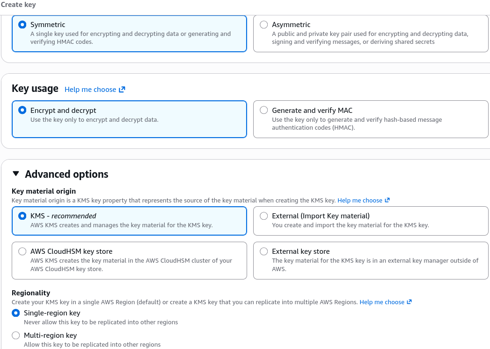
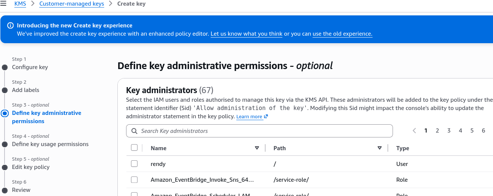
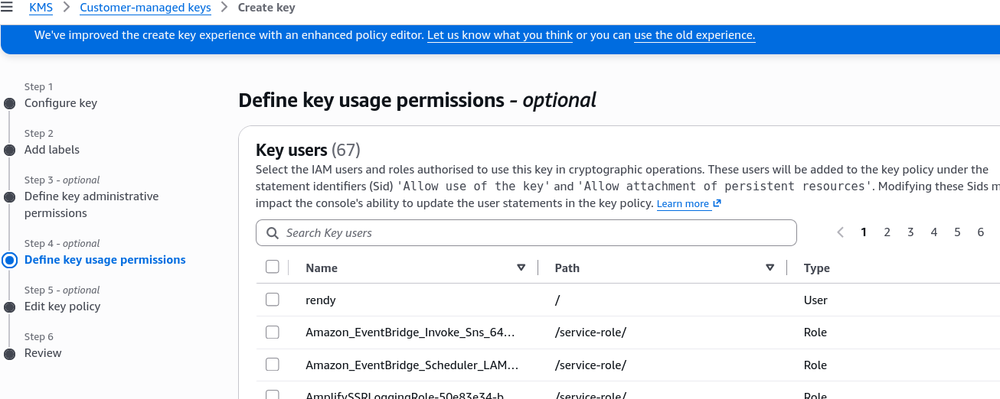
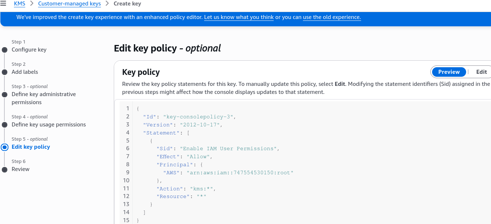
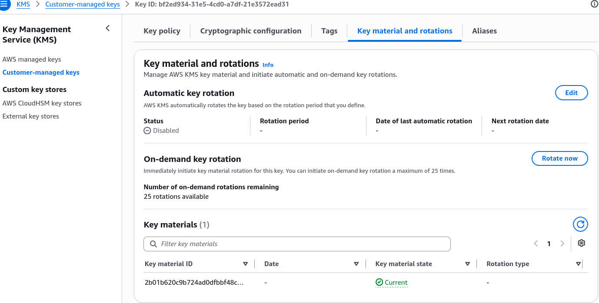
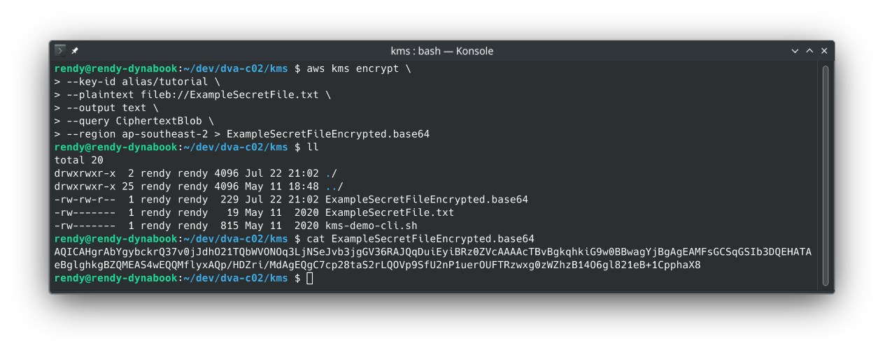

# KMS Hands On w/CLI

Running KMS encryption directly via the AWS CLI is the ultimate way to prove you understand what happens under the hood before the SDK abstracts it away.

Stephane's hands-on demo cleanly highlights how raw binary payloads, base64 encodings, and KMS Key Policies interact.

Here is your scan-ready, easy-to-follow playbook for **KMS Hands-On with CLI**, bro:

---

## 🛠️ 1. Creating the Customer Managed Key (CMK)

1. **Launch KMS Console:** Navigate to **AWS KMS** ──► Select **Customer managed keys** ──► Hit **Create key**.
2. **Key Configuration:**
   - **Key type:** `Symmetric`
   - **Key usage:** `Encrypt and decrypt`
   - **Advanced options:** `KMS` (Origin), `Single-region key` (Regionality).
   - 
3. **Set Alias Name:** Name the key alias **`tutorial`** (accessible via `alias/tutorial`).
4. **Key Policy Setup (Default Policy):** Leave Administrators and Key Users empty to default to the standard **Root/IAM delegation policy**. This enables any user/role with proper IAM permissions (`kms:Encrypt`, `kms:Decrypt`) to use the key.  
   
   ***
   
   ***
   
5. **Enable Rotation (Optional):** Once created. Go to the **Key rotation** tab ──► Enable **Automatic key rotation** (configurable between 90 to 2,560 days, default 365 days).  
   

---

## 🔐 2. CLI Encryption Workflow (Plaintext ──► Ciphertext)

### Step A: Create the Target Secret File

Create a plain text file named `ExampleSecretFile.txt` with your secret text:

```text title="ExampleSecretFile.txt"
SuperSecretPassword
```

### Step B: Call `aws kms encrypt`

Invoke KMS using the key alias. Output the returned base64-encoded ciphertext directly to a file:

```bash
aws kms encrypt \
    --key-id alias/tutorial \
    --plaintext fileb://ExampleSecretFile.txt \
    --output text \
    --query CiphertextBlob \
    --region ap-southeast-2 > ExampleSecretFileEncrypted.base64
```


This command encrypts the plaintext file using the `tutorial` CMK and saves the base64-encoded ciphertext (plaintext that has been encrypted) to `ExampleSecretFileEncrypted.base64`.

### Step C: Decode Base64 to Raw Ciphertext Binary

KMS requires raw binary data for decryption. Decode the base64 string into a raw binary file:

- **Linux / macOS:**

```bash
base64 --decode ExampleSecretFileEncrypted.base64 > ExampleSecretFileEncrypted
```

- **Windows (PowerShell):**

```powershell
certutil -decode .\ExampleSecretFileEncrypted.base64 .\ExampleSecretFileEncrypted
```

---

## 🔓 3. CLI Decryption Workflow (Ciphertext ──► Plaintext)

### Step A: Call `aws kms decrypt`

Notice that **you do NOT need to specify the `--key-id` parameter during decryption!** The metadata identifying which KMS key encrypted the payload is permanently embedded inside the header of the raw ciphertext blob itself.

```bash
aws kms decrypt \
    --ciphertext-blob fileb://ExampleSecretFileEncrypted \
    --output text \
    --query Plaintext \
    --region ap-southeast-2 > ExampleSecretFileDecrypted.base64
```

### Step B: Decode Base64 to Plaintext Text File

Convert the base64-encoded output back into readable plaintext:

- **Linux / macOS:**

```bash
base64 --decode ExampleSecretFileDecrypted.base64 > ExampleSecretFileDecrypted.txt
```

- **Windows (PowerShell):**

```powershell
certutil -decode .\ExampleFileDecrypted.base64 .\ExampleFileDecrypted.txt
```

### Step C: Verify the Decrypted Payload

```bash
cat ExampleSecretFileDecrypted.txt
# Output: SuperSecretPassword
```

---

## Exam Tips

- **The `fileb://` Prefix Requirement 🚨:** When passing raw binary files (or files to be treated as raw bytes) to AWS CLI encryption commands, **you must use `fileb://` (file binary), NOT `file://`!** Using standard `file://` causes character-encoding corruption on binary payloads.
- **The Embedded Key ID Secret:** If an exam question asks how `aws kms decrypt` knows which Customer Managed Key to use when decrypting a ciphertext file without requiring a Key ARN parameter—**remember that KMS automatically embeds key metadata inside the ciphertext header string.**
- **4 KB Payload Limit Trap:** Direct calls to `aws kms encrypt` can only handle payloads **up to 4,096 bytes (4 KB)**! If your file exceeds 4 KB, you **must use Envelope Encryption** via `GenerateDataKey`.
