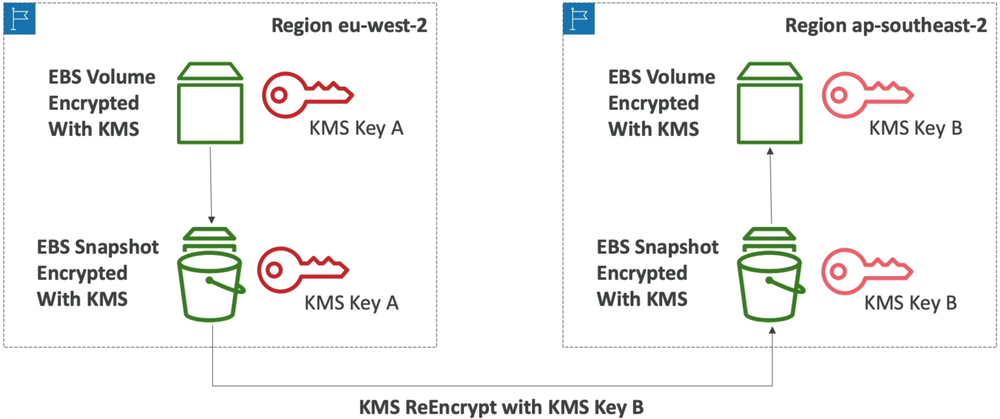
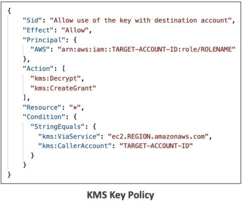

# KMS Overview

**AWS Key Management Service (KMS)** is the undisputed core encryption hub across the entire AWS ecosystem. 🏎️🔑

Whether you are encrypting S3 buckets, EBS volumes, Lambda environment variables, or SSM Parameters, KMS handles the cryptographic key material, authorization logic, and CloudTrail audit logging out of the box.

---

## Key Takeaways

Let's explore the concepts of the core key types, rotation mechanics, regional isolation rules, and custom key policies before we dive into hands-on in the next section.

### 🔑 Symmetric vs. Asymmetric KMS Keys

```text
                               ┌────────────────────────────────────────────────────────┐
                               │                    AWS KMS KEYS                        │
                               └───────────────────────────┬────────────────────────────┘
                                                           │
             ┌─────────────────────────────────────────────┴─────────────────────────────────────────────┐
             ▼                                                                                           ▼
🔐 SYMMETRIC KEYS                                                                           🔓 ASYMMETRIC KEYS
  • Single Secret Key (Encrypt = Decrypt)                                                     • Public/Private Key Pair
  • AWS Services ALWAYS use Symmetric Keys                                                    • Encryption/Decryption OR Sign/Verify
  • Raw key material NEVER leaves KMS HSMs                                                    • Public Key can be downloaded outside AWS!
  • You call API methods (`kms:Encrypt`, `kms:Decrypt`)                                       • Private Key NEVER leaves KMS HSMs

```

- **Symmetric Keys 🔐:** Uses a single key for both encryption and decryption. **Every AWS service integrated with KMS requires a symmetric key.** You never see or download the raw key material; you only interact with it via KMS API calls.
- **Asymmetric Keys 🔓:** Consists of a Public Key (which can be exported outside AWS for external users to encrypt payloads) and a Private Key (stored safely inside KMS HSMs to perform decryption inside your cloud account).

---

### 🏷️ The KMS Key Hierarchy & Pricing Matrix

| Key Category                    | Created / Owned By                                   | Visibility                | Cost                          | Rotation Strategy                                                         |
| ------------------------------- | ---------------------------------------------------- | ------------------------- | ----------------------------- | ------------------------------------------------------------------------- |
| **AWS Owned Keys**              | AWS Services (e.g., S3, DynamoDB)                    | Invisible in your console | **FREE**                      | Managed automatically by the AWS Service.                                 |
| **AWS Managed Keys**            | Created in your account by AWS (`aws/s3`, `aws/ebs`) | Visible in KMS console    | **FREE** (No monthly fee)     | Automatically rotated **every 1 year (365 days)**.                        |
| **Customer Managed Keys (CMK)** | Created & managed by YOU                             | Full visibility & control | **$1/month** + API usage fees | Optional auto-rotation (every 90–2560 days, default 1 year) or on-demand. |
| **Imported Keys**               | Created in your On-Premise HSM                       | Managed by YOU            | **$1/month** + API usage fees | **Manual rotation ONLY** (using aliases).                                 |

---

### 🌐 Regional Isolation & The Cross-Account Snapshot Copy Pattern

**KMS Keys are strictly bound to a single AWS Region!** You cannot use a KMS Key in `us-east-1` to directly encrypt or decrypt data residing in `ap-southeast-2`.

#### 🔄 Pattern A: Cross-Region Resource Migration

To copy an encrypted resource (like an EBS Snapshot or RDS Snapshot) to a new region, you must execute a **Re-Encryption Handshake** during the copy process:

1. Snapshot is encrypted in Region A using **KMS Key A**.
2. Initiating a Region Copy operation re-encrypts the snapshot data using **KMS Key B** in Region B.
3. The new snapshot in Region B can now be restored as a volume!



---

#### 🤝 Pattern B: Cross-Account Resource Sharing

To share an encrypted snapshot with another AWS account:

1. **You CANNOT share resources encrypted with AWS Managed Keys (`aws/ebs`) across accounts!** You MUST use a **Customer Managed Key (CMK)**.
2. Update the CMK's **Key Policy** in Account A to grant `kms:Decrypt`, `kms:DescribeKey`, and `kms:CreateGrant` permissions to Account B.  
   
3. Share the snapshot with Account B.
4. Account B copies the snapshot into its own account, **re-encrypting it using Account B's local CMK**!

---

### 📄 KMS Key Policies: The Ultimate Access Control

Unlike standard IAM policies, **IAM policies ALONE are not enough to access a KMS key!** You must explicitly authorize access inside the **KMS Key Policy**.

```text
🔒 DEFAULT KEY POLICY (Delegates to IAM):
  Allows root account principal ──► Enables IAM policies attached to users/roles to grant access.

🛑 CUSTOM KEY POLICY (Explicit Control & Cross-Account):
  Directly dictates which users, roles, or EXTERNAL ACCOUNTS can use or administer the key!
```

```json
{
  "Sid": "Allow Cross-Account Use of the Key",
  "Effect": "Allow",
  "Principal": {
    "AWS": "arn:aws:iam::999999999999:root"
  },
  "Action": [
    "kms:Encrypt",
    "kms:Decrypt",
    "kms:ReEncrypt*",
    "kms:GenerateDataKey*",
    "kms:DescribeKey"
  ],
  "Resource": "*"
}
```

---

## Exam Tips

- **The Cross-Account Snapshot Sharing Trap 🚨:** If a scenario asks why an engineer cannot share an encrypted EBS snapshot with a secondary AWS account—**check if the snapshot is encrypted with an AWS Managed Key (`aws/ebs`). AWS Managed Keys CANNOT be shared cross-account! The snapshot must be re-encrypted using a Customer Managed Key with an updated Key Policy.**
- **The CloudTrail Audit Requirement:** If a question asks how to track every single user, role, or service attempting to encrypt or decrypt data using KMS keys—**target Amazon CloudTrail integration! Every KMS API call (`kms:GenerateDataKey`, `kms:Decrypt`) is logged as a CloudTrail event.**
- **Cross-Region Snapshot Copying:** If a prompt asks how to move an encrypted RDS database backup to another AWS region—**select the option that copies the snapshot to the target region while specifying a target region KMS key for re-encryption.**

### Practice Test

**Question 1:** A development team has created a new IAM user that has s3:putObject permission to write to an S3 bucket. This S3 bucket uses server-side encryption with AWS KMS managed keys (SSE-KMS) as the default encryption. Using the access key ID and the secret access key of the IAM user, the application received an access denied error when calling the PutObject API.

As a Developer Associate, how would you resolve this issue?

- [ ] Correct the policy of the IAM user to allow the `kms:GenerateDataKey` action
- [ ] Correct the policy of the IAM user to allow the `s3:Encrypt` action
- [ ] Correct the ACL of the S3 bucket to allow the IAM user to upload encrypted objects
- [ ] Correct the bucket policy of the S3 bucket to allow the IAM user to upload encrypted objects

<details>
  <summary>Correct Answer</summary>

- [x] Correct the policy of the IAM user to allow the `kms:GenerateDataKey` action
  - **Explanation:** Correct the policy of the IAM user to allow the `kms:GenerateDataKey` action - You can protect data at rest in Amazon S3 by using three different modes of server-side encryption: SSE-S3, SSE-C, or SSE-KMS. SSE-KMS requires that AWS manage the data key but you manage the customer master key (CMK) in AWS KMS. You can choose a customer managed CMK or the AWS managed CMK for Amazon S3 in your account. If you choose to encrypt your data using the standard features, AWS KMS and Amazon S3 perform the following actions:
    1. Amazon S3 requests a plaintext data key and a copy of the key encrypted under the specified CMK.
    2. AWS KMS generates a data key, encrypts it under the CMK, and sends both the plaintext data key and the encrypted data key to Amazon S3.
    3. Amazon S3 encrypts the data using the data key and removes the plaintext key from memory as soon as possible after use.
    4. Amazon S3 stores the encrypted data key as metadata with the encrypted data.

    The error message indicates that your IAM user or role needs permission for the `kms:GenerateDataKey` action. This permission is required for buckets that use default encryption with a custom AWS KMS key.

    In the JSON policy documents, look for policies related to AWS KMS access. Review statements with `"Effect": "Allow"` to check if the user or role has permissions for the `kms:GenerateDataKey` action on the bucket's AWS KMS key. If this permission is missing, then add the permission to the appropriate policy.

    In the JSON policy documents, look for statements with `"Effect": "Deny"`. Then, confirm that those statements don't deny the `s3:PutObject` action on the bucket. The statements must also not deny the IAM user or role access to the `kms:GenerateDataKey` action on the key used to encrypt the bucket. Additionally, make sure the necessary KMS and S3 permissions are not restricted using a VPC endpoint policy, service control policy, permissions boundary, or session policy.

</details>
