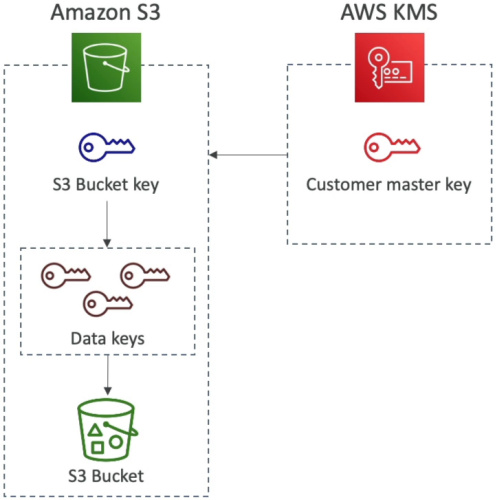
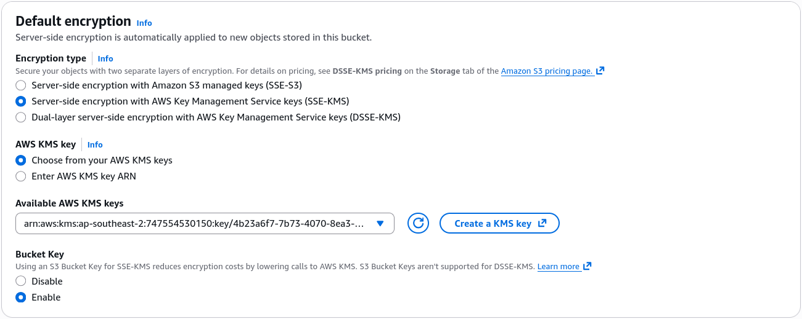

# S3 Bucket Key

**Amazon S3 Bucket Keys** are the ultimate cheat code when you're running serverless data lakes or heavy media processing pipelines with **SSE-KMS** at scale. 🏎️💥

Without an S3 Bucket Key, every single `PUT`, `GET`, or `HEAD` request against an SSE-KMS encrypted bucket forces S3 to make a individual network roundtrip API call to AWS KMS to fetch a fresh Data Encryption Key (DEK). If your application uploads 10 million files a day, that's 10 million direct KMS API calls—which will burn through your operational budget and quickly trigger `KMSThrottlingException` limit errors!

---

## Key Takeaways

Let's look how S3 Bucket Keys work, the cost-slashing numbers, and the critical exam scenarios.

### 🏗️ How S3 Bucket Keys Work (Under the Hood)

Instead of calling KMS for every single file operation, S3 requests a temporary **bucket-level key** directly from KMS via `kms:GenerateDataKey`. S3 then uses this time-limited bucket key to generate individual object data keys directly in-memory at the S3 storage tier:

```text
❌ WITHOUT S3 BUCKET KEY (Standard SSE-KMS):
   Every S3 Object Upload/Download ──► Direct KMS API Call ──► ($$$ + High KMS Throttling Risk)

✅ WITH S3 BUCKET KEY ENABLED:
   1. S3 requests 1 Bucket-Level Key from KMS ──► (1 KMS API Call)
   2. S3 uses Bucket Key to locally encrypt thousands of objects in memory ──► (0 KMS API Calls)
```



---

### 📊 The Operational Impact & Metrics

- **99% Reduction in KMS API Calls 📉:** Cuts down KMS requests by up to 99% because KMS is only invoked when the bucket-level key expires or rotates in memory, rather than per object.
- **99% Reduction in KMS Costs 💰:** KMS charges $\$0.03$ per 10,000 API calls. Offloading millions of individual API calls slashes your KMS billing tier down to practically zero.
- **Fewer CloudTrail Log Events 📑:** Because S3 makes vastly fewer API requests to KMS, your CloudTrail audit logs will show a significantly reduced volume of `kms:GenerateDataKey` and `kms:Decrypt` events.

---

### 🎛️ Console Setup & Configuration

S3 Bucket Keys are **enabled by default** when creating new S3 buckets with SSE-KMS via the AWS Console!

- **Where to find it:** S3 Console ──► Select Bucket ──► **Properties** tab ──► **Default encryption** ──► Choose **SSE-KMS** ──► Toggle **Bucket Key** to **Enable**.
- **Key Choice:** Works seamlessly whether you are using an **AWS Managed Key (`aws/s3`)** or a **Customer Managed Key (CMK)**.  
  

---

## Exam Tips

- **The High-Volume S3 KMS Throttling Question 🚨:** If an exam scenario describes an application uploading millions of small files to an S3 bucket encrypted with SSE-KMS that fails under high traffic due to `KMSThrottlingException` errors or extreme KMS API costs—**look straight for the answer that enables S3 Bucket Keys on the S3 bucket!**
- **CloudTrail Event Audit Reduction:** If a question asks why CloudTrail is suddenly logging far fewer KMS decryption events after a security optimization was applied to an S3 data lake—**the root cause is the introduction of S3 Bucket Keys caching keys at the S3 tier.**
