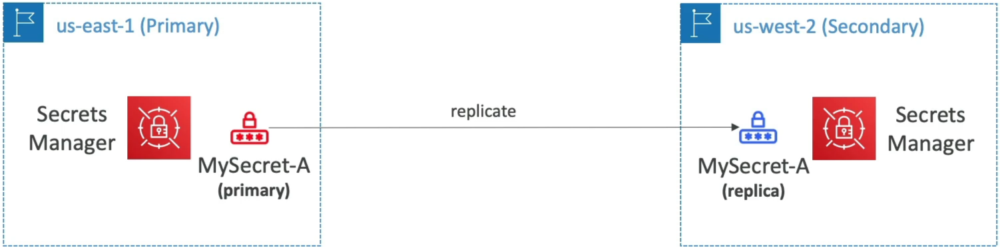
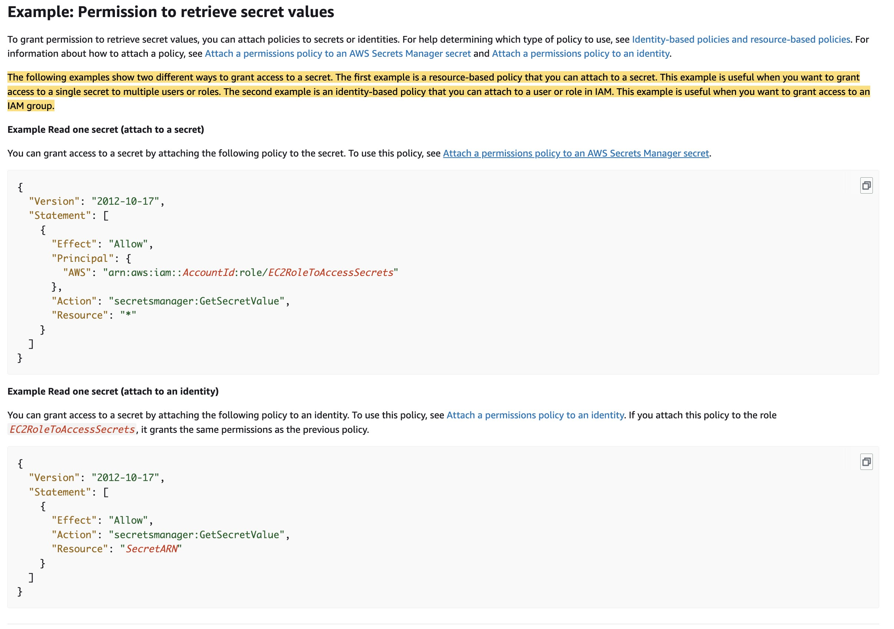

# Secrets Manager - Overview

**AWS Secrets Manager** is the ultimate enterprise power play for managing sensitive credentials, API keys, and database connections across your cloud architecture! 🏎️🔐

While SSM Parameter Store handles general configurations and lightweight secrets, Secrets Manager steps in when you need **automated credential lifecycle rotation**, deep out-of-the-box integrations with database engines (RDS, Aurora, DocumentDB), and **cross-region secret replication**.

---

## Key Takeaways

Let's go over the rotation mechanics, multi-region architecture, and the crucial Secrets Manager vs. Parameter Store comparison.

### 🔄 Automated Secret Rotation Architecture

The defining superpower of Secrets Manager is its ability to automatically rotate sensitive passwords, database credentials, or OAuth tokens on a customizable schedule (e.g., every 30, 60, or 90 days) without causing application downtime.

```text
                               ┌────────────────────────────────────────────────────────┐
                               │                 AWS SECRETS MANAGER                    │
                               └───────────────────────────┬────────────────────────────┘
                                                           │
                                                           │ 1. Triggers rotation schedule
                                                           ▼
🎯 Target Database / Service ◄──── 3. Updates Password ──── ⚡ Lambda Rotation Function
  (Amazon RDS / Aurora)        ──── 4. Confirms Connection ───► (AWS-provided or custom)
                                                           │
                                                           │ 2. Writes new secret version
                                                           ▼
                                               🔐 KMS Encrypted Storage
```

#### 🧠 How Rotation Works Under the Hood:

1. **The Schedule Trigger:** Secrets Manager triggers the rotation event based on your defined cron/rate schedule.
2. **The Rotation Lambda:** Secrets Manager invokes an **AWS Lambda function** (AWS provides pre-baked templates for RDS/Aurora, or you can write a custom Python/Node.js script).
3. **The 4-Step Handshake (Create, Set, Test, Finish):**
   - **`createSecret`:** Lambda generates a new random password payload.
   - **`setSecret`:** Lambda logs into the target database using administrative privileges and creates/updates the user password.
   - **`testSecret`:** Lambda verifies the new credentials can successfully open a connection to the database.
   - **`finishSecret`:** Lambda updates the `AWSCURRENT` version tag inside Secrets Manager to complete the switch!

---

### 🌐 Multi-Region Secrets Replication

For multi-region active-active applications or disaster recovery (DR) architectures, Secrets Manager allows you to **replicate primary secrets across multiple target AWS regions**!



```text
🏛️ PRIMARY REGION (e.g., us-east-1)                 🌐 REPLICA REGION (e.g., us-west-2)
   ├── 🔒 Primary Secret (`MyDbSecret`) ───Sync───► 🔒 Replica Secret (`MyDbSecret`)
   └── ⚡ Lambda Rotation Engine                    (Kept updated automatically)
```

- **Automatic Synchronization:** Whenever the primary secret is rotated or updated, Secrets Manager automatically pushes the updated encrypted payload across all designated replica regions.
- **Identical Secret Name & ARN Structure:** The replica secret keeps the exact same name and ARN suffix as the primary secret (differing only by the region string in the ARN).
- **Disaster Recovery Failover:** If a primary region experiences an outage, you can promote a replica secret to a standalone primary secret instantly.

---

### ⚔️ Secrets Manager vs. SSM Parameter Store (The DVA-C02 Showdown)

This side-by-side comparison matrix is heavily targeted on the DVA-C02 exam to test whether you know which storage service to choose:

| Architectural Metric           | 🔐 AWS Secrets Manager                                  | 🗄️ SSM Parameter Store (`SecureString`)        |
| ------------------------------ | ------------------------------------------------------- | ---------------------------------------------- |
| **Primary Focus**              | Managing sensitive, high-value secrets                  | General application configuration & secrets    |
| **Automated Rotation**         | **Native out-of-the-box (via Lambda)**                  | Manual / Custom EventBridge + Lambda pipelines |
| **Multi-Region Replication**   | **Native primary-to-replica replication**               | Manual sync or custom deployment scripts       |
| **Random Password Generation** | Native API action (`GetRandomPassword`)                 | Not natively built-in                          |
| **RDS Integration**            | Direct, native automatic credential configuration       | Requires custom setup                          |
| **Pricing Model**              | **\$0.40 per secret / month** + $0.05 per 10k API calls | **Standard Tier is 100% FREE!**                |

---

## Exam Tips

- **The RDS Credential Rotation Rule 🚨:** If an exam scenario asks for a secure storage mechanism for Amazon RDS or Aurora credentials that must be **automatically rotated every 30 days** without application downtime—**always choose AWS Secrets Manager over SSM Parameter Store.**
- **The Multi-Region Database Failover Scenario:** If an application runs across `us-east-1` and `ap-southeast-2` and needs access to an RDS Global Database with synchronized credentials across both regions—**select configuring AWS Secrets Manager with Multi-Region Secret Replication.**
- **KMS Permission Check:** Just like Parameter Store `SecureString`, reading a secret from Secrets Manager using the SDK requires the invoking IAM execution role to have both `secretsmanager:GetSecretValue` **AND** `kms:Decrypt` on the backing KMS key!

### Practice Test

**Question 1:** A developer wants to securely store an access token that allows a transaction-processing application running on Amazon EC2 instances to authenticate and send a chat message (via the chat API) to the company's support team when an invalid transaction is detected. While minimizing management overhead, the chat API access token must be encrypted both at rest and in transit, and also be accessible from other AWS accounts.

What is the most efficient solution to address this scenario?

- [ ] Store AWS KMS encrypted access token in a DynamoDB table and configure a resource-based policy for the DynamoDB table to allow access from other accounts. Modify the IAM role of the EC2 instances with permissions to access the DynamoDB table. Fetch the token from the Dynamodb table and then use the decrypted access token to send the message to the chat
- [ ] Leverage AWS Systems Manager Parameter Store with an AWS KMS customer-managed key to store the access token as a SecureString parameter and configure a resource-based policy for the parameter to allow access from other accounts. Modify the IAM role of the EC2 instances with permissions to access Parameter Store. Fetch the token from Parameter Store using the `with decryption` flag and then use the decrypted access token to send the message to the chat
- [ ] Leverage AWS Secrets Manager with an AWS KMS customer-managed key to store the access token as a secret and configure a resource-based policy for the secret to allow access from other accounts. Modify the IAM role of the EC2 instances with permissions to access Secrets Manager. Fetch the token from Secrets Manager and then use the decrypted access token to send the message to the chat
- [ ] Leverage SSE-KMS to store the access token as an encrypted object on S3 and configure a resource-based policy for the S3 bucket to allow access from other accounts. Modify the IAM role of the EC2 instances with permissions to access the S3 object. Fetch the token from S3 and then use the decrypted access token to send the message to the chat

<details>
  <summary>Correct Answer</summary>

- [x] Leverage AWS Secrets Manager with an AWS KMS customer-managed key to store the access token as a secret and configure a resource-based policy for the secret to allow access from other accounts. Modify the IAM role of the EC2 instances with permissions to access Secrets Manager. Fetch the token from Secrets Manager and then use the decrypted access token to send the message to the chat
  - **Explanation:** AWS Secrets Manager is the best solution for storing sensitive information such as access tokens. It provides encryption at rest and in transit, and allows for resource-based policies to grant access to other AWS accounts. By modifying the IAM role of the EC2 instances with permissions to access Secrets Manager, the application can securely fetch the access token and use it to send messages to the chat API.  
    

<details>
   <summary>Incorrect Answer</summary>

- [ ] Leverage AWS Systems Manager Parameter Store with an AWS KMS customer-managed key to store the access token as a SecureString parameter and configure a resource-based policy for the parameter to allow access from other accounts. Modify the IAM role of the EC2 instances with permissions to access Parameter Store. Fetch the token from Parameter Store using the `with decryption` flag and then use the decrypted access token to send the message to the chat
  - **Explanation:** You cannot use a resource-based policy with a parameter in the Parameter Store. Parameter Store supports parameter policies that are available for parameters that use the advanced parameters tier. Parameter policies help you manage a growing set of parameters by allowing you to assign specific criteria to a parameter such as an expiration date or time to live. Parameter policies are especially helpful in forcing you to update or delete passwords and configuration data stored in Parameter Store, a capability of AWS Systems Manager. So this option is incorrect.

</details>

</details>
