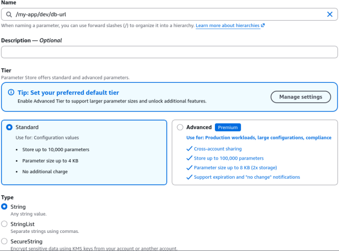
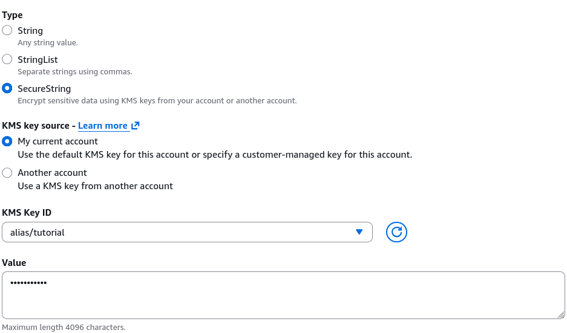
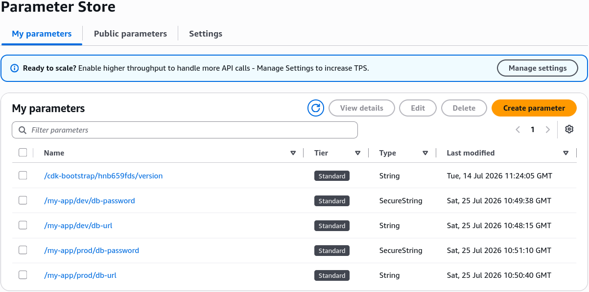
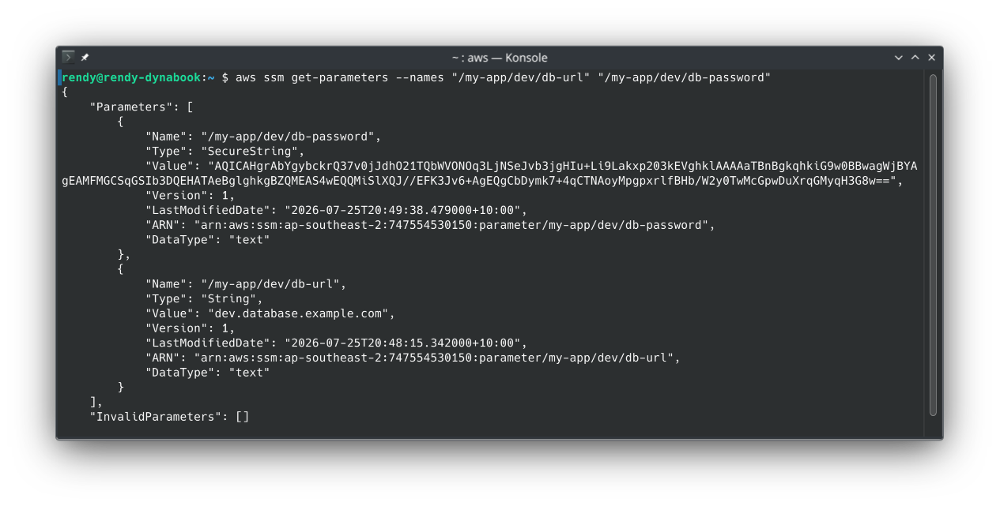
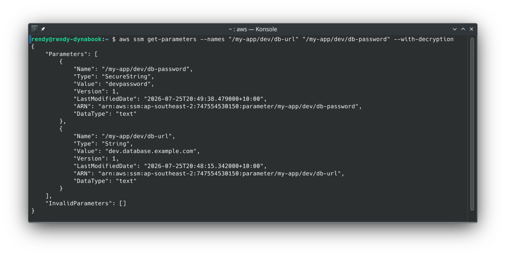
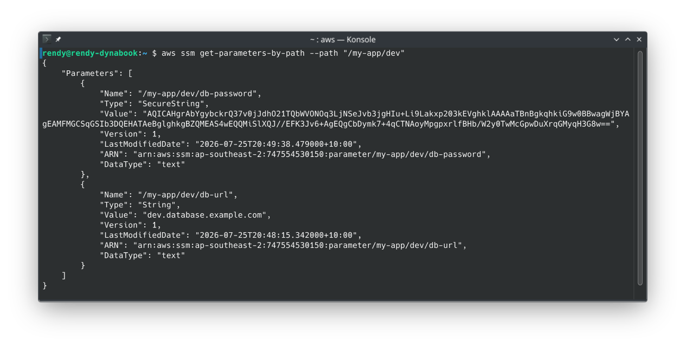
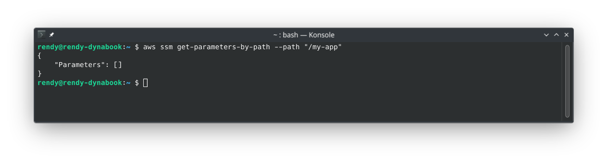
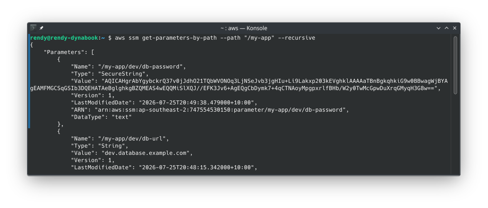
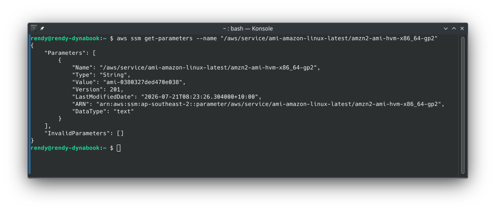

# SSM Parameter Store Hands On (CLI)

Stepping into AWS CloudShell and firing off live **SSM Parameter Store** queries directly over the CLI is where all the theoretical security concepts turn into real-world developer muscles! 🏎️⚡

Stephane’s hands-on walkthrough highlights the core operational workflow: defining structured parameter hierarchies, storing sensitive data via KMS `SecureString` types, and querying parameters using exact paths or recursive wildcards.

---

## Hands On

Let's practice step-by-step console execution, the AWS CLI command matrix, and the key DVA-C02 exam tactics for Parameter Store.

### 🎛️ 1. Building the Parameter Hierarchy in the Console

To structure environment configurations cleanly, parameters use forward-slash filesystem paths (e.g., `/my-app/dev/db-url`):

- **Standard Parameter (`String`):**
  - _Name:_ `/my-app/dev/db-url`
  - _Type:_ `String` (Data Type: `text`)
  - _Value:_ `dev.database.example.com`
  - 
- **Encrypted Secret (`SecureString`):**
  - _Name:_ `/my-app/dev/db-password`
  - _Type:_ `SecureString`
  - _KMS Key:_ Selected custom KMS key (e.g., `alias/Tutorial` or default `alias/aws/ssm`)
  - _Value:_ `devpassword` _(stored as encrypted cipher text!)_
  - 
- **Production Environment Parameters:** Replicated the identical structure under the `/my-app/prod/*` path (`/my-app/prod/db-url`, `/my-app/prod/db-password`).  
  

---

### 💻 2. The AWS CLI Command Matrix

The CLI is where DVA-C02 scenario questions focus heavily. Here are the precise commands tested on the exam:

#### A. Fetching Specific Parameters (`get-parameters`)

To pull specific parameters by explicit names:

```bash
aws ssm get-parameters \
    --names "/my-app/dev/db-url" "/my-app/dev/db-password"
```

- _Default Behavior:_ Returns plaintext for `String` types, but leaves `SecureString` values in raw encrypted ciphertext.
  

#### B. Decrypting Secrets (`--with-decryption`)

To decrypt `SecureString` types over the CLI, pass the `--with-decryption` flag:

```bash
aws ssm get-parameters \
    --names "/my-app/dev/db-url" "/my-app/dev/db-password" \
    --with-decryption

```

- _Under the Hood:_ The AWS CLI checks if your IAM identity carries `kms:Decrypt` permissions on the underlying KMS key, decrypts the payload on the fly, and outputs the plaintext value!
  

#### C. Querying by Hierarchy Path (`get-parameters-by-path`)

To fetch all parameters under a specific path level:

```bash
aws ssm get-parameters-by-path \
    --path "/my-app/dev"
```



#### D. Recursive Searching (`--recursive`)

By default, `--path` only checks parameters at that exact level. To search down through nested sub-folders, add the `--recursive` flag:  


```bash
aws ssm get-parameters-by-path \
    --path "/my-app" \
    --recursive \
    --with-decryption

```

- _Result:_ Returns all four parameters (`dev` and `prod`) in a single JSON payload with values fully decrypted!  
  

### 3. Bonus: Querying Public Parameters

You can also query public parameters that AWS publishes, such as the latest Amazon Linux 2 AMI ID:



This is useful for dynamically fetching the latest AMI ID for EC2 instances/CloudFormation templates in your automation scripts.

---

## Exam Tips

- **The Decryption Flag Trap (`--with-decryption`) 🔑:** If an exam scenario states an application or CLI script executes `get-parameters` or `get-parameters-by-path` on a `SecureString` parameter, but receives an encrypted cipher blob instead of the actual password—**the fix is adding the `--with-decryption` boolean flag to the SDK/CLI call**
- **Path Querying vs. Single Fetch:**
  - Use `get-parameters` when you know the exact array of parameter names.
  - Use `get-parameters-by-path` (with `--recursive`) when you want to load an entire application or environment namespace (e.g., loading all config keys for `/my-app/dev/` during a Lambda cold start)!
- **IAM Policy Path Scoping:** Because parameter names use hierarchy slashes, you can easily scope an IAM policy to allow a Lambda execution role access to `arn:aws:ssm:region:account:parameter/my-app/dev/*` while strictly denying access to `/my-app/prod/*`!
