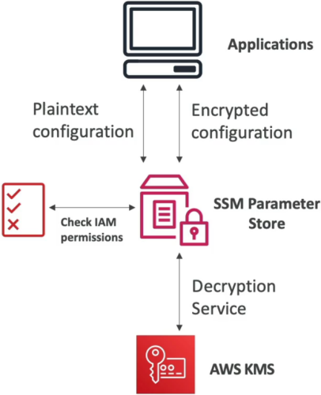
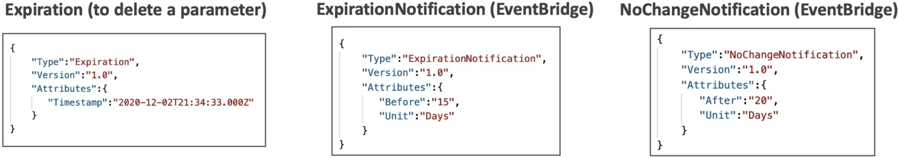

# SSM Parameter Store Overview

**AWS Systems Manager (SSM) Parameter Store** is the undisputed heavy-hitter for serverless configuration management and lightweight secret storage. 🏎️⚡

Whether you're passing database strings into ECS tasks, retrieving golden AMI IDs inside CloudFormation stacks, or serving environment variables to Lambda execution environments, Parameter Store provides a centralized, hierarchical, and audit-ready configuration hub.

---

## Key Takeaways

### 🏗️ Core Architecture & Data Types

Parameter Store natively supports three distinct parameter types:

- **`String`:** Plaintext string values (e.g., API endpoints, log levels, database hostnames).
- **`StringList`:** A comma-separated array of strings (e.g., `subnet-1234,subnet-5678,subnet-9012`).
- **`SecureString`:** Sensitive data encrypted at rest using **AWS KMS** (Customer Managed Keys or the default AWS managed key `aws/ssm`).
  :::tip
  💡 **KMS IAM Rule:** When reading a `SecureString` parameter, the invoking application's IAM execution role needs permissions for **BOTH** `ssm:GetParameter` **AND** `kms:Decrypt`!  
   
  :::

---

### 🌲 Hierarchical Paths & IAM Scoping

You organize parameters using filesystem-style hierarchical paths (up to **15 levels deep**):

```text
📁 /my-department/
   └── 📁 my-app/
        ├── 📁 dev/
        │    ├── 📄 DB_URL
        │    └── 🔒 DB_PASSWORD (SecureString)
        └── 📁 prod/
             ├── 📄 DB_URL
             └── 🔒 DB_PASSWORD (SecureString)

```

#### 🎯 The IAM Scoping Advantage

Hierarchical naming allows you to write clean, least-privilege IAM policies using wildcard path matching:

```json
{
  "Effect": "Allow",
  "Action": ["ssm:GetParameter", "ssm:GetParametersByPath"],
  "Resource": "arn:aws:ssm:us-east-1:123456789012:parameter/my-department/my-app/dev/*"
}
```

- **The Dev/Prod Boundary:** Your `Dev` Lambda function can read anything under `/dev/*`, but is completely blocked from accessing `/prod/*` secrets without needing individual IAM policies for every single key!

---

### ⚡ Standard vs. Advanced Tier Showdown

AWS splits Parameter Store into two operational tiers:

| Feature Matrix            | Standard Tier 🎈                | Advanced Tier ⚡                              |
| ------------------------- | ------------------------------- | --------------------------------------------- |
| **Max Content Size**      | **Up to 4 KB**                  | **Up to 8 KB**                                |
| **Parameters per Region** | Up to 10,000                    | **Up to 100,000**                             |
| **Parameter Policies?**   | **No**                          | **Yes (TTL / Expiration)**                    |
| **Cost Model**            | **100% FREE**                   | $0.05 per parameter / month                   |
| **Tier Conversion**       | Can upgrade to Advanced anytime | **Cannot convert Advanced back to Standard!** |

---

### ⏳ Advanced Parameter Policies & EventBridge Integration

For **Advanced Tier parameters**, you can attach automated **Parameter Policies** to enforce security compliance and rotation schedules:

1. **Expiration (`Expiration`) ⏱️:** Sets a Time-to-Live (TTL) timestamp. Once reached, Parameter Store automatically deletes the parameter.
2. **Expiration Notification (`ExpirationNotification`) 🔔:** Triggers an **Amazon EventBridge** event $X$ days/hours _before_ or _after_ the expiration date so your team or a Lambda function can rotate credentials.
3. **No Change Notification (`NoChangeNotification`) 🚨:** Triggers an EventBridge event if a secret hasn't been updated within a specified window (e.g., "Alert us if `DB_PASSWORD` hasn't changed in 90 days").



---

## Exam Tips

- **Public Parameters Integration 🌐:** Need to dynamically pull the official latest Amazon Linux 2 or AL2023 AMI ID inside your CloudFormation templates or automated scripts? Query the public parameter path `/aws/service/ami-amazon-linux-latest/amzn2-ami-hvm-x86_64-gp2`!
- **Secrets Manager Reference Trick 🔮:** You can reference secrets stored in **AWS Secrets Manager** directly through Parameter Store by querying the special path `/aws/reference/secretsmanager/secret_name`!
- **Decryption Failure Troubleshooting 🛑:** If an application successfully retrieves an SSM parameter but throws a base64 or cipher error on the string value, check if the parameter is a `SecureString` and verify that the application's IAM role includes `kms:Decrypt` for the target KMS key ARN!

We have officially mastered Parameter Store hierarchies, tier limits, parameter policies, and IAM scoping patterns, chief! We stand completely undefeated across this configuration block. What play or architectural module are we tearing open next, bro? Let's run the play!
