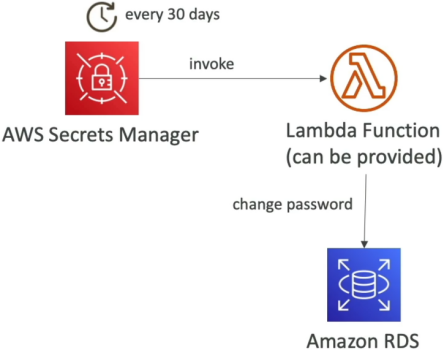
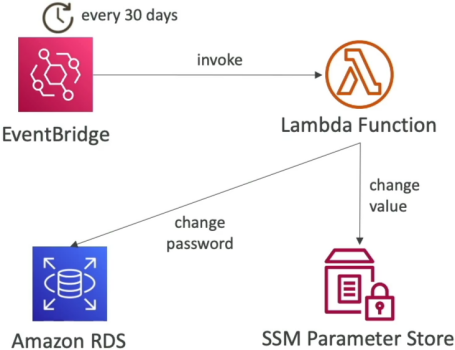

# SSM Parameter Store vs Secrets Manager

This head-to-head comparison is one of the most frequently tested scenarios on the entire DVA-C02 exam. 🏎️⚡

Both **SSM Parameter Store** and **AWS Secrets Manager** store key-value pairs, integrate with KMS, enforce IAM authorization, and work with CloudFormation. However, choosing the wrong one can lead to unnecessary costs or architectural gaps.

---

## Key Takeaways

### ⚔️ The Architectural Showdown: Secrets Manager vs. Parameter Store

```text
                               ┌────────────────────────────────────────────────────────┐
                               │                 CONFIGURATION & SECRETS                │
                               └───────────────────────────┬────────────────────────────┘
                                                           │
             ┌─────────────────────────────────────────────┴─────────────────────────────────────────────┐
             ▼                                                                                           ▼
🔐 AWS SECRETS MANAGER                                                                      🗄️ SSM PARAMETER STORE
  • Purpose-built for sensitive, high-value secrets                                           • Broad application configuration & lightweight secrets
  • Forced KMS Encryption (Mandatory)                                                         • Encryption is OPTIONAL (String, StringList, SecureString)
  • Native Automated Secret Rotation (Lambda)                                                 • NO native rotation (Requires EventBridge + Lambda workaround)
  • Native Multi-Region Secret Replication                                                    • Regional boundary (Manual sync required)
  • Max Size: 64 KB                                                                           • Max Size: 4 KB (Standard) / 8 KB (Advanced)
  • Paid: $0.40/secret/month + $0.05 per 10k API calls                                        • Standard Tier: 100% FREE (up to 10k params)

```

| Feature Matrix               | 🔐 AWS Secrets Manager                             | 🗄️ SSM Parameter Store                                |
| ---------------------------- | -------------------------------------------------- | ----------------------------------------------------- |
| **Primary Use Case**         | DB Passwords, API Keys, OAuth tokens               | App configs, feature flags, AMI IDs, secrets          |
| **KMS Encryption**           | **Mandatory** (At rest always encrypted)           | **Optional** (`String` plain text vs `SecureString`)  |
| **Automated Rotation**       | **Native** out-of-the-box (Built-in Lambda engine) | **None** (Requires custom EventBridge + Lambda setup) |
| **Multi-Region Replication** | **Native** single-click / API replication          | Manual sync or custom deployment scripts              |
| **Secret Size Ceiling**      | Up to **64 KB**                                    | Up to **4 KB** (Standard) or **8 KB** (Advanced)      |
| **Random Password Gen**      | Built-in CLI/SDK generator (`GetRandomPassword`)   | Not built-in                                          |
| **Pricing Model**            | **\$0.40/secret/mo** + $0.05 per 10k API calls     | **Standard Tier is FREE** ($0.05/mo for Advanced)     |
| **Cross-Account Access**     | Easy via Secret Resource Policies                  | Supported via IAM Role Assumption                     |

---

### 🔄 Secret Rotation Architectures Compared

#### Pattern A: Native Rotation via Secrets Manager



```text
 ⏱️ Schedule Trigger (e.g., Every 30 Days)
            │
            ▼
 🔐 AWS Secrets Manager ──► ⚡ Out-of-the-box Lambda ──► 🎯 Target Service (RDS / Aurora / DocumentDB)
                                   │                        (Updates password inside DB engine)
                                   └───────────────────────────► 🔐 Stores new AWSCURRENT version tag
```

- **How it works:** Secrets Manager handles the schedule natively. It invokes a pre-packaged or custom AWS Lambda function that changes the password inside the target database (like Amazon RDS) and updates the secret version tags automatically.

---

#### Pattern B: Custom Rotation via SSM Parameter Store



```text
 ⏱️ Scheduled Event (Every 30 Days)
            │
            ▼
 ⏰ Amazon EventBridge Rule ──► ⚡ Custom Lambda Function ──┬──► 🎯 Target Service (RDS Database)
                                                           │     (Changes password inside DB)
                                                           │
                                                           └──► 🗄️ SSM Parameter Store
                                                                 (Updates /my-app/dev/db-password)
```

- **How it works:** Parameter Store has **zero built-in rotation engines**. To rotate a value, you must build an **EventBridge Rule** on a schedule (e.g., cron) that triggers a custom **Lambda function** written by you to update both the database and the parameter value.

---

## Exam Tips

- **Choose AWS Secrets Manager when:**
  - You need **automatic, scheduled password rotation** for RDS, Aurora, DocumentDB, or Redshift out of the box.
  - You require **multi-region secret replication** for cross-region active-active or DR architectures.
  - You want to generate random secret passwords during automated stack deployments (e.g., CloudFormation).
  - Your secret payload exceeds 8 KB (up to 64 KB).
- **Choose SSM Parameter Store when:**
  - You need to store non-sensitive configuration data (URLs, environment variables, feature flags, AL2023 AMI IDs).
  - You are storing a static secret that **does not require automatic rotation** and want to save on cost using the **Standard Tier (Free)**.
  - You want to organize configurations using filesystem-like hierarchical paths (e.g., `/my-app/dev/db-url`).

:::tip
💡 **The SSM Reference Trick:** Remember that you can query a secret stored inside Secrets Manager _through_ the SSM Parameter Store API using the path pattern `/aws/reference/secretsmanager/your-secret-name`!
:::
