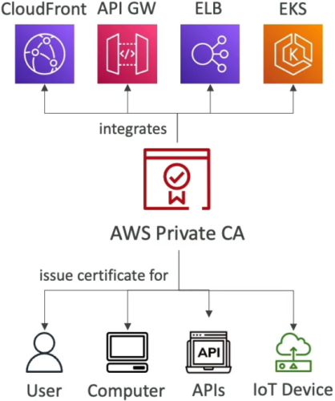

# ACM Private CA - Overview

**AWS Private CA** (formerly ACM Private CA) is the enterprise power move when you need to run an internal Public Key Infrastructure (PKI) without the brutal overhead of hosting and maintaining your own offline root or intermediate Certificate Authorities!

While standard AWS Certificate Manager (ACM) handles **public** web traffic, **AWS Private CA** issues internal X.509 certificates that secure microservices, internal Application Load Balancers, API Gateways, Kubernetes clusters, and IoT fleets over private networks.



---

## Key Takeaways

Let's cover the architecture, certification hierarchy, key differences from Public ACM, and DVA-C02 exam scenarios for your knowledge arsenal.

### 🏗️ Architecture & CA Hierarchy

With AWS Private CA, you can build up to a **5-tier deep Certificate Authority hierarchy** fully managed by AWS:

```text
                   ┌────────────────────────────────────────────────────────┐
                   │               AWS PRIVATE CA HIERARCHY                 │
                   └───────────────────────────┬────────────────────────────┘
                                               │
                                               ▼
                                   🏛️ Root CA (Self-Signed / Offline)
                                               │
                                               ▼
                                   🏢 Subordinate / Intermediate CAs
                                               │
                                               ▼
                               🔐 End-Entity X.509 Certificates
                      (ALB, API Gateway, EC2, EKS, mTLS, IoT Devices)
```

- **Root & Subordinate CAs:** You can create a root CA inside AWS, or create a subordinate CA signed by your existing on-premises enterprise root CA (e.g., Active Directory Certificate Services).
- **End-Entity Certificates:** The CAs issue non-CA certificates (end-entity) meant exclusively for encrypting traffic or authenticating devices. They cannot be used to sign other certificates!
- **Private Network Scope:** These certificates are signed by _your_ private authority—meaning public browsers will flag them as untrusted unless your devices/trust stores explicitly import your Private CA's root certificate!

---

### ⚔️ Public ACM vs. AWS Private CA (The Exam Matrix)

Understanding the distinction between these two services prevents costly missteps on exam scenarios:

| Metric                  | 🌐 Public ACM Certificates                                       | 🛡️ AWS Private CA                                      |
| ----------------------- | ---------------------------------------------------------------- | ------------------------------------------------------ |
| **Trust Scope**         | **Public Internet** (Trusted by default in all browsers/OS)      | **Internal Network Only** (Must trust Private Root CA) |
| **Exportability**       | **Cannot export** private key material (Bound to ALB/CloudFront) | **100% Exportable** (Use on EC2, on-prem servers, IoT) |
| **Pricing Model**       | **100% FREE** for public endpoints                               | **$400/month per Private CA** + per-certificate fees   |
| **Lifecycle / Renewal** | ACM manages validation (DNS/Email) & auto-renews                 | ACM handles auto-renewal for integrated AWS services   |
| **Use Case**            | Public websites, CloudFront, public ALBs                         | mTLS, internal microservices, code signing, IoT        |

---

### 🔌 Deployment Patterns & Native Integrations

1. **ACM-Integrated AWS Services:** Request private certificates via ACM backed by your Private CA. ACM handles auto-renewal and deploys them seamlessly to internal **Application Load Balancers**, **Amazon API Gateway**, or **AWS App Mesh**!
2. **Exported Certificates for Custom Workloads:** Call the `IssueCertificate` API via AWS SDK or CLI to export private key/cert pairs. Deploy them onto EC2 instances, on-prem servers, container pods (via EKS cert-manager), or embedded IoT devices!
3. **Mutual TLS (mTLS):** Crucial for zero-trust microservice communications or client-authenticated API Gateway endpoints requiring two-way certificate validation.

---

## Exam Tips

- **Internal Microservice Encryption 🚨:** If a scenario requires encrypted TLS communication between internal microservices running on EC2 or EKS, and the certificates **must be exportable to raw instances**—**choose AWS Private CA over standard public ACM.**
- **Cost Caution Trap:** Remember that standard public ACM certs are free, but **AWS Private CA carries a $400/mo baseline cost per CA instance**. Don't select Private CA unless explicit requirements call for internal PKI, mTLS, custom validity periods, or exportable certs!
- **Revocation Lists (CRL / OCSP):** Private CA natively publishes **Certificate Revocation Lists (CRLs)** into S3 buckets or handles status checks via **OCSP (Online Certificate Status Protocol)**.
