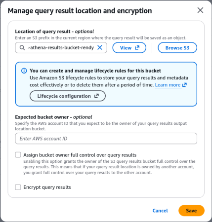
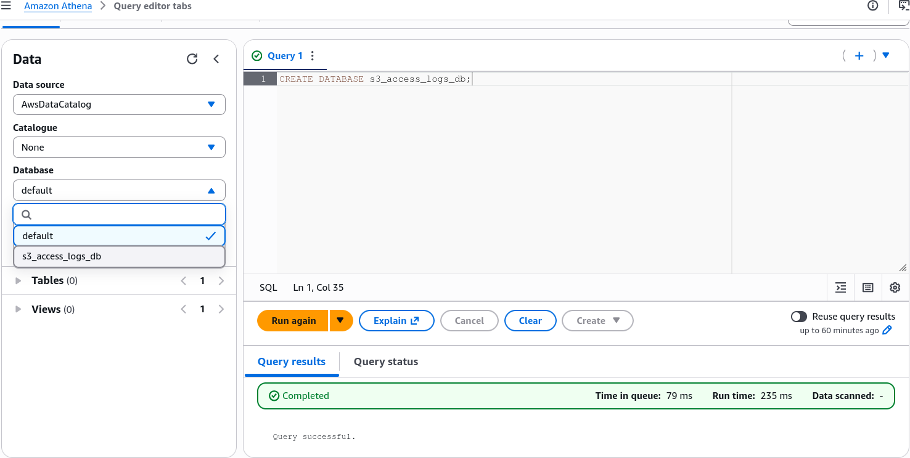
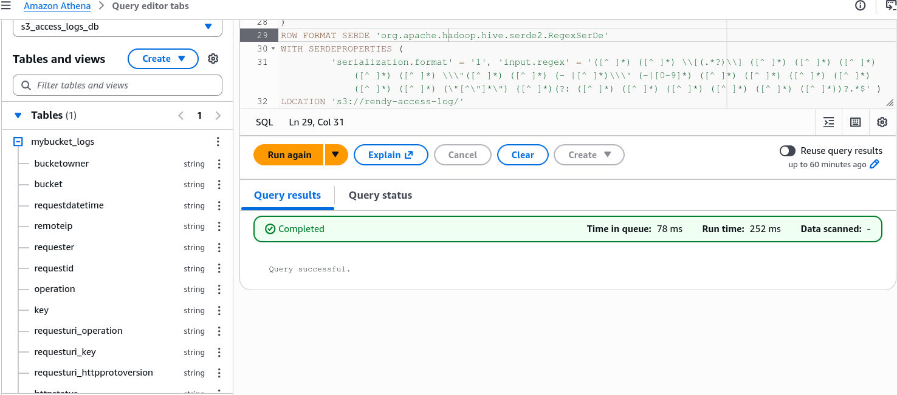
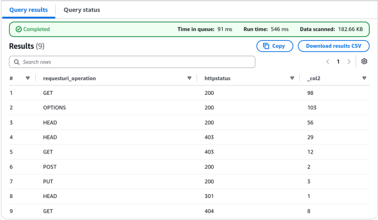
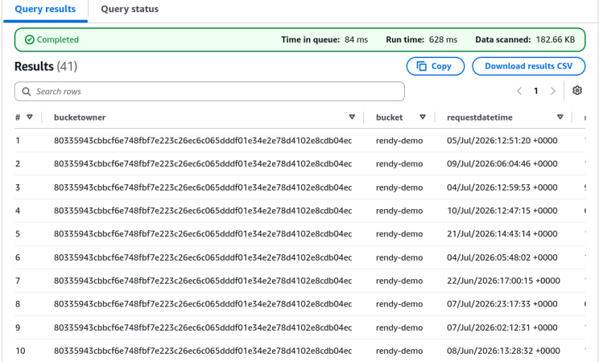
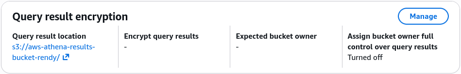

# Amazon Athena - Hands On

Walking through the Amazon Athena console and querying raw S3 access logs using SQL is where the power of serverless data lakes really hits. 📊

Stephane’s hands-on lab breaks down the mandatory setup sequence and real-world log analytics queries. Let's summarize the step-by-step workflow, mandatory syntax rules.

---

## Hands On

```text
                               ┌────────────────────────────────────────────────────────┐
                               │             ATHENA S3 ACCESS LOG WORKFLOW              │
                               └───────────────────────────┬────────────────────────────┘
                                                           │
             ┌─────────────────────────────────────────────┼─────────────────────────────────────────────┐
             ▼                                             ▼                                             ▼
🗄️ 1. QUERY RESULT LOCATION                    📂 2. DATABASE & TABLE SCHEMA                     🔍 3. SQL LOG ANALYTICS
  • Create dedicated S3 results bucket           • `CREATE DATABASE s3_access_logs_db`           • Preview table (`LIMIT 10`)
  • Configure in Athena Settings (`s3://.../`)   • Execute AWS DDL SerDe schema query            • Run aggregations (`COUNT(*) BY status`)
  • Prevents execution errors                    • Target S3 location with trailing slash (`/`)  • Filter 403 errors for unauthorized checks
```

### Step 1: Configure S3 Query Result Output Location

- Before running any query in Athena, you **must** specify an S3 output directory (e.g., `s3://aws-athena-results-bucket/`).
- Athena automatically dumps query output CSV files and execution metadata into this designated bucket.  
  

### Step 2: Create Database & DDL External Table Schema

1. Execute `CREATE DATABASE s3_access_logs_db;` in the query editor.  
   
2. Create the external schema using Hive Regex SerDe:

```sql
CREATE EXTERNAL TABLE IF NOT EXISTS s3_access_logs_db.mybucket_logs(
         BucketOwner STRING,
         Bucket STRING,
         RequestDateTime STRING,
         RemoteIP STRING,
         Requester STRING,
         RequestID STRING,
         Operation STRING,
         Key STRING,
         RequestURI_operation STRING,
         RequestURI_key STRING,
         RequestURI_httpProtoversion STRING,
         HTTPstatus STRING,
         ErrorCode STRING,
         BytesSent BIGINT,
         ObjectSize BIGINT,
         TotalTime STRING,
         TurnAroundTime STRING,
         Referrer STRING,
         UserAgent STRING,
         VersionId STRING,
         HostId STRING,
         SigV STRING,
         CipherSuite STRING,
         AuthType STRING,
         EndPoint STRING,
         TLSVersion STRING
)
ROW FORMAT SERDE 'org.apache.hadoop.hive.serde2.RegexSerDe'
WITH SERDEPROPERTIES (
         'serialization.format' = '1', 'input.regex' = '([^ ]*) ([^ ]*) \\[(.*?)\\] ([^ ]*) ([^ ]*) ([^ ]*) ([^ ]*) ([^ ]*) \\\"([^ ]*) ([^ ]*) (- |[^ ]*)\\\" (-|[0-9]*) ([^ ]*) ([^ ]*) ([^ ]*) ([^ ]*) ([^ ]*) ([^ ]*) (\"[^\"]*\") ([^ ]*)(?: ([^ ]*) ([^ ]*) ([^ ]*) ([^ ]*) ([^ ]*) ([^ ]*))?.*$' )
LOCATION 's3://target-bucket-name/prefix/';

```

:::tip
You can reuse the access log bucket from previous labs ([S3 Access Logs Lab](./../section-14-s3-security/s3-access-logs-hands-on.mdx)) or create a new S3 bucket and enable access logging on it.
:::



### Step 3: Run SQL Analytical Queries

- **Status Aggregation (Error Breakdown):**

```sql
SELECT requesturi_operation, httpstatus, count(*) FROM "s3_access_logs_db"."mybucket_logs"
GROUP BY requesturi_operation, httpstatus;
```



- **Security & Access Analysis (Searching for 403 Forbidden Errors):**

```sql
SELECT * FROM "s3_access_logs_db"."mybucket_logs"
where httpstatus='403';
```



---

## Exam Tips

- **The Missing Query Location Trap 🚨:** If a developer executes an Athena query via the AWS Management Console or AWS CLI (`StartQueryExecution`) and gets a `Missing query result location` error—**the fix is setting the S3 output location under Athena Settings or workgroup configuration.**  
  
- **`CREATE EXTERNAL TABLE` Syntax:** Notice that Athena uses `CREATE EXTERNAL TABLE`. The word `EXTERNAL` tells Athena that the underlying dataset lives outside Athena inside S3, meaning deleting or dropping the table inside Athena **does NOT delete the raw source files inside S3**!
