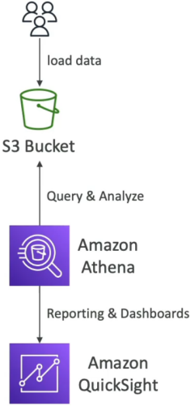
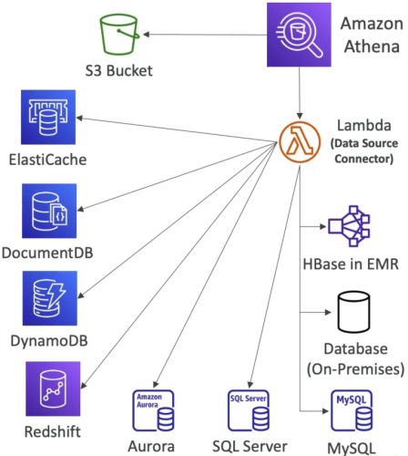

# Amazon Athena - Overview

**Amazon Athena** is the absolute king of ad-hoc SQL analytics when you need to query data sitting directly in Amazon S3 without the overhead of provisioning or managing a traditional database server! 📊

Because Athena is completely serverless, it integrates natively into data lakes, log aggregation pipelines, and business intelligence dashboards.

---

## Key Takeaways

Let's go over the core features, performance optimization techniques, and federated query patterns.

### 🏗️ Core Architecture & Pricing Model

- **Engine:** Built on top of the open-source **Presto / Trino** SQL query engine.
- **Supported Formats:** Queries CSV, JSON, ORC, Avro, and Apache Parquet directly in S3.
- **Pricing Mechanics (\$5 / TB Scanned) 💰:** You are billed **$5.00 per Terabyte of data scanned** from S3 (with a 10 MB minimum per query). DDL statements (`CREATE`, `ALTER`, `DROP`) are 100% free!
- **Serverless & In-Place:** Data remains in your S3 buckets—Athena brings the compute to the data.
  

---

### ⚡ Athena Performance Optimization (The Exam Goldmine)

Because Athena pricing is tied directly to the volume of data scanned, **optimizing performance translates directly into massive cost savings**!

```text
                               ┌────────────────────────────────────────────────────────┐
                               │             ATHENA PERFORMANCE OPTIMIZATION            │
                               └───────────────────────────┬────────────────────────────┘
                                                           │
             ┌─────────────────────────────────────────────┼─────────────────────────────────────────────┐
             ▼                                             ▼                                             ▼
📊 1. COLUMNAR FORMATS                        📦 2. COMPRESSION                                 📂 3. PARTITIONING & FILE SIZES
  • Use Apache Parquet or ORC                   • Compress files (Snappy, GZIP)                  • Partition S3 paths: `/year=2026/month=07/`
  • Athena reads ONLY queried columns           • Slashes data volume read over wire             • Drastically reduces scanned S3 folders
  • Converts via AWS Glue ETL jobs              • Saves costs & speeds up execution              • Consolidate small files into >128 MB blocks
```

1. **Use Columnar Data Formats (Parquet / ORC) 📊:**
   - Traditional row formats (CSV/JSON) force Athena to read the entire row even if you query just one column.
   - Columnar formats allow Athena to selectively read _only_ the specific columns requested in the `SELECT` query, cutting scanned data by up to 90%! (Convert CSV to Parquet using **AWS Glue ETL**).
2. **Compress Data Files 📦:**
   - Compress files using Snappy, GZIP, or ZSTD. Smaller file sizes = fewer bytes scanned from S3 = cheaper and faster queries.
3. **Partition Your Data Lakes 📂:**
   - Organize S3 bucket prefix paths into virtual partition keys:
     `s3://my-data-bucket/flight-data/year=2026/month=07/day=28/data.parquet`
   - When running `SELECT * FROM flight_data WHERE year = '2026' AND month = '07'`, Athena skips 99% of the S3 bucket and scans only that specific subfolder!
4. **Optimize File Sizes 📄:**
   - Avoid thousands of tiny KB-sized files. Consolidate data into larger file chunks (**128 MB or larger**) to reduce S3 request overhead and execution latency.

---

### 🌉 Athena Federated Query (Beyond S3)

Athena isn't locked down to S3! With **Federated Queries**, you can execute a single SQL query that joins datasets across multiple AWS and on-premises data sources in real time.

- **How it Works:** Uses **AWS Lambda-based Data Source Connectors**.
- **Supported Targets:** DynamoDB, ElastiCache (Redis), CloudWatch Logs, DocumentDB, RDS (MySQL/PostgreSQL), Redshift, and custom external databases.
- **Example Use Case:** Write one SQL statement to join active Redis session IDs with historical user profiles in DynamoDB and order history stored in S3 Parquet files!  
  

---

## Exam Tips

- **The S3 Log Analysis Rule 🚨:** If a question asks how to run ad-hoc SQL queries on S3 access logs, CloudTrail logs, or VPC Flow Logs without setting up a database or ETL cluster—**choose Amazon Athena, chief!**
- **Cost Optimization Strategy:** If a scenario states Athena queries are running too slowly or triggering massive S3 scan bills—**select converting raw JSON/CSV data into partitioned Apache Parquet files using AWS Glue!**
- **QuickSight Integration:** Athena serves as the primary data abstraction layer for visualization in **Amazon QuickSight**.
