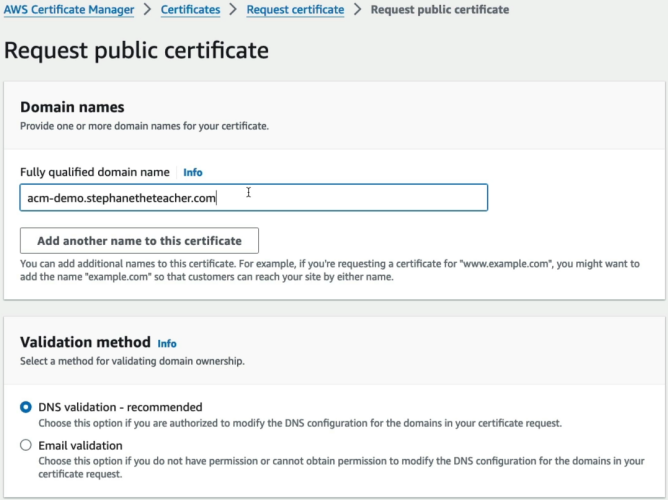
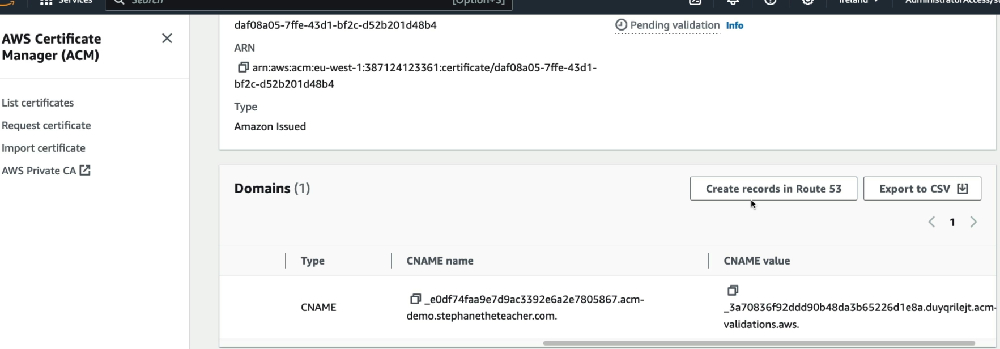
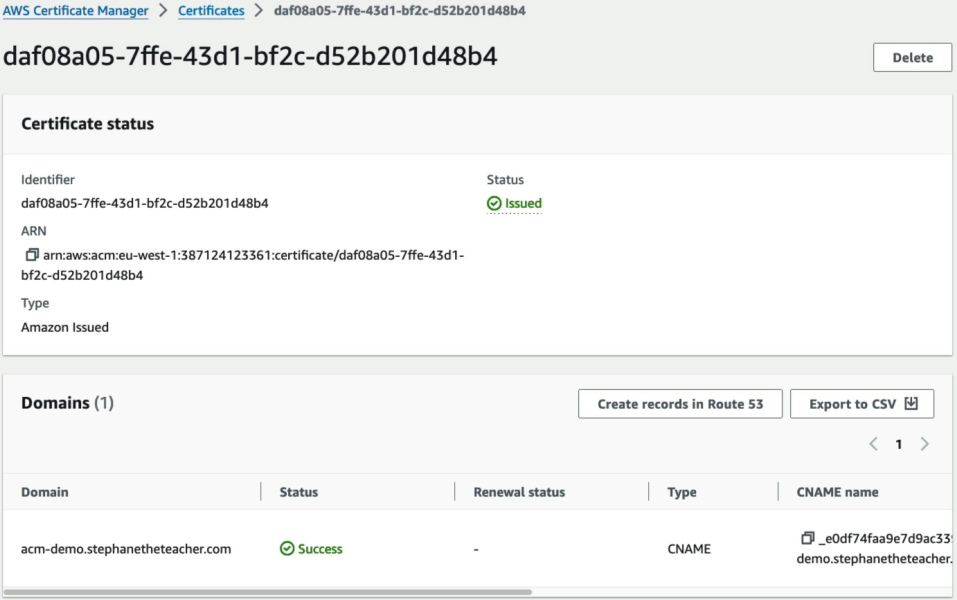
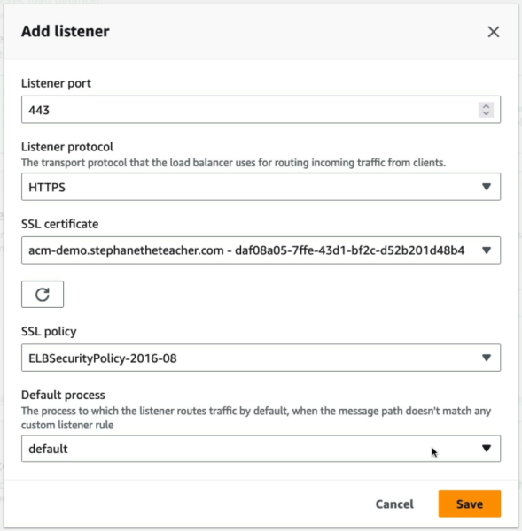
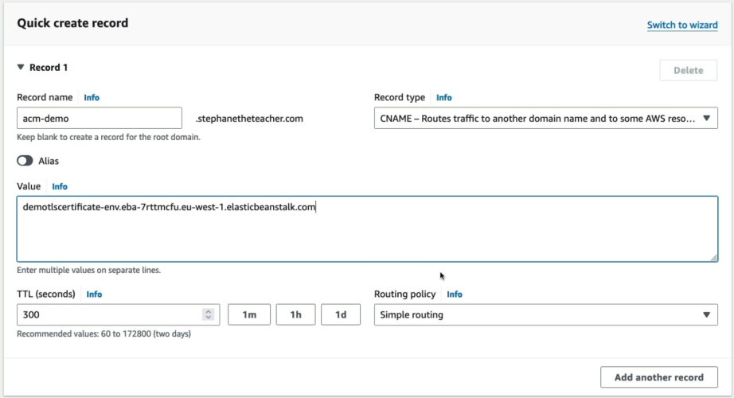
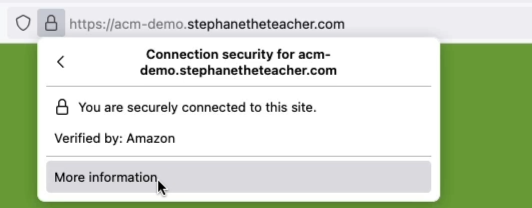
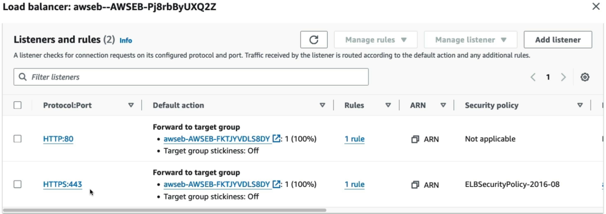

# Amazon Certificate Manager (ACM) Hands On

Seeing the full end-to-end chain—from requesting an **ACM certificate** and validating ownership via **Route 53 DNS records**, to wiring up an **ALB HTTPS listener (Port 443)** inside **Elastic Beanstalk**—is the ultimate proof-of-concept for in-flight encryption! 🔒

Stephane's hands-on demo covers the full architecture: ACM + Route 53 + Application Load Balancer + Elastic Beanstalk.

---

## 🛠️ 1. Complete Hands-On Architecture & Request Flow

```text
 1. Request Cert (ACM) ──► 2. Create CNAME (Route 53) ──► 3. Cert Issued (Validated)
                                                                │
                                                                ▼
 4. User hits Custom CNAME ──► 5. Route 53 routes to ALB ──► 6. ALB Terminates HTTPS (Port 443)
    (ACMdemo.domain.com)                                            └── Forwarded via HTTP to EC2 Task

```

### Phase 1: ACM Certificate Request & Route 53 DNS Validation

1. **Request Public Certificate:** Enter Fully Qualified Domain Name (FQDN) like `acm-demo.stephantheteacher.com`.
2. **Select DNS Validation:** ACM generates a unique CNAME name and CNAME value.  
   
3. **The One-Click Integration ⚡:** Because Route 53 manages the hosted zone in the same account, clicking **"Create records in Amazon Route 53"** automatically inserts the validation CNAME record into the DNS zone!  
   
4. **Validation Complete:** ACM queries public DNS, verifies ownership via the CNAME token, and moves status from `Pending validation` to `Issued`.  
   

### Phase 2: Deploying HTTPS Listener on Elastic Beanstalk (ALB)

1. **Provision Environment:** Create High-Availability Web Server environment (Node.js/EC2).
2. **Configure Load Balancer:**
   - Select **Application Load Balancer (ALB)**.
   - Add Listener: **Port `443`** / Protocol **`HTTPS`**.
   - SSL Certificate: Select the issued ACM Certificate ARN.
   - SSL Security Policy: Select modern TLS cipher policy (e.g., `ELBSecurityPolicy-2016-08`).  
     

### Phase 3: Route 53 CNAME Alias Routing & Testing

1. **Create App CNAME Record:** In Route 53, map `acm-demo.stephantheteacher.com` ──► Elastic Beanstalk Environment URL (`*.elasticbeanstalk.com`).  
   
2. **Verify HTTPS in Browser:** Navigate to your domain with `https` prefix.
3. **Inspect Certificate:** Browser displays valid SSL padlock verified by **Amazon** as the Certificate Authority!  
   
4. **Console Verification:** Inspect ALB under EC2 Console ──► _Listeners & rules_ ──► Port 443 displays the default ACM certificate attached.  
   

---

## ⚔️ Key AWS Service Integrations Covered

| Service                             | Role in the Architecture                                                                        |
| ----------------------------------- | ----------------------------------------------------------------------------------------------- |
| **AWS Certificate Manager (ACM)**   | Issues and manages free public SSL/TLS certificates; handles automatic DNS renewals.            |
| **Amazon Route 53**                 | Hosts public DNS records; processes validation CNAME records and routes app CNAME traffic.      |
| **AWS Elastic Beanstalk**           | Provisions underlying infrastructure (ALB, ASG, EC2) and exposes HTTPS configuration listeners. |
| **Application Load Balancer (ALB)** | **Terminates TLS/HTTPS traffic at Port 443**, offloading decryption compute from EC2 instances. |

---

## Exam Tips

- **The Automatic Validation Record Integration ⚡:** When requesting an ACM certificate using DNS validation for a domain managed in Route 53 within the same AWS account, you don't need to manually copy/paste CNAME strings. Use the **"Create records in Amazon Route 53"** button!
- **The Route 53 CNAME Routing Rule:** When mapping a custom subdomain (e.g., `app.yourdomain.com`) to a load balancer or Elastic Beanstalk environment, use a **CNAME record** (or an **Alias record** targeting the ALB DNS name).
- **TLS Offloading Efficiency 🛡️:** In an ALB + EC2 architecture, HTTPS is decrypted **at the load balancer level**. The traffic between the ALB and the EC2 target group runs over HTTP (Port 80) inside the private VPC by default, saving CPU cycles on backend application servers!
