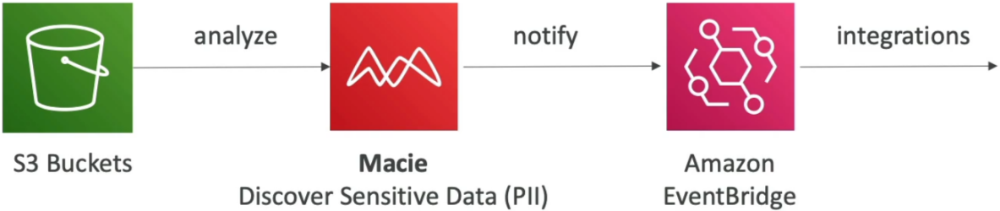

# Amazon Macie

**Amazon Macie** is AWS's dedicated automated data security auditor that uses machine learning and pattern matching to continuously scan, discover, classify, and protect sensitive data living inside **Amazon S3**! 🏎️🔒

While other monitoring tools analyze infrastructure logs or network streams, Macie focuses on the _content_ of your files to ensure compliance with privacy regulations like GDPR, HIPAA, and PCI-DSS.

---

## Key Takeaways

Let's break down the core detection capabilities, custom data identifiers, event-driven remediation loops, and DVA-C02 exam scenarios.

### 🏗️ Core Functionality & Detection Engines

```text
                               ┌────────────────────────────────────────────────────────┐
                               │                      AMAZON MACIE                      │
                               └───────────────────────────┬────────────────────────────┘
                                                           │
             ┌─────────────────────────────────────────────┴─────────────────────────────────────────────┐
             ▼                                                                                           ▼
🔍 S3 Sensitive Data Discovery                                                            🛡️ S3 Security Posture Monitoring
  • Scans S3 objects using ML & Regex                                                      • Checks bucket ACLs, policies, and public status
  • Managed Data Identifiers:                                                              • Alerts on unencrypted or exposed buckets
    - PII (SSNs, Passports, Driver's Licenses)                                             • Continually maps S3 data sensitivity
    - Financial (Credit Card numbers, IBANs)
    - Credentials (AWS Secret Keys, API Tokens)
  • Custom Data Identifiers (Regex for company formats)
```

#### A. What Macie Detects:

- **Managed Data Identifiers:** Pre-built, AWS-maintained detection criteria targeting **PII** (Social Security Numbers, names, addresses), **PHI** (medical record numbers), **financial info** (credit card numbers, bank account IBANs), and **credentials** (AWS secret keys, API tokens).
- **Custom Data Identifiers:** Allows you to define custom regular expressions (regex) to flag internal company-specific data formats, such as employee ID numbers or proprietary customer account IDs.

#### B. Automated Discovery vs. Targeted Jobs:

- **Automated Sensitive Data Discovery:** Macie uses intelligent sampling techniques across your entire S3 estate to build an interactive, updated **sensitivity heatmap** of your buckets.
- **Targeted Sensitive Data Discovery Jobs:** On-demand or scheduled scans (daily, weekly, monthly) applied to specific buckets or object types.

---

### ⚡ The Automated Event Response Pipeline

Macie does not modify or quarantine objects directly when sensitive data is discovered. Instead, it emits detailed **Findings** to **Amazon EventBridge**, allowing you to build fully automated remediation pipelines!



```text
📦 Raw PII uploaded to S3
          │
          ▼
🔐 Amazon Macie (Scans & generates sensitive data Finding)
          │
          ▼
🔔 Amazon EventBridge Rule (Filters finding severity)
          │
          ├──► ⚡ AWS Lambda Function (Auto-quarantines object / revokes S3 bucket public access)
          │
          └──► 📢 Amazon SNS Topic (Alerts Security Operations Team via Slack / Email)
```

---

### ⚔️ Macie vs. GuardDuty (The DVA-C02 Distinction)

Exam questions often test whether you know which security service handles which responsibility:

| Feature             | 🔐 Amazon Macie                                  | 🛡️ Amazon GuardDuty                                          |
| ------------------- | ------------------------------------------------ | ------------------------------------------------------------ |
| **Primary Scope**   | **Data Privacy & S3 Content Classification**     | **Threat Detection & Anomaly Monitoring**                    |
| **Analyzed Target** | **S3 Objects & Files** (CSV, JSON, PDF, Parquet) | CloudTrail, VPC Flow Logs, DNS logs, EKS/Lambda logs         |
| **Primary Goal**    | Finds PII, PHI, financial data, and credentials  | Detects compromised EC2 instances, compromised keys, malware |

:::tip
**What about RDS or DynamoDB?** Macie operates _exclusively_ on **Amazon S3**. To scan an RDS database or DynamoDB table with Macie, you export a database snapshot to S3 (e.g., in Parquet format) and run a Macie discovery job against the S3 export!
:::

---

## Exam Tips

- **The S3 PII Rule 🚨:** If a scenario asks for a service to automatically discover, classify, and alert on **PII or credit card details stored in S3 buckets**—**choose Amazon Macie.**
- **Automated Remediation Pattern:** To automatically isolate a bucket or remove public permissions upon finding PII, route Macie findings through **Amazon EventBridge** to invoke an **AWS Lambda function**.
- **Custom Regex Pattern Matching:** When asked how to detect custom internal employee ID formats or proprietary customer keys in S3—**select configuring Macie Custom Data Identifiers!**
