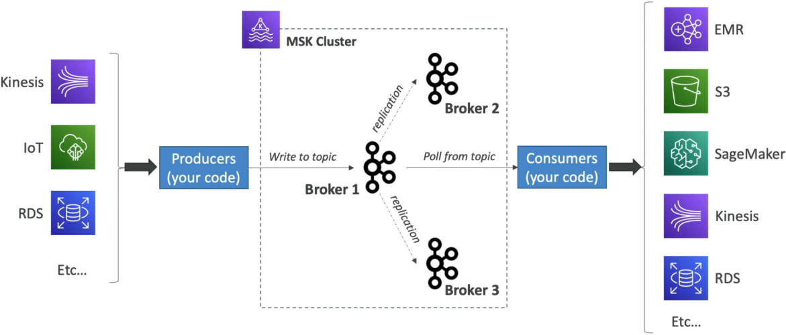
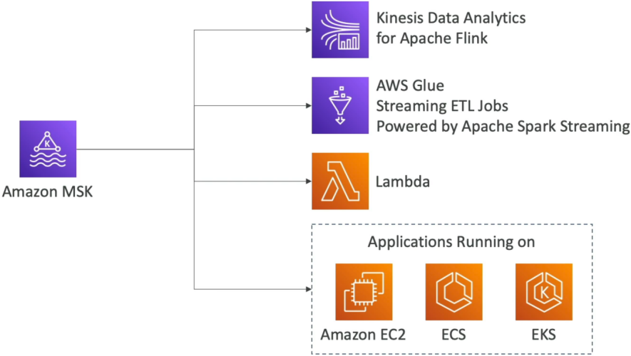

# Amazon MSK - Overview

**Amazon MSK (Managed Streaming for Apache Kafka)** is AWS's fully managed solution for open-source Apache Kafka, giving you real-time event streaming pipelines without the massive headache of manually patching, scaling, and maintaining Kafka brokers!

While both Amazon Kinesis Data Streams and Amazon MSK solve the real-time streaming puzzle, the DVA-C02 exam heavily tests **architectural trade-offs, configuration limits, and ingestion/consumption patterns** between the two services.

---

## Key Takeaways

Let's go over the MSK architecture, scaling mechanics, consumption integration points, and the Kinesis vs. MSK comparison matrix.

### 🏗️ Core Architecture & Deployment Options

Amazon MSK deploys Kafka brokers across up to **3 Availability Zones (AZs)** inside your private VPC for high availability:

- **MSK Provisioned:** You choose the EC2 broker instance types (e.g., `kafka.m5.large`) and allocate EBS storage volumes per broker. Data is stored persistently on EBS for as long as you configured.
- **MSK Serverless:** Automatically provisions capacity, scales brokers, and manages storage on demand based on application throughput—zero server management required!
- **Metadata Consensus Note (KRaft vs. ZooKeeper) 🧠:** Upstream Apache Kafka 4.0 removes ZooKeeper entirely in favor of **KRaft (Kafka Raft)** consensus. Modern MSK clusters run KRaft controllers managed transparently by AWS behind the scenes at no extra cost!

---

### ⚔️ Amazon Kinesis Data Streams vs. Amazon MSK (The Exam Showdown)

When DVA-C02 questions present real-time streaming requirements, use this side-by-side comparison matrix to immediately pick the right target:

| Architectural Metric       | 🌊 Amazon Kinesis Data Streams                            | 🎸 Amazon MSK (Apache Kafka)                           |
| -------------------------- | --------------------------------------------------------- | ------------------------------------------------------ |
| **Message Payload Size**   | **Strict 1 MB limit**                                     | **Default 1 MB, configurable up to 10 MB+**            |
| **Partitioning Concept**   | **Shards**                                                | **Topics with Partitions**                             |
| **Scaling Mechanism**      | **Shard Splitting** (scale up) & **Merging** (scale down) | **Add Partitions** (cannot remove partitions!)         |
| **Retention Period**       | 24 hours up to 365 days max                               | **Unlimited** (constrained only by EBS storage budget) |
| **Protocol Compatibility** | AWS SDK / KPL / KCL APIs                                  | Standard **Apache Kafka APIs** (Zero vendor lock-in)   |
| **Security**               | TLS in-flight & KMS at-rest encryption                    | PLAINTEXT or TLS in-flight and KMS at-rest encryption  |

---

### 🔌 Producing & Consuming from MSK

```text
📥 PRODUCERS                       🎸 MSK CLUSTER                       📤 CONSUMERS
(Kinesis, IoT, App Code) ──►  [ Topic / Partitions ]  ──►  ⚡ AWS Lambda (Event Source)
                                                           🌊 Managed Flink (Kinesis Analytics)
                                                           🧹 AWS Glue Streaming ETL
                                                           💻 Custom App (EC2 / ECS / EKS)

```



#### A. Producing Data:

Standard Kafka Producers, Debezium Change Data Capture (CDC) connectors, or custom applications write to MSK topics using standard Kafka client libraries.

#### B. Consuming Data (Key Exam Targets):

1. **AWS Lambda:** Configured directly as an Event Source Mapping (`MSK` trigger). Lambda automatically manages polling batches and scaling workers.
2. **Amazon Managed Service for Apache Flink** _(formerly Kinesis Data Analytics)_: Stateful real-time stream processing applications running native Flink SQL or Java/Scala code.
3. **AWS Glue:** Real-time Streaming ETL jobs powered by Apache Spark Streaming.
4. **Custom Kafka Consumers:** Self-managed application containers deployed on Amazon EC2, ECS, or EKS using native Kafka client SDKs.



---

## Exam Tips

- **The >1 MB Message Size Requirement 🚨:** If a scenario states an application streams messages larger than 1 MB (e.g., 5 MB payloads) that exceed Kinesis limits—**choose Amazon MSK with custom message size configuration.**
- **Existing Kafka Application Migration 🚚:** If an enterprise wants to migrate an existing open-source Apache Kafka workload to AWS without rewriting application producer/consumer code or changing APIs—**select Amazon MSK!**
- **Partition Scaling Direction:** Remember that while Kinesis shards can be split and merged, **Kafka topic partitions can only be added—you cannot decrease the partition count on a topic without recreating it!**
