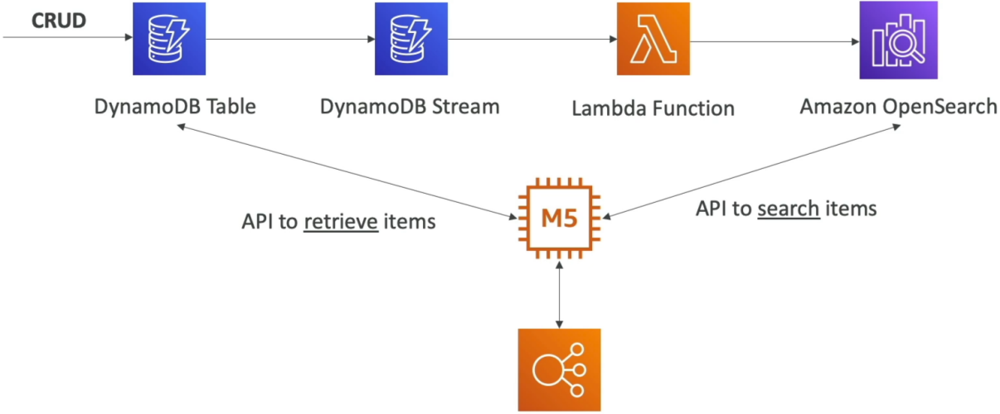
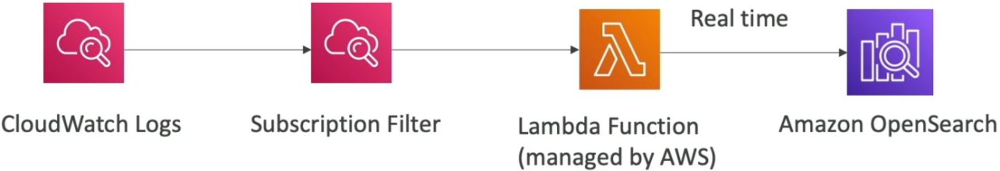
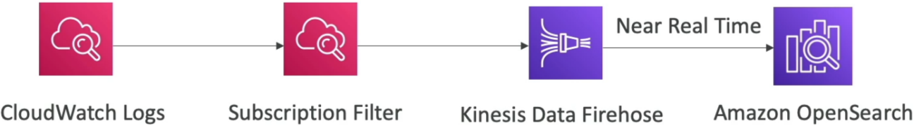
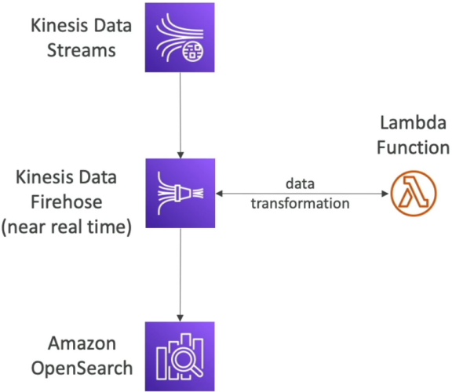
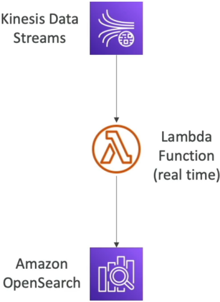

# Amazon OpenSearch Service

**Amazon OpenSearch Service** (formerly Amazon ElasticSearch Service) is a total classic when an architectural question demands full-text search, fuzzy/partial string matching, or log analytics dashboard. 🔍

Because standard databases like DynamoDB are optimized for direct primary key / index lookups, offloading search and analytical queries to OpenSearch is an essential design pattern.

## Key Takeaways

Let's run through the core features, deployment modes, ingestion pipeline architectures, and DVA-C02 exam tips.

### 🔎 What is Amazon OpenSearch Service?

OpenSearch is a fully managed search and analytics engine derived from open-source ElasticSearch.

- **Key Advantage Over Databases:** Unlike DynamoDB (which requires strict Partition/Sort key matching), OpenSearch can search across **any field**, supporting **partial matches, fuzzy search, and auto-complete**.
- **Query Interface:** Uses OpenSearch Query DSL (Domain Specific Language) out of the box, with SQL support enabled via an optional plugin.
- **Visualization:** Includes **OpenSearch Dashboards** (formerly Kibana) for interactive log analytics and data visualization.

---

### 🏗️ Provisioning Modes

1. **Managed Clusters:** You provision dedicated compute instances (data nodes, master nodes) across Availability Zones.
2. **OpenSearch Serverless:** Automatically handles capacity management, scaling, and provisioning without managing underlying instances.

---

### ⚙️ Real-World Architecture & Ingestion Patterns

The DVA-C02 exam frequently tests how to get data **into** OpenSearch using common serverless pipelines:

```text
                               ┌────────────────────────────────────────────────────────┐
                               │             OPENSEARCH INGESTION ARCHITECTURES         │
                               └───────────────────────────┬────────────────────────────┘
                                                           │
             ┌─────────────────────────────────────────────┼─────────────────────────────────────────────┐
             ▼                                             ▼                                             ▼
⚡ Pattern A: DynamoDB + Streams                📑 Pattern B: CloudWatch Logs                  🌊 Pattern C: Kinesis Data Streams
  • User updates DynamoDB Table                 • CloudWatch Log Subscription Filter            • Option 1: Firehose (Near Real-time)
  • DynamoDB Stream triggers Lambda             • Routes to Lambda or Kinesis Firehose          • Option 2: Lambda Reader (Real-time)
  • Lambda writes record to OpenSearch          • Writes log payload into OpenSearch             • Direct API write to OpenSearch

```

#### 🔹 Pattern A: DynamoDB Offloading for Full-Text Search

1. App writes item to **DynamoDB Table**.
2. **DynamoDB Streams** captures the insert/update/delete mutation.
3. **AWS Lambda** polls the stream and syncs the payload into **OpenSearch** in real time.
4. App searches OpenSearch for partial text (e.g., `"straw hat"`) to fetch item IDs, then performs a high-speed `GetItem` call on DynamoDB!  
   

#### 🔹 Pattern B: CloudWatch Logs Analytics

- **Subscription Filter ──► Lambda ──► OpenSearch:** Real-time log streaming via managed Lambda execution.  
  
- **Subscription Filter ──► Kinesis Data Firehose ──► OpenSearch:** Near real-time, high-volume buffered log ingestion without writing custom Lambda code!  
  

#### 🔹 Pattern C: Kinesis Data Streams

- **Kinesis Data Streams ──► Kinesis Data Firehose ──► OpenSearch:** Near real-time ingestion with built-in buffering and automatic scaling.  
  
- **Option 2: Kinesis Data Streams ──► Lambda ──► OpenSearch:** Real-time ingestion with custom transformation logic in Lambda.  
  

---

## Exam Tips

- **The DynamoDB Partial Search Trap 🚨:** If a scenario describes a DynamoDB table storing product catalogs or user profiles where users now need to perform **fuzzy searching or partial name matching** across unindexed fields—**select streaming DynamoDB updates via DynamoDB Streams + Lambda into Amazon OpenSearch Service.**
- **Near Real-time vs. Real-time Ingestion:**
  - If the pipeline requires **zero code / built-in buffering** for high throughput: **Kinesis Data Firehose ──► OpenSearch**.
  - If the pipeline requires **sub-second custom transformations**: **Kinesis Data Streams / DynamoDB Streams ──► Lambda ──► OpenSearch**.
