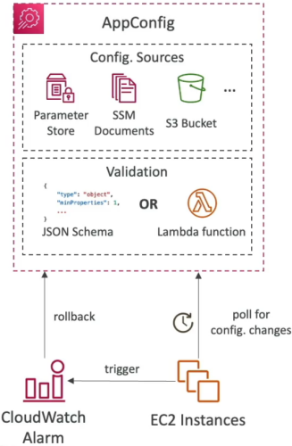

# AWS AppConfig - Overview

**AWS AppConfig** (a capability of AWS Systems Manager) is the ultimate operational power play for decoupling your application code deployments from dynamic runtime configurations! ⚡

Instead of baking environment settings directly into build artifacts or forcing full container or EC2 restarts just to toggle a feature, AppConfig lets you **update configuration data and feature flags dynamically at runtime in real time**.

---

## Key Takeaways

Let's go over the core concepts, deployment rollout strategies, validation checks, and the essential DVA-C02 tips for your exam survival guide.

### 🏗️ Core Concepts & Architectural Components

```text
                               ┌────────────────────────────────────────────────────────┐
                               │                     AWS APPCONFIG                      │
                               └───────────────────────────┬────────────────────────────┘
                                                           │
             ┌─────────────────────────────────────────────┼─────────────────────────────────────────────┐
             ▼                                             ▼                                             ▼
📄 Configuration Profiles                      🧪 Application Environments                    🚀 Deployment Strategies
  • Feature Flags (`AWS.AppConfig.FeatureFlags`) • Dev, Staging, Production                     • Linear / Exponential Rollouts
  • Freeform (`JSON`, `YAML`, `Text`)            • Tracks active configurations                 • Bake Times (Monitoring window)
  • Hosted Store, SSM Parameter, S3, SSM Doc     • Tied to CloudWatch Alarms                    • Instant Automatic Rollbacks
```

1. **Applications & Environments:**
   - **Application:** The top-level logical container representing your microservice.
   - **Environment:** Logical deployment targets (e.g., `Dev`, `Staging`, `Prod`).

2. **Configuration Profiles & Storage Sources:** Defines where your configuration data lives:
   - **AppConfig Hosted Store:** Built-in, fully managed configuration store (ideal for Feature Flags).
   - **SSM Parameter Store:** References plaintext parameters or `SecureString` configurations.
   - **Amazon S3 Buckets / SSM Documents:** References raw configuration files stored in S3 or Systems Manager documents.
3. **Feature Flags:** Allows you to deploy new code behind conditional toggles (`true`/`false` or complex JSON rules). Features can stay inactive in production until you flip the flag at runtime without redeploying code.



---

### 🛡️ Validation & Safe Rollout Mechanics

Deploying a bad configuration value (e.g., a broken JSON key, a string instead of a boolean, or an out-of-range port number) can take down a fleet faster than a code bug. AppConfig enforces safety using two distinct layers:

#### Layer 1: Configuration Validation (Before Deployment)

AppConfig runs validation checks **at upload time** before any deployment can start:

- **JSON Schema Validator:** Checks structural/syntax correctness (e.g., verifying types like booleans or numbers, minimum/maximum constraints).
- **Lambda Function Validator:** Executes custom code logic for semantic validation (e.g., attempting a test database connection or verifying that an external endpoint is reachable).

#### Layer 2: Gradual Deployment & CloudWatch Alarm Rollback (During Deployment)

When you deploy a new configuration version, AppConfig uses a **Deployment Strategy**:

```text
 🚀 Deployment Starts ──► 📈 Gradual Rollout (e.g., 10% ➔ 50% ➔ 100%)
                                 │
                                 ├── (CloudWatch Alarm Fires!) ──► 🚨 AUTOMATIC INSTANT ROLLBACK!
                                 │                                 (Reverts fleet to last known good state)
                                 ▼
                         ✅ Bake Time Period Passes ──► Deployment Complete
```

- **Step Percentage & Growth Type:** Controls what percentage of application instances receive the updated configuration over time (Linear or Exponential).
- **Bake Time:** A designated monitoring period _after_ the configuration is fully distributed to ensure system stability.
- **Automatic Rollback:** AppConfig continuously monitors attached **Amazon CloudWatch Alarms**. If an operational metric breaches thresholds during deployment or bake time, AppConfig **automatically halts the rollout and reverts all clients to the last known good configuration state**!

---

### 💻 Application Fetch Pattern & AppConfig Agent

Client applications running on EC2, ECS, EKS, or AWS Lambda poll for configuration changes:

- **AWS AppConfig Helper / AppConfig Agent:** A lightweight sidecar or Lambda extension that automatically handles client-side caching, fetching update tokens, and polling AppConfig APIs (`GetLatestConfiguration`) efficiently in the background.

---

### ⚔️ AppConfig vs. SSM Parameter Store vs. Secrets Manager

| Feature Matrix         | 🎛️ AWS AppConfig                                            | 🗄️ SSM Parameter Store                            | 🔐 AWS Secrets Manager                        |
| ---------------------- | ----------------------------------------------------------- | ------------------------------------------------- | --------------------------------------------- |
| **Primary Use Case**   | Dynamic runtime configs, feature flags, operational toggles | Static app parameters, URLs, configuration values | Encrypted credentials, API keys, DB passwords |
| **Gradual Deployment** | **Native** (Linear/Exponential percentage rollouts)         | None (Instant global update)                      | None (Instant global update)                  |
| **Validation Checks**  | **Native** (JSON Schema & Lambda Function validators)       | Basic type checking (`String`, `SecureString`)    | Basic syntax                                  |
| **Auto-Rollback**      | **Native** via CloudWatch Alarms                            | None                                              | None                                          |

---

## Exam Tips

- **The Feature Flag Rollout Scenario 🚨:** If a scenario asks for a service to toggle new application features in real time or safely release features to user subsets **without redeploying application code or restarting instances**—**always select AWS AppConfig.**
- **Preventing Bad Configuration Outages:** If an exam question asks how to ensure a dynamic configuration file does not contain invalid port numbers or broken schemas prior to being released across an EC2 fleet—**choose AWS AppConfig with JSON Schema or AWS Lambda Validators!**
- **CloudWatch Alarm Integration:** If a scenario requires deploying configuration changes gradually while automatically reverting back if application error rates spike—**select configuring an AWS AppConfig Deployment Strategy bound to CloudWatch Alarms!**
