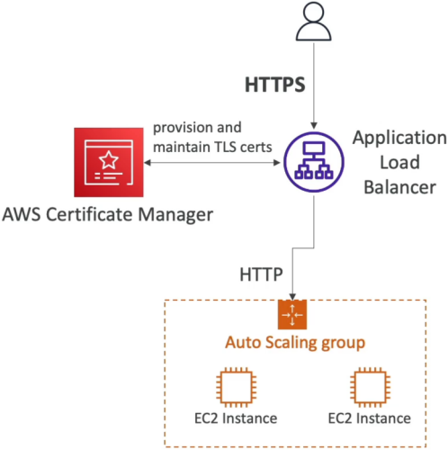

# Amazon Certificate Manager (ACM)

**AWS Certificate Manager (ACM)** is the ultimate zero-headache service for provisioning, managing, and deploying SSL/TLS certificates to secure your public and private endpoints with **in-flight encryption (HTTPS)**! 🔒

While setting up and renewing SSL certificates used to be an operational nightmare, ACM automates domain validation, certificate issuing, and background renewal completely **free of charge for public certificates**!

---

## Key Takeaways

Let's go over how ACM integrates into AWS architectures, the strict regional rules, domain validation choices, and exam tips for the DVA-C02 exam.

### 🏗️ Integrated Services & TLS Offloading

ACM certificates **cannot be directly downloaded or installed onto raw EC2 instances, on-premises servers, or standalone web servers**. Instead, ACM deploys certificates directly onto AWS managed resources that support TLS termination:

```text
                               ┌────────────────────────────────────────────────────────┐
                               │             AWS CERTIFICATE MANAGER (ACM)              │
                               └───────────────────────────┬────────────────────────────┘
                                                           │ (Deploys Managed Certificates)
             ┌─────────────────────────────────────────────┼─────────────────────────────────────────────┐
             ▼                                             ▼                                             ▼
⚖️ Application Load Balancer (ALB)             🌐 Amazon CloudFront                              🔌 Amazon API Gateway
  • Decrypts HTTPS traffic at edge               • Global TLS termination                        • Custom Domain Name HTTPS
  • Forwards HTTP to EC2 Target Groups           • Must use us-east-1 region                     • Maps endpoints seamlessly
```

- **Application Load Balancer (ALB) / Network Load Balancer (NLB):** Attach ACM certificates directly to HTTPS listeners to handle TLS termination before passing traffic down to EC2 instances or container tasks.  
  
- **Amazon CloudFront:** Secure custom domains globally at the edge.
- **Amazon API Gateway:** Enable HTTPS for custom API domain names (e.g., `api.yourdomain.com`).

---

### 🚨 The CloudFront `us-east-1` Region Rule (Crucial Exam Trap!)

This is one of the most heavily tested ACM rules across the entire AWS ecosystem:

- **Regional Scope:** ACM certificates are regional resources. If you request a certificate in `ap-southeast-2` (Sydney), it can only be attached to ALBs, NLBs, or API Gateways living in `ap-southeast-2`.
- **The Global CloudFront Rule 🌐:** Because Amazon CloudFront is a globally distributed edge service controlled out of N. Virginia, **any ACM certificate used for a CloudFront distribution MUST be requested in (or imported to) the `us-east-1` region!**

```text
❌ Requesting ACM Cert in ap-southeast-2 ──► CloudFront cannot see or attach it!
✅ Requesting ACM Cert in us-east-1      ──► CloudFront can select & deploy it to global edge locations!
```

---

### 🔄 Domain Validation & Automatic Renewal

Before ACM issues a certificate for `example.com`, you must prove domain ownership via one of two methods:

| Validation Method                   | How it Works                                                                            | Automatic Renewal Behavior                                                                                                   |
| ----------------------------------- | --------------------------------------------------------------------------------------- | ---------------------------------------------------------------------------------------------------------------------------- |
| **DNS Validation (Recommended) ⭐️** | ACM provides a custom **CNAME record** to add to your DNS zone (e.g., Amazon Route 53). | **100% Fully Automated!** As long as the CNAME record stays in Route 53, ACM renews the cert automatically before expiry.    |
| **Email Validation**                | AWS emails the domain owner / WHOIS contacts with an approval link.                     | **Semi-Manual.** Requires clicking an email link prior to renewal, which can cause unexpected cert expiration if overlooked! |

---

## Exam Tips

- **The CloudFront Certificate Missing Trap 🚨:** If a developer requests an ACM SSL/TLS certificate for a web application, but cannot see the certificate inside the CloudFront Console dropdown menu—**the root cause is that the ACM certificate was requested in a local region instead of `us-east-1`!**
- **Cost-Effective In-Flight Encryption:** Public SSL/TLS certificates issued directly by AWS Certificate Manager are **100% FREE** when used with integrated services (ALB, CloudFront, API Gateway).
- **Auto-Renewal Failure:** If an ACM certificate fails to renew automatically under DNS validation, check if a developer accidentally deleted the ACM-generated CNAME validation record from Route 53!

### Scenario Practice

**Scenario:** To enable HTTPS connections for his web application deployed on the AWS Cloud, a developer is in the process of creating server certificate.
Which AWS entities can be used to deploy SSL/TLS server certificates? (Select two)

- [ ] IAM
- [ ] AWS Systems Manager
- [ ] AWS Secrets Manager
- [ ] AWS CloudFormation
- [ ] AWS Certificate Manager

<details>
  <summary>Correct Answer</summary>

- [x] IAM
  - IAM is used as a certificate manager only when you must support HTTPS connections in a Region that is not supported by ACM. IAM securely encrypts your private keys and stores the encrypted version in IAM SSL certificate storage. IAM supports deploying server certificates in all Regions, but you must obtain your certificate from an external provider for use with AWS. You cannot upload an ACM certificate to IAM. Additionally, you cannot manage your certificates from the IAM Console.
- [x] AWS Certificate Manager
  - AWS Certificate Manager (ACM) is the preferred tool to provision, manage, and deploy server certificates. With ACM you can request a certificate or deploy an existing ACM or external certificate to AWS resources. Certificates provided by ACM are free and automatically renew. In a supported Region, you can use ACM to manage server certificates from the console or programmatically.

</details>
