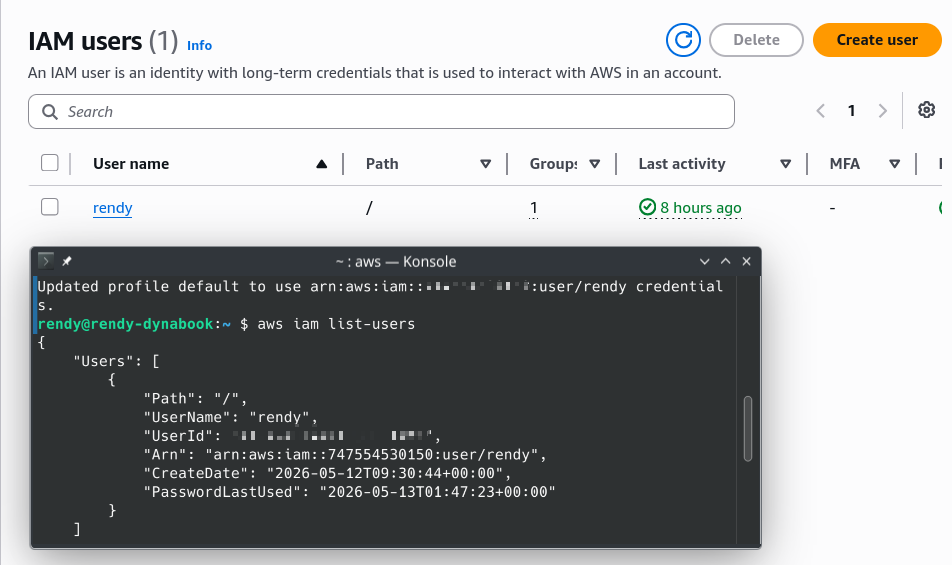
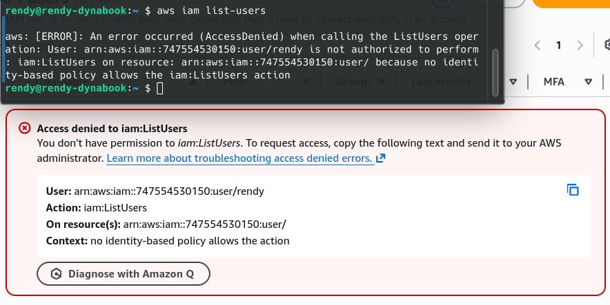

# AWS CLI Hands-On

In which we start to use the AWS CLI

## Key takeaways

- **Access Key Creation**: The lecture starts by explaining how to create access keys in the AWS Management Console, emphasizing the imortance of understanding how these keys function for accessing the CLI.
  - To create access keys, click on your username and go to `Security credentials`. Scroll down to `Access Keys` and Click `Create access key`.
  - Select one of the use cases for the access key. In this case, I choose `CLI`, AWS is going to have alternatives recommended. For example, for the CLI, it says to use `AWS CLI V2` and the `aws login` command. It also recommends to use `AWS CloudShell` which we will cover in the next lecture.
  - After creating the access key, you will be provided with an `Access key ID` and a `Secret access key`. It is crucial to copy and save these keys securely, as the secret access key will not be shown again for security reasons. If you lose it, you will need to create a new access key.
- **CLI Configuration**: You need to configure the AWS CLI using the `aws configure` command by providing the access key ID, secret access key, default region, and output format. I use `ap-southeast-2` as it is the closest region to me, but you can choose any region you prefer. Now the CLI is configured and ready to use.
- **Listing Users**: To list users in the AWS account using the command `aws iam list-users`, highlighting the consistency of information retrieval through both the CLI and Management Console.
  
- **Permission Management**: Maarek illustrates how removing permissions from a user affect their ability to perform actions in the CLI. For example, taking the `Rendy` user out of the admin group results in a denial permission when trying to list users.
- **IAM Permission Consistency**: Both the management console and CLI enforce the same IAM permission sets, meaning changes in permissions impact access across both interfaces.
  
