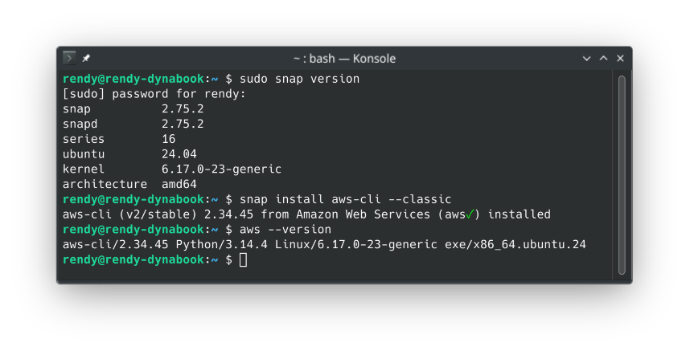

# AWS CLI Setup

In this lecture, we will set up AWS Command Line Interface (CLI) to interact with AWS services from the terminal. I will write my experience of setting up the CLI on Linux.

## Windows & Mac OS X

Please follow the instruction here [AWS CLI install instructions](https://docs.aws.amazon.com/cli/latest/userguide/getting-started-install.html#getting-started-install-instructions)

## Linux

There are two ways to install the AWS CLI on Linux, using CLI installer or the official supported snap packages. I will use the snap package method as I can get update more easily down the line.

- Make sure you have snap installed on your Linux distribution. You can check by running `snap --version` in the terminal. If it's not installed, you can install it using your package manager (e.g., `sudo apt install snapd` for Debian-based distributions).
- Run the following command to install the AWS CLI using snap:
  ```bash
  sudo snap install aws-cli --classic
  ```
- After the installation is complete, you can verify that the AWS CLI is installed correctly by running:
  ```bash
  aws --version
  ```
  
