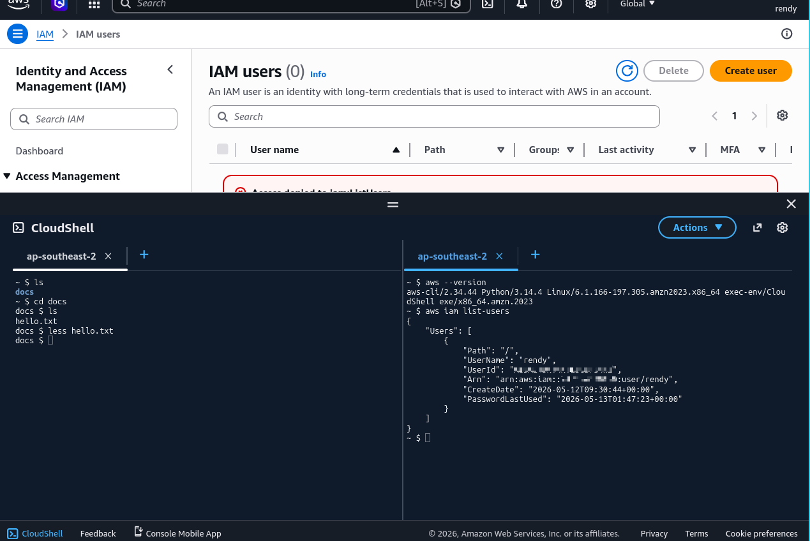

# AWS CloudShell

Hands-on with AWS CloudShell, a browser-based shell that provides a pre-configured environment for managing AWS resources.

## Key takeaways

- **Introduction to AWS CloudShell**: AWS CloudShell is a cloud-based terminal alternative for executing AWS CLI commands, emphasizing its accessibility in different regions.
- **CloudShell Icon Location**: There are two icons for accessing CloudShell, one in the top navigation bar and another one in the bottom left corner of the AWS Management Console. Both icons provide access to the same CloudShell environment. If you don't see it, make sure to check the region you are in, as CloudShell is not available in all regions.
- **Free Usage**: AWS CloudShell is free to use, but it does have some limitations, such as a maximum session duration of 20 hours and a storage limit of 1 GB. It is important to be aware of these limits when using CloudShell for your tasks.
- **Automatic Region Setting**: The default region for API calls is automatically adjusted to the region where the user is logged in when using CloudShell.
- **File Management**: Users can create and manage files within CloudShell, with the important feature that files persist even after restarting the environment.
- **Customization Options**: There are options to adjust the font size and choose between light or dark themes to enhance the user experience.
- **File Upload/Download**: The ability to upload and download files is noted as a particularly useful feature for users.
- **Multiple Sessions**: Users can open multiple tabs or split the terminal view for working with multiple sessions simultaneously.

## Personal notes

CloudShell is basically a terminal in the cloud of AWS.

