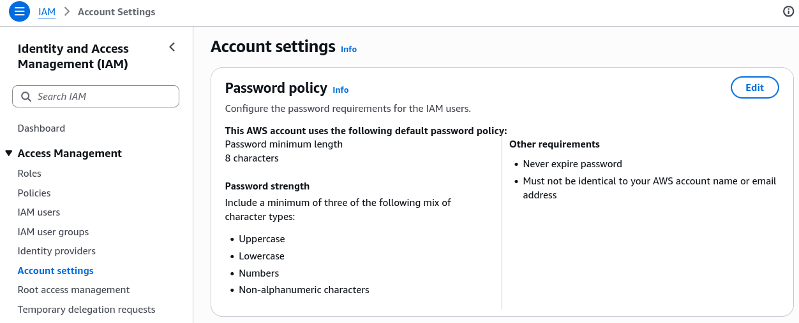
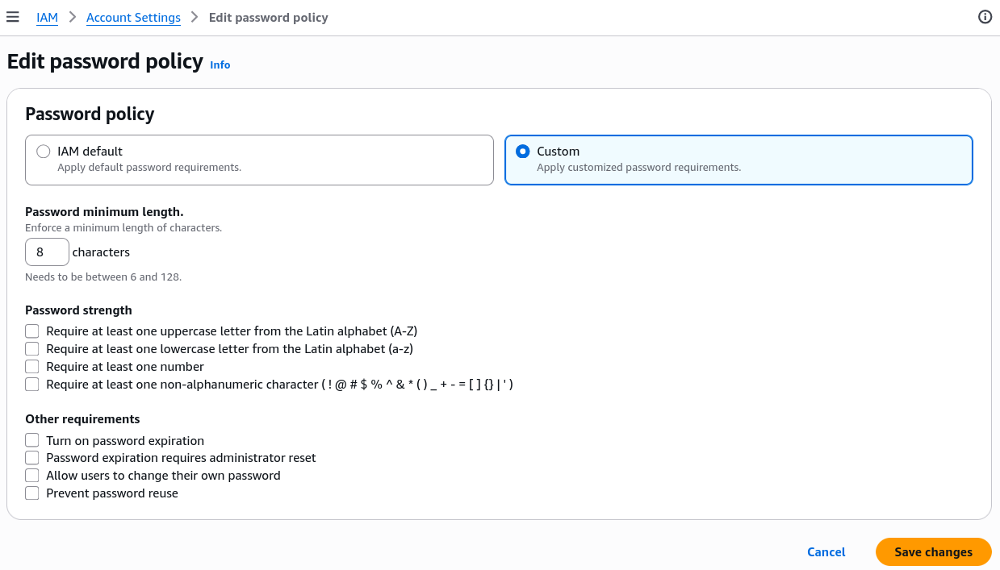

# IAM MFA Hands-On

Continuation of the previous MFA Overview lecture, this session focuses on the practical implementation of password policies and Multi-Factor Authentication (MFA) in AWS.

## Key Takeaways

- **Password Policy**: To set password policies, navigate to the IAM dashboard, select "Account settings", and click "Edit" to customize the password policy according to our security requirements.
  
  
- **Setting Up MFA**: To add a new MFA device, click on the account name, click "Security Credentials", from there you can manage MFA devices. Click "Assign MFA device" to start the setup process.
- From now on, when logging in to the AWS Management Console, you will be prompted to enter MFA code after entering the password.
