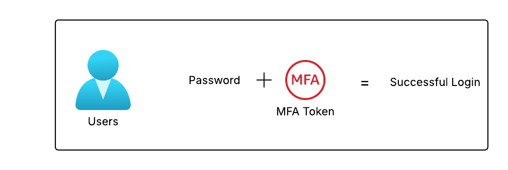

# IAM MFA Overview

Now that I have created users in group, it's time to protect these users.

## Key Takeaways

- **Password Policy**: First defense mechanism is to set up a strong password policy, with stronger password user use, the more secure the account will be.
  - In AWS, you can setup a password policy:
    - Set a minimum password length.
    - Require specific character types
      - including uppercase letters
      - lowercase letters
      - numbers
      - non-alphanumeric characters
    - Allow all IAM users to change their own passwords.
    - Require users to change their password after some time (e.g., 90 days).
    - Prevent password reuse by setting a password history requirement (e.g., users cannot reuse their last 5 passwords).
- **Multi-Factor Authentication (MFA)**: MFA is second line of defense, it adds an extra layer of security by requiring users to provide something that they own (e.g., a physical device or mobile app) in addition to their password.
  git - Users have access to your account and can possibly cause damage, loss of data or financial loss
  - You want to protect your Root Account and IAM users
  - MFA is using the combination of password (something you know) and physical device (something you have)
    
  - Main benefit: If password is compromised, the attacker still needs a physical device to access the account.
- MFA devices options in AWS
  - Virtual MFA device: A software-based MFA solution that can be installed on a smartphone or computer. It generates time-based one-time passwords (TOTP) that users enter during sign-in. e.g Google Authenticator, Authy
  - Universal 2nd Factor (U2F) security key: A hardware-based MFA solutions e.g YubiKey by Yubico
    
  - Hardware Key Fob: A physical device that generates one-time password.
    
