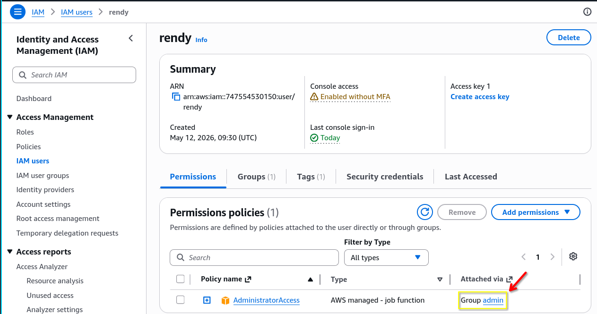
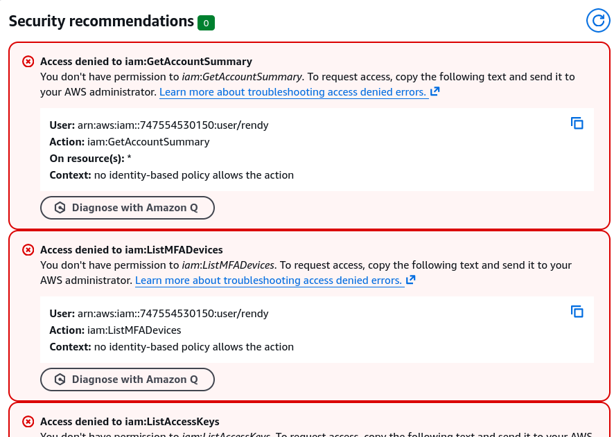
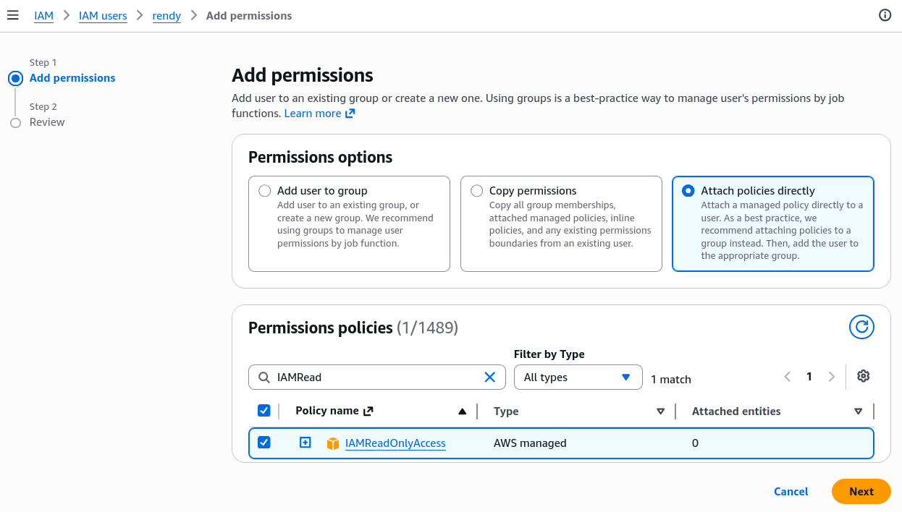
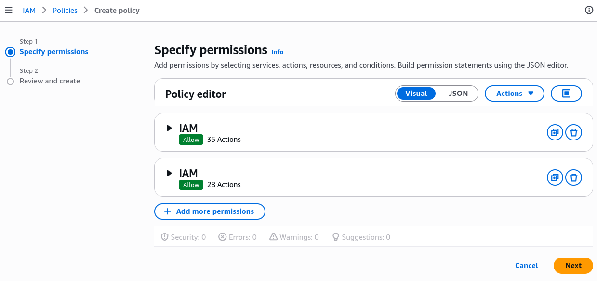
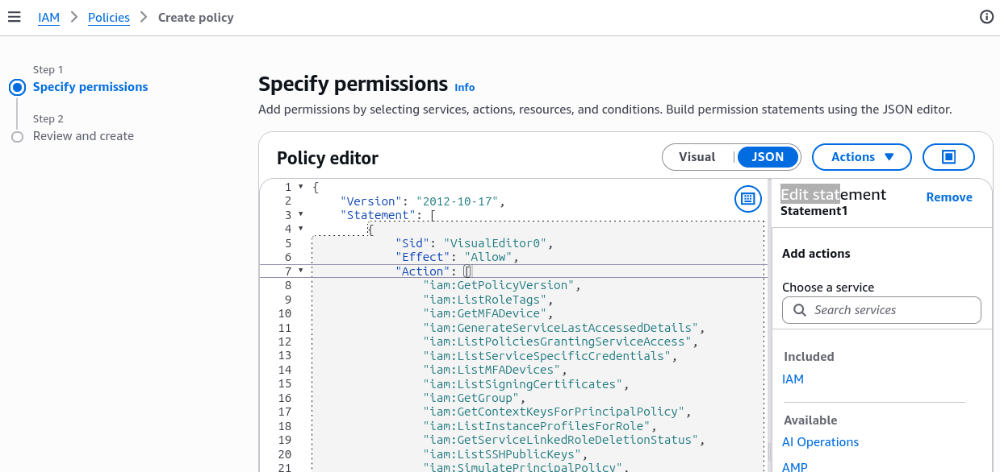

# IAM Policies Hands-On

On this lecture, we explore the practical application of IAM policies in AWS, focusing on how to create and manage policies effectively.

## Key Takeaways

- **User Permission Management**: The lecture illustrates how user permissions are managed through group memberships, using the example of a user, Rendy, who initially has administrator access.
  
- **Effects of Group Membership**: When removed from the admin group, Rendy experiences a loss of permissions, demonstrating how group affiliation impacts access rights.
  
- **Restoring Access**: By adding the IAMReadOnlyAccess policy to Rendy, I regain certain permissions, allowing me to view IAM resouces without the ability to create new ones.
  
- **Flexibility in IAM**: Users can inherit permissions from groups, and multiple policies can be attached to a single user, showcasing the flexible nature of IAM management.
- **Common IAM Policies**: The lecture discusses key policies like `AdministratorAccess` for full access and `IAMReadOnlyAccess` for limited read and list actions, along with their JSON representations.
- **Custom Policy Creation**: It covers how to create custom policies using both a visual editor and JSON editor, enabling tailored permissions based on specific needs.
  
  
- **Maintaining IAM Efficiency**: The importance of cleaning up unnecessary groups and policies is emphasized to maintain an efficient IAM setup.
