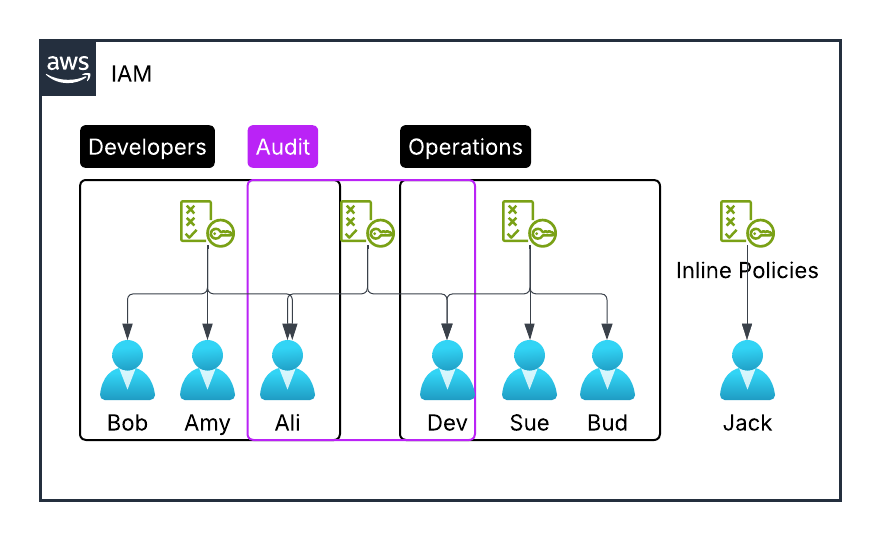

# IAM Policies

This lecture focuses on IAM policies in AWS.

## Key Takeaways



- **Group Level Policies**: IAM policies can be applied to user groups, allowing members to share the same permissions.
- **Inline Policies**: These policies are specific to individual users regardless of their group memberships.
- **Multiple Group Membership**: Users can belong to more than one group and inherit multiple policies, leading to layered approach in policy assignment.

```json title="IAM Policy Structure"
{
  "Version": "2012-10-17",
  "Id": "S3-Account-Permissions",
  "Statement": [
    {
      "Sid": "1",
      "Effect": "Allow",
      "Principal": {
        "AWS": "arn:aws:iam::123456789012:root"
      },
      "Action": ["s3:GetObject", "s3:PutObject"],
      "Resource": "arn:aws:s3:::mybucket/*"
    }
  ]
}
```

- **IAM Policy Structure**: Key components of a policy include:
  - **Version Number**: Specifies the policy language version.
  - **ID**: A unique identifier for the policy.
  - **Statement**: Each has:
    - **Sid (Statement ID)**: A unique statement identifier (optional).
    - **Effect**: Defines whether the action is allowed or denied.
    - **Principal**: Identifies the user or role the policy applies to.
    - **Action**: Specifies the allowed or denied API calls.
    - **Resource**: Details the specific resources affected.
    - **Conditions**: Optional constrains to apply.
- **Importance of Understanding Components**: Familiarity with components like effect, principal, action, and resource is crucial for effective IAM management in AWS.
