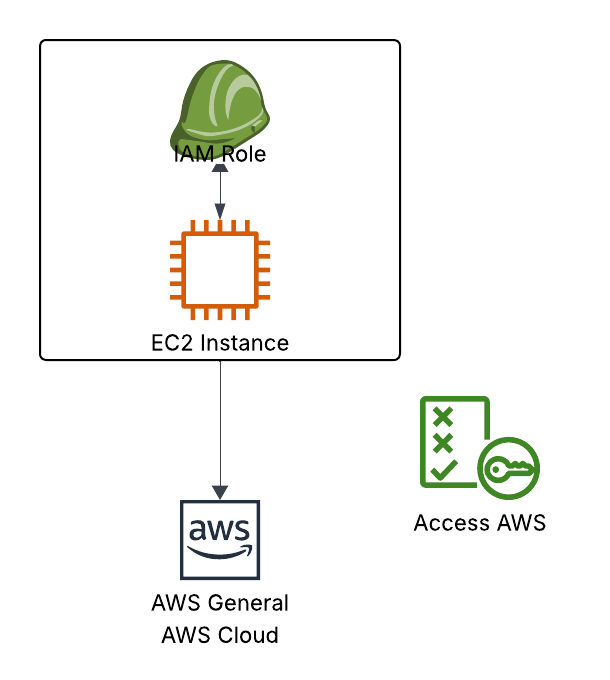

# IAM Roles for AWS Services

IAM Roles for AWS Services are a powerful feature that allows you to delegate permissions to AWS services. Essentially, they are like users, but they are not associated with a physical person. Instead, they are intended to be used by AWS services or applications.

## Key takeaways

- **Purpose of IAM Roles**: They are essential for granting permissions to AWS services, allowing them to perform actions on behalf of the user.
- **Service Focus**: Unlike user accounts, IAM roles are specifically designed for AWS services rather than individual users.
- **Example of Usage**: Services like EC2 instance require these roles to access and manage resources securely. The role acts as a bridge for permissions.  
  
- **Common Roles**: The lecture mentions other common roles, including those for Lambda functions and CloudFormation.
