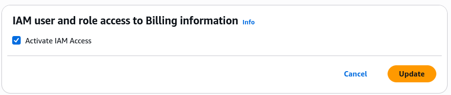
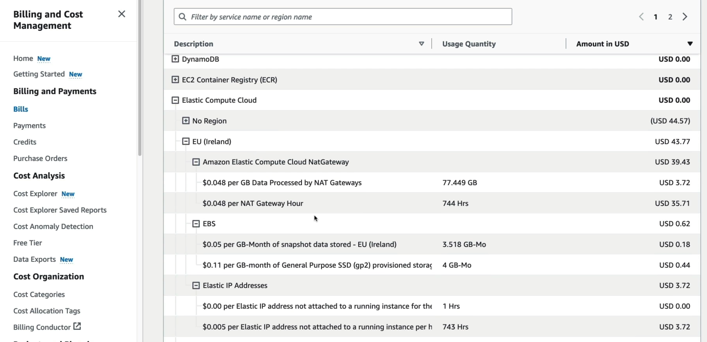
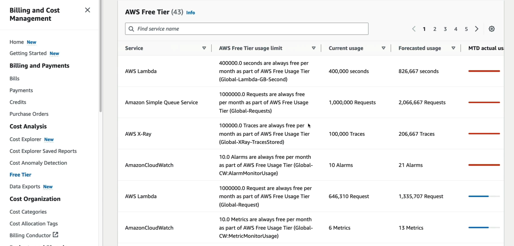
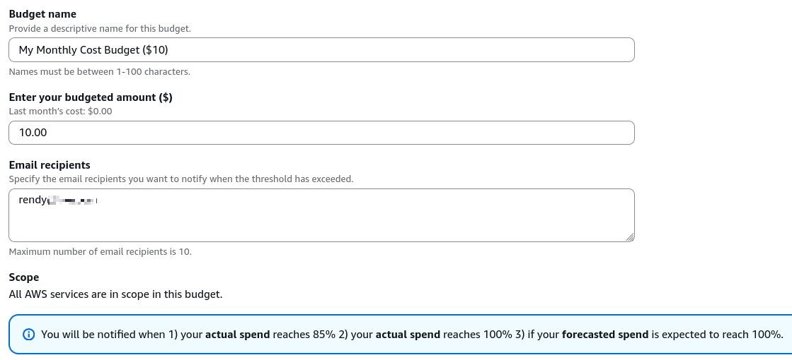
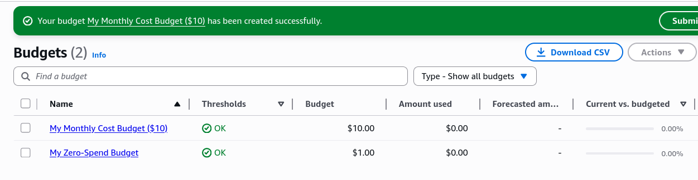

# AWS Budget Setup

Getting billing and budget alerts set up is an important step in managing AWS costs effectively.

## Key takeaways

- **The "Root Account" Prerequisite**
  - Even when using IAM user that has `AdministratorAccess`, we can't see billing data by default.
  - The fix: Log in as the root user, go to **Account**, scroll-down untul you find the **IAM User and Role Access to Billing Information** section, click `Edit`, and then check the box that says `Activate IAM Access`. This will allow IAM users with the appropriate permissions to access billing information.
    
- **Bill Breakdown**
  - **Service Deep Dive**: The **Bills** page is where we can find out exactly how much we are being charged for each AWS service.
  - **Granular info**: It breakdown costs by **Service** and **Region** (e.g Maarek's shows that most of his costs are from EC2 in EU Ireland).
    
- **Free Tier Monitoring**
  - **Usage Tracking**: The **Free Tier dashboard** shows how much of the monthly "allowance" we have used for each service.
  - **Forecasts**: If the dashboard predicts you'll overshoot the limit, it'll highlight in **red**.
    
- **Budget**
  - **Zero Spend Budget**: Maarek shows how to set up a budget with **Zero spend budget** template. So whenever a single cent is spent, we will get an alert via email.
  - **Monthly Cost Budget**: We can also set up a budget with a specific amount, for example, I don't want to spend more than $10 per month for this course, so I can set up a monthly cost budget with a limit of $10. If the forecasted cost exceeds $10, I will get an alert via email.
    
  - Just a note, if we follow the course closely, we should not be spending any money. Setting up the budget is just practice and just in case we do make a mistake.

