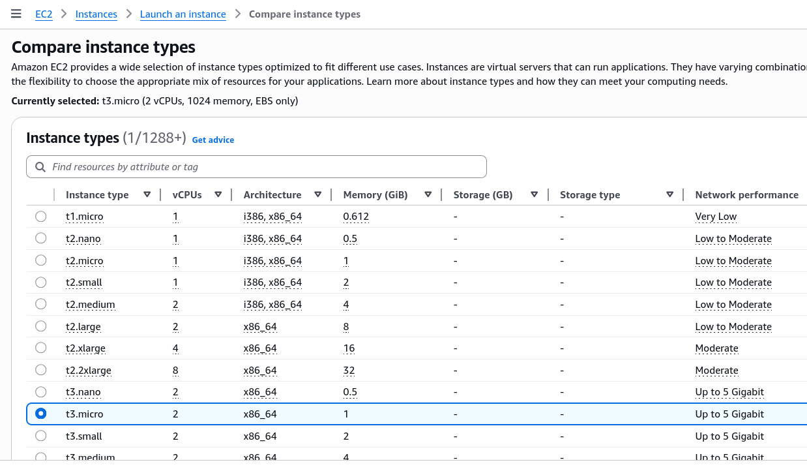
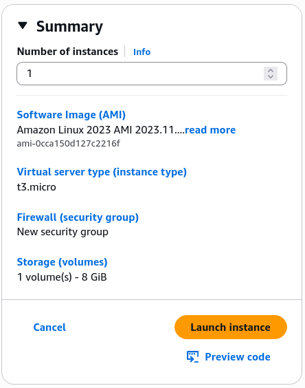

# EC2 Hands-on

Okay, time to level up our EC2 knowledge with launching our first instance, it is a huge milestone in our AWS journey!

## Key takeaways

- **The Launch Essentials (The Setup)**: First of all go to EC2 Dashboard and click on **Launch Instance**
  - **AMI (Amazon Machine Image)**: Think of this as our OS template. Stephane used Amazon Linux 2, however when I'm doing this course, Amazon Linux 2023 is the default, so I went with that one. Amazon Linux is AWS-optimized flavor of Linux and free tier eligible.
  - **Instance Type**: Choosing the "size" of the VM. The **t2.micro** or **t3.micro** is the MVP of the free tier.
    
  - **Key Pairs**: Essential for SSH access. It's like a password, but way more secure. You create a key pair, download the private key, and AWS keeps the public key. When you SSH into your instance, it checks if you have the right private key. Download the `.pem` file (Linux/Max/Win10) or `.ppk` file (older windows).
- **Networking & Security**:
  - **Public vs Private IP**: Public IP allows you to access your instance from the internet, while Private IP is for internal communication within AWS. For our first instance, we want a public IP so we can SSH into it.
  - **Security Groups (Firewalls)**: You have to explicitly open "ports" to let traffic in.
    - **Port 22 (SSH)**: To log in and manage the server.
    - **Port 80 (HTTP)**: To let people actually see your website
- **User Data**:
  - We passed a script into the field.

    ```bash title="User Data Script"
    #!/bin/bash
    # Use this for your user data (script from top to bottom)
    # install httpd (Linux 2 version)
    yum update -y
    yum install -y httpd
    systemctl start httpd
    systemctl enable httpd
    echo "<h1>Hello World from $(hostname -f)</h1>" > /var/www/html/index.html
    ```

  - **Rule**: The Script runs **once and only once** at the very first boot
  - **What it does**: It automatically updated the sustem, installed a webserver (`httpd`), started it, and created "Hello World" page. This is called **bootstrapping**.

  
Summary of the instance before launching it.

- **Lifecycle Management**:
  - **Stop**: This is like shutting down our computer. We stop paying for the "compute" (CPU/RAM), but we still pay for the storage (the EBS volume) because our data is still there.
  - **Start**: Wakes it back up. Remember, when you start it again, it might get a new public IP, unless we have an Elastic IP (which is a static public IP).
  - **Terminate**: This will deletes the instance forever. By default, the root EBS volume is deleted too.
  - Pro tip: If the website doesn't load, make sure to access the IP address using `http://` as we haven't setup SSL certificate yet + https is disabled.
